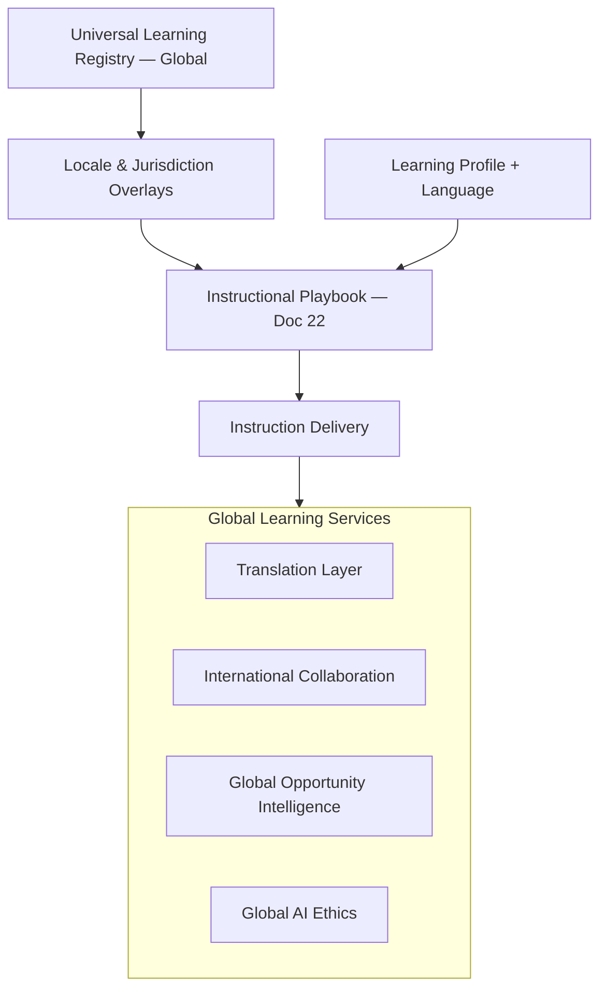

# CONSTITUTIONAL DOCUMENT D — Global Learning Framework™

**AcademyOS Constitution — Amendment: Global Education Framework™**  
**Status:** Constitutional Architecture — No Implementation  
**Version:** 1.0  
**Effective:** June 27, 2026  
**Parent:** Document A — Global Education Framework™  
**Integrates:** Academy Way Learning System (Docs 1–24) · Part VI-A Learning Intelligence™ · Document 9 Student Opportunity Engine · Document 17 Life/Venture Lab

---

## 1. Charter

The **Global Learning Framework™ (GLF)** defines how AcademyOS **adapts instruction, collaboration, and opportunity** for learners worldwide while preserving one unified competency model (Universal Learning Registry™) and mastery philosophy.

**Learning is global in architecture. Local in lived context.**

---

## 2. Constitutional Principles

| Principle | Statement |
|-----------|-----------|
| **One competency model** | ULR skill IDs and mastery rules do not fork by country |
| **Localized context** | Examples, tasks, and scenarios reflect learner's world |
| **Multilingual by design** | UI, support, and selected content in multiple languages |
| **Global citizenship** | Earthology and cross-cultural competence are core — not US-centric civics alone |
| **Ethical AI globally** | AI use respects cultural context and local regulation |
| **Opportunity without borders** | Global Opportunity Intelligence™ surfaces worldwide experiences |

---

## 3. Learning Adaptation Architecture



---

## 4. Language Translation

### 4.1 Instructional Translation Tiers

| Tier | Content | Standard |
|------|---------|----------|
| **T1** | Legal, safety, consent | Certified human |
| **T2** | Playbook, assessments, rubrics | Human-reviewed AI |
| **T3** | ULR titles/descriptions (display) | Glossary-controlled AI + review |
| **T4** | Teacher-generated content | Teacher responsibility + AI assist |
| **T5** | Student work | Original preserved; optional translation link |

### 4.2 Wilson / Structured Literacy

| Element | Language Approach |
|---------|-------------------|
| **WRS instruction** | English (Wilson curriculum requirement) |
| **Parent guides** | Translated per locale pack |
| **UI navigation** | Family language |
| **Evidence / notes** | Educator language + translation optional |
| **Multilingual learners** | Profile documents strength; SL domain separate from conversational fluency |

---

## 5. Multilingual Interfaces

| Surface | Localization |
|---------|--------------|
| **Student dashboard** | UI language preference |
| **Family portal** | Independent from student UI language |
| **Educator workspace** | Professional language preference |
| **Admissions** | Applicant language (Document B) |
| **Notifications** | Recipient locale |
| **RTL layouts** | Arabic, Hebrew, Persian, Urdu |
| **Screen readers** | WCAG + locale voice packs |

**Fallback:** Document A fallback chain.

---

## 6. Localized Examples

| Domain | Localization Pattern |
|--------|---------------------|
| **Real-Life Math** | Currency, tax, banking, shopping, measurement units |
| **Life Lab** | Housing norms, employment law context, transit systems |
| **Earthology** | Local geography, government, history, culture strands emphasized |
| **LitLab** | Literature from student's region + global canon |
| **Venture Lab** | Local market examples, business registration context |
| **LitLab grammar** | British vs. American English — locale config, not error |

**Overlay reference:** Document A §11 Curriculum Localization.

---

## 7. Localized Financial Literacy (Real-Life Math™)

| Strand | Localization |
|--------|--------------|
| **Money / Banking** | Local currency; bank types; account norms |
| **Taxes** | Income tax, VAT, GST — jurisdiction overlay |
| **Insurance** | Health, auto, national systems |
| **Credit / Loans** | Local credit bureau concepts — educational only |
| **Housing** | Rent vs. buy norms; typical costs (ranges, not advice) |
| **Employment** | Payslip format; mandatory deductions |
| **Entrepreneurship** | Business registration steps — country pack |

**Rule:** RLM competencies global; **performance tasks** swap scenarios via `LocaleOverlay`.

---

## 8. Localized Life Lab™

| Strand | Localization |
|--------|--------------|
| **Independent living** | Housing, utilities, civic registration |
| **Employment** | Job search norms, resume format, interview culture |
| **Financial literacy** | Overlap RLM overlay |
| **Communication** | Cultural norms — direct vs. indirect communication modules |
| **Executive function** | Universal — supports language-agnostic |

Life Lab Y1–Y4 progression (Doc 17) unchanged; **context** adapts.

---

## 9. Localized Entrepreneurship (AI Venture Lab™)

| Strand | Localization |
|--------|--------------|
| **Business creation** | Entity types by country (LLC, GmbH, Ltd, sole trader) |
| **Business finance** | Local tax, invoicing, VAT |
| **Marketing / Sales** | Cultural communication norms |
| **Operations** | Local delivery, payment systems |
| **Digital products** | Global market — default; local payment overlay |
| **Ethics** | Local business law awareness — informational |

**International business strand:** Explicit competency track for cross-border commerce, export basics, currency risk — global skills.

---

## 10. International Business Competencies

```
domain.ai_venture_lab.strand.international_business  (global extension)
    ├── sub_strand.cross_border_sales
    ├── sub_strand.import_export_basics
    ├── sub_strand.global_payment_systems
    ├── sub_strand.currency_and_exchange_literacy
    └── sub_strand.trade_compliance_awareness
```

Populated in Phase 4 ULR — architecture declared here.

---

## 11. Global AI Ethics

| Principle | Application |
|-----------|-------------|
| **Jurisdiction compliance** | AI features respect local AI regulation (EU AI Act, etc.) |
| **Age-appropriate** | Venture Lab AI tools gated by org policy + country age rules |
| **Cultural sensitivity** | No culturally biased feedback; localized examples |
| **Transparency** | AI use disclosed to students and families |
| **Human oversight** | Mastery and high-stakes decisions human-validated (Doc 21) |
| **Data residency** | AI processing respects country data rules |
| **Language equity** | AI quality monitored across languages — not English-only optimization |
| **Venture ethics strand** | Doc 17 ethics competencies include global AI use |

---

## 12. Cross-Cultural Communication

| Competency Area | Domains |
|-----------------|---------|
| **LitLab professional communication** | Cultural register, email norms |
| **Life Lab communication** | Conflict resolution across cultures |
| **Venture Lab sales/marketing** | International customer awareness |
| **Earthology culture strand** | Cultural humility, perspective-taking |
| **Global citizenship** | §13 |

Assessed via ULR — not separate soft-skills silo.

---

## 13. Global Citizenship

| Element | Description |
|---------|-------------|
| **Earthology citizenship strand** | Rights, responsibilities — comparative government |
| **Global systems strand** | Climate, trade, migration, technology |
| **Sustainability / SDG** | Doc 16 alignment |
| **Service learning** | §14 |
| **Not US civics only** | US government one module — comparative by design |
| **Digital citizenship** | LitLab digital literacy — global platform norms |

---

## 14. International Service Learning

| Component | Description |
|-----------|-------------|
| **Local service** | Community project in student's location |
| **Virtual service** | Remote contribution to global orgs |
| **Cross-border partnership** | Matched classrooms — structured protocol |
| **Evidence** | KEE artifact.action + reflection |
| **Safety** | Child safeguarding rules per jurisdiction |
| **Scheduling** | SIE coordinates time zones |

---

## 15. Remote Teamwork

| Capability | Description |
|------------|-------------|
| **Async collaboration** | Project tools; timezone-aware deadlines |
| **Sync video** | Rotating meeting times for fairness |
| **Role clarity** | Venture Lab operations norms |
| **Documentation** | Shared language protocol (team selects working language) |
| **Conflict resolution** | Cross-cultural facilitation guides |

Scheduling Intelligence assigns **fair rotation** for global team meetings.

---

## 16. International Project-Based Learning

| Project Type | Description |
|--------------|-------------|
| **Pen-pal inquiry** | Earthology connect lens — structured |
| **Global challenge** | SDG-themed cross-school projects |
| **Venture collaboration** | Joint MVP across countries |
| **Literature exchange** | LitLab multilingual book projects |
| **Data collaboration** | Shared datasets — ethics review |

Projects reference ULR project competencies — evidence in KEE.

---

## 17. Global Opportunity Intelligence™

Extension of Student Opportunity Engine (Doc 9) for worldwide scope.

### 17.1 Opportunity Types

| Type | Global Scope |
|------|--------------|
| **Internships** | Remote and local; visa note informational |
| **Competitions** | Academic, entrepreneurship, STEM — international |
| **Mentorship** | Industry mentors by timezone |
| **Scholarships** | Doc C integration |
| **University programs** | Summer, online, dual enrollment |
| **Venture accelerators** | Youth-focused global programs |
| **Cultural exchange** | Virtual and in-person |
| **Conferences** | Student presentation opportunities |

### 17.2 Matching Dimensions

| Dimension | Source |
|-----------|--------|
| **Skills / mastery** | PAJ + ULR |
| **Interests** | Learning Profile |
| **Location / timezone** | Profile |
| **Language** | Opportunity language requirements |
| **Age / grade band** | Eligibility rules |
| **Mobility profile** | Military, expat-specific opportunities |
| **Readiness** | Graduation Readiness domains |

### 17.3 Global Opportunity Registry

```
GlobalOpportunity
    ├── opportunity_key
    ├── title (localized)
    ├── type
    ├── host_organization
    ├── jurisdiction_scope[]     (empty = global)
    ├── language_requirements[]
    ├── timezone_flexibility
    ├── remote_eligible
    ├── visa_note                  (informational)
    ├── skill_tags[]               (ULR refs)
    ├── application_url
    └── status
```

---

## 18. International Internships

| Element | Approach |
|---------|----------|
| **Remote-first** | Default for global equity |
| **Local placement** | Geo-matched where available |
| **Age compliance** | Country labor law notes — informational |
| **School credit** | Competency evidence — not seat time |
| **Safeguarding** | Background check requirements on host |
| **Visa** | Informational only — family responsibility |

---

## 19. International Competitions

| Category | Examples |
|----------|----------|
| **Academic olympiads** | Math, science, informatics |
| **Debate / Model UN** | LitLab + Earthology |
| **Entrepreneurship** | Global youth pitch competitions |
| **Arts / maker** | International fairs |
| **AI / coding** | Ethics-gated age policies |

Opportunity Engine alerts by skill readiness + interest.

---

## 20. Global Venture Creation

| Element | Description |
|---------|-------------|
| **Cross-border teams** | Venture Lab reflect phase includes collaboration review |
| **Multi-currency ventures** | Business finance overlay |
| **Global customer** | Digital products default market |
| **Export awareness** | International business strand |
| **Portfolio** | Global venture artifacts on Digital Portfolio |
| **Ethics** | Cultural respect, AI disclosure, child business laws |

---

## 21. Scheduling & Timezone (Learning Context)

| Rule | Application |
|------|-------------|
| **Learner timezone primary** | Session display and default scheduling |
| **Global cohorts** | Explicit UTC or rotation policy |
| **Teacher assignment** | Timezone overlap optimization |
| **Async learning** | PBL and independent work across zones |
| **Live collaboration** | Fair rotation algorithm |

Cross-reference: Document A §15 Timezone Philosophy.

---

## 22. Integration Matrix

| System | Role |
|--------|------|
| **Document A** | Config, language, currency, overlays |
| **Document B** | Language at entry; placement |
| **Document C** | Funding for global programs |
| **ULR (Docs 12–17)** | Global skills + locale overlays |
| **Instructional Framework (Doc 18)** | Models apply globally |
| **Learning Profile (Doc 19)** | Multilingual, timezone, interests |
| **Opportunity Engine (Doc 9)** | Extended by Global Opportunity Intelligence |
| **Scheduling Intelligence** | Timezone-aware |
| **KEE** | Multilingual evidence chain |

---

## 23. Governance

| Rule | Requirement |
|------|-------------|
| **GLF-1** | No domain competency removed for non-US learners |
| **GLF-2** | Localized overlays versioned — never silent skill change |
| **GLF-3** | Global Opportunity entries vetted before catalog publish |
| **GLF-4** | Cross-border projects require safeguarding review |
| **GLF-5** | AI features disabled where jurisdiction prohibits — via compliance pack |
| **GLF-6** | English-only UI prohibited as long-term state for active country packs |

---

*End of Constitutional Document D — Global Learning Framework™*
