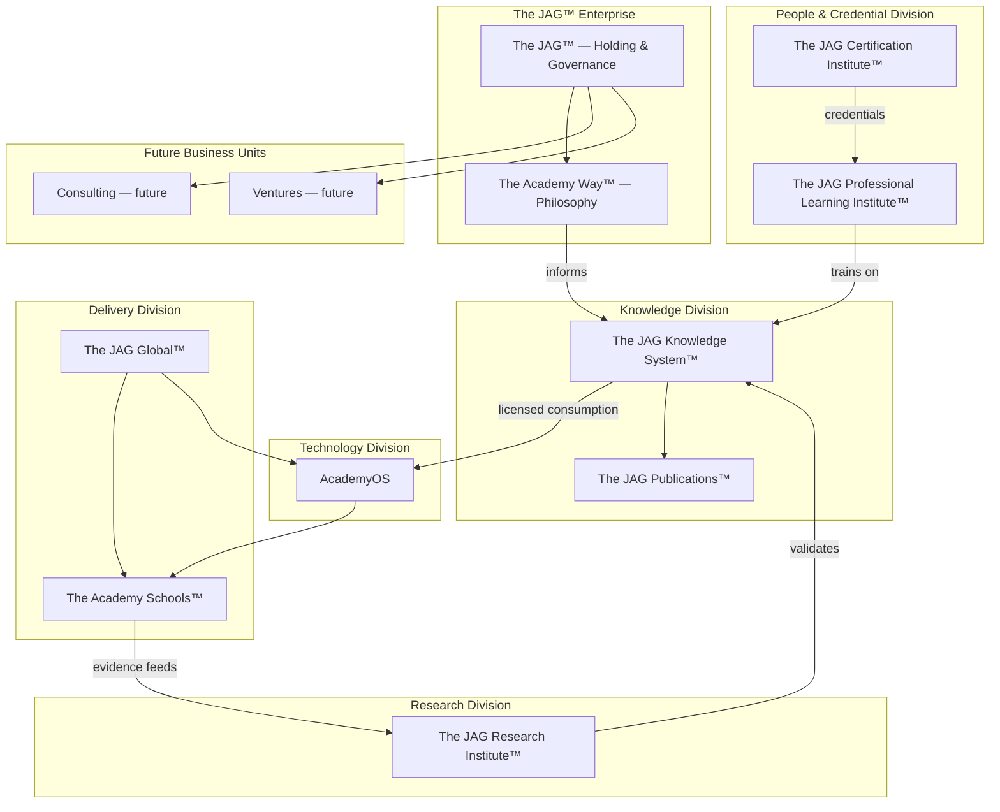

# DOCUMENT 106 — The JAG™ Enterprise Framework™

**The JAG™ — Enterprise Foundational Governance**  
**Status:** Permanent Enterprise Architecture — No Implementation  
**Version:** 1.0  
**Effective:** June 28, 2026  
**Supersedes:** Implicit single-product assumptions in prior governance  
**Authority:** Capstone enterprise document — Documents 57–105 remain operative within divisions

---

## 1. Foundational Directive

> **The JAG™ is an enterprise — not a software project.**

The JAG integrates **knowledge, technology, research, publications, professional learning, certifications, schools, consulting, and future ventures** under one permanent organizational architecture.

Every division operates with **clear ownership**, **defined interfaces**, and **shared philosophy** — while preserving the foundational rule established in Document 57:

**The JAG owns instructional knowledge. AcademyOS consumes under license.**

---

## 2. Enterprise Purpose

| Dimension | Purpose |
|-----------|---------|
| **Mission** | Transform learning worldwide through mastery-based education, evidence, and accessible excellence |
| **Philosophy** | The Academy Way™ — time and credits do not determine outcomes; evidence and readiness do |
| **Model** | Knowledge-first enterprise: author once, implement everywhere |
| **Impact** | Learners, families, educators, schools, partners, and society |

---

## 3. Enterprise Architecture



---

## 4. Entity Definitions

### 4.1 The JAG™

| Attribute | Definition |
|-----------|------------|
| **Role** | Enterprise holding entity; ultimate owner of JAG intellectual property |
| **Owns** | Knowledge System, Publications, Research outputs, Certification programs, brand marks |
| **Governance** | Editorial Board (Doc 61), Enterprise Leadership, IP Framework (Doc 58) |
| **Does not own** | AcademyOS software (platform entity), third-party curriculum, learner data |
| **Legal posture** | Parent organization for all divisions listed herein |

**The JAG™ is the permanent name of the enterprise.** Individual divisions operate as branded units under this master brand (Document 107).

---

### 4.2 The Academy Way™

| Attribute | Definition |
|-----------|------------|
| **Role** | Educational philosophy and constitutional framework |
| **Nature** | Not a product — the **design system for learning** |
| **Sources** | Global Education Framework (Docs A–D), Academy Way Blueprints (Docs 1–56), Mastery Philosophy (Doc 6) |
| **Governs** | All knowledge authoring, school implementation, research ethics, AI boundaries |
| **Key principles** | Mastery over seat time · Evidence over grades · Open entry · Human gates on AI · Family partnership · Neurodiversity as profile not identity |

**Rule:** No JAG division may publish instructional content contradicting The Academy Way without constitutional amendment.

---

### 4.3 AcademyOS

| Attribute | Definition |
|-----------|------------|
| **Role** | Technology platform — operational nervous system of the enterprise |
| **Nature** | Software product and service layer |
| **Owns** | Application code, infrastructure, runtime services, platform UX |
| **Consumes** | JAG Knowledge System assets under license (Doc 57) |
| **Serves** | Academy Schools, licensed partners, JAG Global deployments |
| **Core services** | ULR Registry · PAJ · KEE · SIE · AI Coach · Parent Portal · Teacher Workspace · Executive Dashboards · Configuration Studio |

**Rule:** AcademyOS shall not own canonical instructional knowledge. Version pins reference JAG publication packages.

---

### 4.4 The Academy Schools™

| Attribute | Definition |
|-----------|------------|
| **Role** | Direct implementation sites — proof of concept and flagship delivery |
| **Includes** | The Academy Virtual™ · The Academy High School™ · future campus models |
| **Nature** | Operating schools — not the platform, not the knowledge owner |
| **Implements** | The Academy Way via AcademyOS + JAG knowledge assets |
| **Produces** | Evidence, outcomes, fidelity data for Research Institute |
| **Relationship to JAG** | Internal or affiliated operating units under enterprise umbrella |

**Rule:** Schools implement; they do not fork canonical knowledge without JAG governance approval.

---

### 4.5 The JAG Knowledge System™

| Attribute | Definition |
|-----------|------------|
| **Role** | Complete hierarchy of instructional knowledge assets |
| **Governance** | Documents 57–61, 78–83 |
| **Contains** | Knowledge bases, concept libraries, competency libraries, RLP packages, AI metadata, evidence taxonomies |
| **Status** | First RLP complete (Docs 98–105); SL concept libraries complete (Docs 51, 62, 84–97) |
| **Asset key root** | `jag.*` |

**See:** Document 57 — authoritative knowledge architecture.

---

### 4.6 The JAG Research Institute™ (JAG-RI / ARI)

| Attribute | Definition |
|-----------|------------|
| **Role** | Enterprise research division — validates, extends, and publishes evidence for The Academy Way |
| **Former reference** | Academy Research Institute (Doc 24) — now enterprise division |
| **Activities** | Outcome studies · psychometric validation · A/B instructional research · longitudinal cohorts · open research summaries |
| **Inputs** | Anonymized AcademyOS evidence · school outcomes · JAG knowledge pilots |
| **Outputs** | Research libraries · threshold calibration · peer-reviewed publications · policy briefs |
| **Ethics** | IRB-aligned · no learner identification in enterprise aggregates · Document 24 standards |

**Rule:** Research may inform knowledge revisions; publication authority remains JAG Editorial Board (Doc 61).

---

### 4.7 The JAG Professional Learning Institute™ (JAG-PLI)

| Attribute | Definition |
|-----------|------------|
| **Role** | Enterprise professional learning division |
| **Governance** | Document 81 — Professional Learning Framework |
| **Delivers** | Teacher pathways · administrator institutes · parent academies · leadership programs |
| **Content source** | JAG Knowledge System + Reference Learning Packages (PD Modules, Doc 101 pattern) |
| **Delivery** | AcademyOS PL runtime · workshops · handbooks (Doc 82) · online courses (Doc 80) |
| **Credentials** | Feeds JAG Certification Institute |

---

### 4.8 The JAG Certification Institute™ (JAG-CI)

| Attribute | Definition |
|-----------|------------|
| **Role** | Enterprise credentialing authority |
| **Governance** | Document 81 §7 · Document 103 pattern per domain |
| **Issues** | Microcredentials · certificates · professional certifications · renewal cycles |
| **Standards** | Competency-aligned · observation-based · no proprietary third-party exam content |
| **Examples** | `cert.sl.phonological_awareness` (Doc 103) · `cert.sl.foundation` · future domain certs |
| **Recognition** | Academy Schools staffing · partner quality gates · public trust marks |

---

### 4.9 The JAG Publications™

| Attribute | Definition |
|-----------|------------|
| **Role** | Enterprise publishing division — knowledge to market |
| **Governance** | Document 80 — Publication Framework |
| **Formats** | Books · teacher manuals · parent handbooks · courses · certification programs · research monographs |
| **Source assets** | JAG Knowledge System maturity Level 7+ (Doc 83) |
| **Distribution** | Direct · partners · licensed bundles · international editions |
| **IP** | JAG-owned; licensed to AcademyOS and schools |

---

### 4.10 The JAG Global™

| Attribute | Definition |
|-----------|------------|
| **Role** | International expansion division |
| **Scope** | Locale overlays · country packs · partner school networks · regulatory alignment |
| **Governance** | Global Education Framework (Constitution Docs A–D) · Document 61 International Review |
| **Activities** | Translation · cultural adaptation · international PL · partner licensing · UNESCO/SDG alignment where applicable |
| **Does not** | Fork canonical knowledge — overlays extend master assets (Doc 82) |

---

### 4.11 Future Business Units

| Unit | Status | Purpose |
|------|--------|---------|
| **The JAG Consulting™** | Planned | Implementation advisory for partners, districts, governments |
| **The JAG Ventures™** | Planned | EdTech investments aligned with Academy Way |
| **The JAG Foundation™** | Planned | Scholarship, equity access, nonprofit partnerships |
| **The JAG Media™** | Planned | Documentary, podcast, public awareness |
| **The JAG AI Lab™** | Planned | Bounded AI research — human-gate preserved |

**Rule:** New business units require Enterprise Framework amendment (Document 106 MAJOR version) and Brand Architecture registration (Document 107).

---

## 5. Division Relationship Matrix

| From \ To | JKS | AcademyOS | Schools | JRI | JPLI | JCI | Publications | Global |
|-----------|-----|-----------|---------|-----|------|-----|--------------|--------|
| **JKS** | — | licenses | informs | source | content | standards | source | overlays |
| **AcademyOS** | consumes | — | serves | data | delivers | badges | — | configures |
| **Schools** | implements | uses | — | evidence | hosts | employs | — | localizes |
| **JRI** | validates | reads | studies | — | informs | calibrates | publishes | adapts |
| **JPLI** | trains | integrates | supports | uses | — | prepares | co-publishes | localizes |
| **JCI** | maps | permissions | gates | validates | certifies | — | packages | recognizes |
| **Publications** | compiles | — | distributes | cites | includes | embeds | — | translates |
| **Global** | overlays | configures | expands | partners | translates | localizes | editions | — |

---

## 6. Ownership & IP Summary

| Asset | Owner |
|-------|-------|
| Instructional knowledge (JKS) | **The JAG™** |
| Platform software | **AcademyOS entity** |
| Research publications (JRI) | **The JAG™** |
| Certification programs (JCI) | **The JAG™** |
| Published books/courses (Publications) | **The JAG™** |
| Brand marks | **The JAG™** |
| Learner evidence records | **Learner / org** — privacy governed |
| Wilson & third-party curriculum | **Respective publishers** |

**Full detail:** Document 58.

---

## 7. Governance Hierarchy

```
The JAG™ Enterprise Leadership
    ├── Enterprise Framework (this document)
    ├── Brand Architecture (Doc 107)
    ├── Capability Map (Doc 108)
    ├── Operating Model (Doc 109)
    ├── 2035 Vision (Doc 110)
    └── Division Governance
            ├── Knowledge — Docs 57–61, 78–83
            ├── Research — JRI charter (Doc 24 extended)
            ├── PL — Doc 81
            ├── Certification — Doc 103 pattern
            ├── Publications — Doc 80
            └── Technology — AcademyOS product governance (future ops docs)
```

---

## 8. Enterprise Rules

| Rule | Requirement |
|------|-------------|
| **ENT-1** | The JAG is an enterprise — not synonymous with AcademyOS |
| **ENT-2** | The Academy Way is philosophy — not owned separately from JAG governance |
| **ENT-3** | Knowledge assets are JAG-owned — all divisions consume via license |
| **ENT-4** | Schools produce evidence; Research validates; Knowledge revises |
| **ENT-5** | New divisions register in Enterprise Framework before launch |
| **ENT-6** | Enterprise governance Docs 106–110 complete the governance layer — future work prioritizes implementation and knowledge expansion |

---

## 9. Document Lineage

| Range | Scope |
|-------|-------|
| **1–56** | Academy Way blueprint lineage |
| **57–61** | JAG Knowledge System governance |
| **78–83** | Knowledge Domains governance |
| **84–105** | Structured Literacy assets + first RLP |
| **106–110** | **Enterprise governance — this layer** |

---

*End of Document 106 — The JAG™ Enterprise Framework™*

*The JAG™ — All Rights Reserved*
