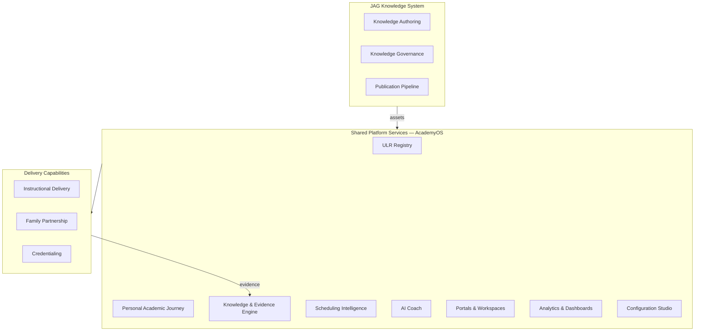
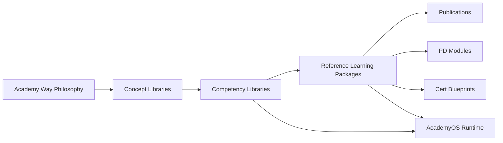

# DOCUMENT 108 — The JAG™ Enterprise Capability Map™

**The JAG™ — Enterprise Foundational Governance**  
**Status:** Permanent Capability Architecture — No Implementation  
**Version:** 1.0  
**Effective:** June 28, 2026  
**Parent:** Document 106 — Enterprise Framework™  
**Related:** Document 109 — Operating Model™

---

## 1. Charter

The **Enterprise Capability Map™** defines **every major capability** across JAG divisions — who owns it, what it depends on, what platform services it shares, and how knowledge flows for reuse.

**Purpose:** Prevent duplication · clarify ownership · guide investment · align implementation priorities.

---

## 2. Capability Map Architecture

---

## 3. Capability Catalog by Division

### 3.1 The JAG™ (Enterprise / Holding)

| Capability ID | Capability | Owner | Maturity |
|---------------|------------|-------|----------|
| `cap.ent.governance` | Enterprise governance & strategy | Enterprise Leadership | Defined (Docs 106–110) |
| `cap.ent.ip` | Intellectual property management | Legal + JAG IP | Defined (Doc 58) |
| `cap.ent.brand` | Brand & trademark governance | Marketing + Legal | Defined (Doc 107) |
| `cap.ent.partner` | Partner & license management | JAG Global + Legal | Emerging |
| `cap.ent.finance` | Enterprise finance & unit economics | Finance | Operational |
| `cap.ent.hr` | Enterprise talent & org design | HR | Operational |

**Dependencies:** All divisions report metrics · Legal enables all IP licensing

---

### 3.2 The Academy Way™ (Philosophy)

| Capability ID | Capability | Owner | Maturity |
|---------------|------------|-------|----------|
| `cap.aw.constitution` | Constitutional framework | Academy Way Steward | Defined (Docs A–D, 1–6) |
| `cap.aw.mastery` | Mastery philosophy & levels | Academy Way Steward | Defined (Doc 6) |
| `cap.aw.paj` | Personal Academic Journey design | Academy Way + Product | Defined (Doc 3) |
| `cap.aw.gre` | Graduation Readiness design | Academy Way + Product | Defined (Doc 7) |
| `cap.aw.global` | Global by Design principles | Academy Way + JAG Global | Defined (Doc A) |
| `cap.aw.neurodiversity` | Profile-not-label framework | Academy Way Steward | Defined (Constitution VI-D) |

**Dependencies:** None upstream — informs all knowledge and delivery  
**Knowledge reuse:** Embedded in every JKS asset metadata

---

### 3.3 The JAG Knowledge System™

| Capability ID | Capability | Owner | Maturity |
|---------------|------------|-------|----------|
| `cap.jks.kb` | Knowledge base architecture | JKS Domain Leads | Defined (Doc 38 pattern) |
| `cap.jks.concept` | Concept library authoring | JKS Authors + Editorial Board | 16 SL complete |
| `cap.jks.competency` | Competency library authoring | JKS Authors | 1 RLP (Doc 98) |
| `cap.jks.skill` | Atomic skill authoring | JKS Authors | Planned |
| `cap.jks.rlp` | Reference Learning Package assembly | JKS Curators | 1 complete (Docs 98–105) |
| `cap.jks.assessment` | Assessment item standards | JKS + JRI | Defined (Doc 26) |
| `cap.jks.evidence` | Evidence taxonomy | JKS | Defined (Doc 27) |
| `cap.jks.ai_meta` | AI metadata authoring | JKS + AI Review | Defined (Doc 47) |
| `cap.jks.graph` | Knowledge graph management | JKS | Defined (Doc 59) |
| `cap.jks.lifecycle` | Content lifecycle | Editorial Board | Defined (Doc 60) |
| `cap.jks.governance` | Review & publication authority | Editorial Board | Defined (Doc 61) |
| `cap.jks.locale` | Localization overlays | JAG Global + JKS | Emerging |
| `cap.jks.maturity` | Maturity model enforcement | Editorial Board | Defined (Doc 83) |

**Shared platform:** ULR Registry · Configuration Studio version pins  
**Dependencies:** Academy Way constitution · JRI validation (optional pre-publish)  
**Downstream consumers:** AcademyOS · JPLI · JCI · Publications · Schools

---

### 3.4 AcademyOS (Technology)

| Capability ID | Capability | Owner | Maturity |
|---------------|------------|-------|----------|
| `cap.aos.ulr` | Universal Learning Registry runtime | Platform Engineering | Blueprint |
| `cap.aos.paj` | Personal Academic Journey runtime | Platform Product | Blueprint |
| `cap.aos.kee` | Knowledge & Evidence Engine | Platform Engineering | Blueprint |
| `cap.aos.sie` | Scheduling Intelligence Engine | Platform Engineering | Blueprint |
| `cap.aos.aic` | AI Coach / Decision Engine | Platform AI + JKS | Blueprint |
| `cap.aos.tw` | Teacher Workspace | Platform Product | Blueprint |
| `cap.aos.pp` | Parent Portal | Platform Product | Blueprint |
| `cap.aos.admin` | Administrator Console | Platform Product | Blueprint |
| `cap.aos.exec` | Executive Dashboards | Platform Analytics | Blueprint (Doc 104 pattern) |
| `cap.aos.cfg` | Configuration Studio | Platform Engineering | Blueprint |
| `cap.aos.handbook` | Handbook composition runtime | Platform + Doc 82 | Planned |
| `cap.aos.pl` | Professional Learning runtime | Platform + JPLI | Planned |
| `cap.aos.cert` | Certification runtime & badges | Platform + JCI | Planned |
| `cap.aos.integrations` | SIS, roster, LTI, SSO | Platform Engineering | Operational |
| `cap.aos.privacy` | Privacy, security, compliance | Platform Security | Operational |

**Shared platform:** Self — provides shared services to all divisions  
**Dependencies:** JKS published assets (license) · Doc 105 integration patterns  
**Knowledge reuse:** Consumes JAG assets — never forks canonical definitions

---

### 3.5 The Academy Schools™

| Capability ID | Capability | Owner | Maturity |
|---------------|------------|-------|----------|
| `cap.sch.instruction` | Daily instructional delivery | School leadership + teachers | Operational |
| `cap.sch.intervention` | Tier 1–3 intervention delivery | Intervention team | Operational |
| `cap.sch.enrollment` | Admissions & onboarding | Admissions | Operational |
| `cap.sch.family` | Family partnership on-site | Family success team | Operational |
| `cap.sch.fidelity` | Implementation fidelity monitoring | Instructional coaches | Defined (Doc 102) |
| `cap.sch.evidence` | Evidence collection at point of instruction | Teachers | Blueprint |
| `cap.sch.staffing` | Certified staff alignment | HR + JCI | Emerging |
| `cap.sch.outcomes` | Local outcome reporting | School leadership | Operational |

**Shared platform:** Full AcademyOS stack  
**Dependencies:** JKS + RLP · JPLI-trained staff · JCI credentials for specialists  
**Upstream to:** JRI (evidence) · JKS (pilot feedback)

---

### 3.6 The JAG Research Institute™

| Capability ID | Capability | Owner | Maturity |
|---------------|------------|-------|----------|
| `cap.jri.outcomes` | Outcome evaluation & effect sizes | JRI Director | Defined (Doc 24) |
| `cap.jri.psychometric` | Assessment reliability & validity | JRI Psychometrics | Planned |
| `cap.jri.longitudinal` | Cohort & retention studies | JRI Research | Planned |
| `cap.jri.ari` | Academy Research Index | JRI | Defined (Doc 24) |
| `cap.jri.ethics` | Research ethics & IRB | JRI Ethics Board | Defined |
| `cap.jri.publish` | Research publication pipeline | JRI + Publications | Emerging |
| `cap.jri.calibrate` | Threshold & metric calibration | JRI + JKS | Planned |
| `cap.jri.open` | Open research summaries for JKS | JRI | Planned |

**Shared platform:** AcademyOS analytics (anonymized) · KEE aggregates  
**Dependencies:** School evidence · privacy governance  
**Downstream to:** JKS revisions · Doc 104 research metrics · Publications

---

### 3.7 The JAG Professional Learning Institute™

| Capability ID | Capability | Owner | Maturity |
|---------------|------------|-------|----------|
| `cap.jpli.pathways` | Learning pathway design | JPLI | Defined (Doc 81) |
| `cap.jpli.modules` | PD module authoring & delivery | JPLI + JKS | 1 module (Doc 101) |
| `cap.jpli.workshops` | Facilitated training | JPLI | Operational |
| `cap.jpli.parent_academy` | Parent academies | JPLI | Defined (Doc 81) |
| `cap.jpli.leadership` | Leadership institutes | JPLI | Defined |
| `cap.jpli.coaching` | Instructional coaching programs | JPLI | Operational |
| `cap.jpli.ce` | Continuing education tracking | JPLI + AcademyOS | Planned |

**Shared platform:** AcademyOS PL runtime · Handbook (Doc 82)  
**Dependencies:** JKS · RLP PD modules · Doc 102 rubrics  
**Downstream to:** JCI certification prep · Schools fidelity

---

### 3.8 The JAG Certification Institute™

| Capability ID | Capability | Owner | Maturity |
|---------------|------------|-------|----------|
| `cap.jci.standards` | Certification standard setting | JCI Board | Defined (Doc 103 pattern) |
| `cap.jci.blueprint` | Assessment blueprint design | JCI + JKS | 1 blueprint (Doc 103) |
| `cap.jci.admin` | Exam & practical administration | JCI | Planned |
| `cap.jci.badges` | Digital credential issuance | JCI + AcademyOS | Planned |
| `cap.jci.renewal` | Renewal & CE enforcement | JCI | Defined (Doc 81) |
| `cap.jci.registry` | Public credential registry | JCI | Planned |

**Shared platform:** AcademyOS cert runtime · permission flags  
**Dependencies:** JPLI completion · JKS competency maps · Doc 102 observation  
**Downstream to:** Schools staffing gates · Partner quality

---

### 3.9 The JAG Publications™

| Capability ID | Capability | Owner | Maturity |
|---------------|------------|-------|----------|
| `cap.pub.pipeline` | Publication production pipeline | Publications | Defined (Doc 80) |
| `cap.pub.book` | Book & manual production | Publications | Planned |
| `cap.pub.course` | Online course packaging | Publications + JPLI | Planned |
| `cap.pub.research` | Research monograph publishing | Publications + JRI | Planned |
| `cap.pub.distribute` | Distribution & fulfillment | Publications | Emerging |
| `cap.pub.rights` | Rights & translation management | Publications + Legal | Defined (Doc 58) |

**Shared platform:** Handbook composition · PL course shell  
**Dependencies:** JKS maturity Level 7+ (Doc 83)  
**Knowledge reuse:** Compiles JKS assets — never diverges from canonical source

---

### 3.10 The JAG Global™

| Capability ID | Capability | Owner | Maturity |
|---------------|------------|-------|----------|
| `cap.glo.locale` | Locale pack management | JAG Global | Emerging |
| `cap.glo.partner` | International partner schools | JAG Global | Planned |
| `cap.glo.regulatory` | Country regulatory alignment | JAG Global + Legal | Planned |
| `cap.glo.translate` | Translation workflow | JAG Global + JKS | Planned |
| `cap.glo.market` | Market entry strategy | JAG Global | Planned |

**Shared platform:** Configuration Studio locale overlays · Global Education Framework  
**Dependencies:** JKS master assets · Doc 61 International Review  
**Knowledge reuse:** Overlays only — master remains English/canonical

---

### 3.11 Future Business Units

| Capability ID | Capability | Owner | Status |
|---------------|------------|-------|--------|
| `cap.con.advisory` | Implementation consulting | JAG Consulting | Planned |
| `cap.con.audit` | Fidelity audit services | JAG Consulting | Planned |
| `cap.ven.invest` | Venture investments | JAG Ventures | Planned |
| `cap.fdn.scholarship` | Equity scholarships | JAG Foundation | Planned |

---

## 4. Shared Platform Services (AcademyOS)

| Service | Serves | Owner |
|---------|--------|-------|
| **ULR Registry** | JKS asset consumption · PAJ placement | Platform |
| **PAJ** | All instructional progression | Platform |
| **KEE** | Evidence validation · mastery bundles | Platform |
| **SIE** | Scheduling · dosage · review clusters | Platform |
| **AI Coach** | Recommendations · human gates | Platform + JKS rules |
| **Teacher Workspace** | Schools · JPLI · JCI | Platform |
| **Parent Portal** | Schools · Family Journey | Platform |
| **Executive Dashboards** | Schools · Network · JRI · Enterprise | Platform |
| **Configuration Studio** | Version pins · locale · feature flags | Platform |
| **Identity & SSO** | All divisions | Platform |
| **Privacy & Audit** | All divisions | Platform |

**Rule:** Divisions do not build parallel registries for competencies, evidence, or credentials.

---

## 5. Knowledge Reuse Map

| Reuse Pattern | Description |
|---------------|-------------|
| **Author once** | Competency defined in JKS — referenced everywhere |
| **Derive, don't duplicate** | PD modules derive from RLP — not rewritten |
| **Compile for publish** | Publications compile JKS sections — source remains canonical |
| **Pin versions** | AcademyOS pins `jag.publication.*` — no silent drift |
| **Overlay for global** | Translations overlay — master unchanged |
| **Validate with research** | JRI calibrates thresholds — JKS absorbs via governance |

---

## 6. Dependency Matrix (Critical Paths)

| Consumer | Requires | Blocking if Missing |
|----------|----------|---------------------|
| AcademyOS PA pathway | Published competency library | PAJ cannot advance learners |
| JCI certification | PD module + rubric + blueprint | Cannot issue credential |
| Publications book | JKS maturity Level 7 | Cannot publish externally |
| Schools Tier 2 PA | RLP + trained staff | Fidelity risk |
| JRI effect size study | KEE evidence at scale | Research delayed |
| JAG Global locale | Master published + overlay authored | Cannot launch locale |
| Executive dashboards | Doc 104 metric definitions | Metrics inconsistent |

---

## 7. Capability Ownership Rules

| Rule | Requirement |
|------|-------------|
| **CAP-1** | Every capability has one primary owner division |
| **CAP-2** | Shared platform capabilities owned by AcademyOS — not JKS |
| **CAP-3** | Instructional definitions owned by JKS — not AcademyOS |
| **CAP-4** | Credentials owned by JCI — delivered via AcademyOS |
| **CAP-5** | Research claims owned by JRI — absorbed by JKS through governance |
| **CAP-6** | New capabilities register in Capability Map before funding |

---

## 8. Implementation Priority (Post-Governance)

| Priority | Focus | Rationale |
|----------|-------|-----------|
| **1** | JKS expansion — competency libraries + atomic skills | Knowledge is source of truth |
| **2** | AcademyOS runtime — ULR, PAJ, KEE | Enables school evidence loop |
| **3** | RLP replication per competency library | Complete packages |
| **4** | JPLI + JCI operationalization | Staff quality |
| **5** | JRI pilot studies | Validate thresholds |
| **6** | Publications Level 7 assets | Revenue + reach |
| **7** | JAG Global locale packs | Scale |

---

*End of Document 108 — The JAG™ Enterprise Capability Map™*

*The JAG™ — All Rights Reserved*
