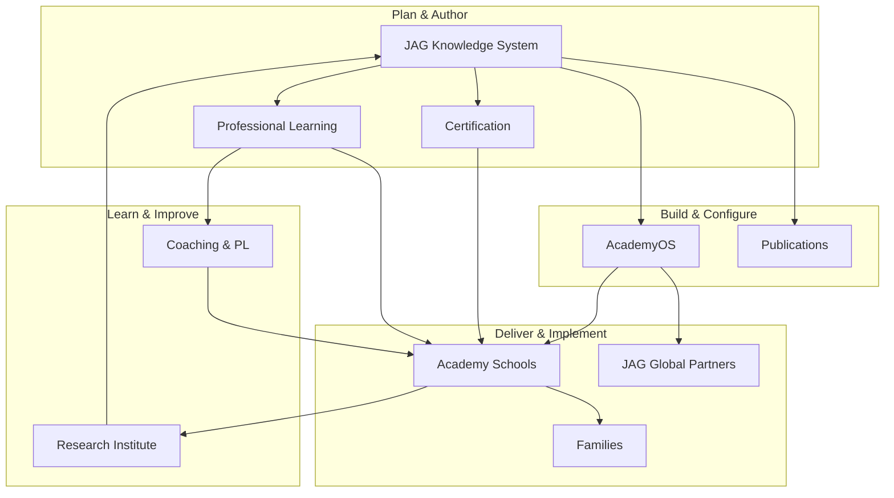

# DOCUMENT 109 — The JAG™ Enterprise Operating Model™

**The JAG™ — Enterprise Foundational Governance**  
**Status:** Permanent Operating Architecture — No Implementation  
**Version:** 1.0  
**Effective:** June 28, 2026  
**Parent:** Document 106 — Enterprise Framework™  
**Related:** Document 108 — Capability Map™

---

## 1. Charter

The **Enterprise Operating Model™** defines **how every JAG division collaborates** — workflows, handoffs, decision rights, rhythms, and integration points across knowledge, technology, research, schools, families, professional learning, certification, publications, global expansion, consulting, and innovation.

**This is not an org chart.** It is the **operating logic** of the enterprise.

---

## 2. Operating Principles

| Principle | Statement |
|-----------|-----------|
| **Knowledge first** | Author canonical knowledge before scaling delivery |
| **Evidence loops** | Schools produce → KEE captures → Research validates → Knowledge revises |
| **Human gates** | AI recommends; educators and governance approve |
| **Single registry** | One competency namespace — no forked definitions |
| **License, don't copy** | AcademyOS and partners consume JAG assets under version pin |
| **Family as partner** | Parents coach; teachers instruct; platform connects |
| **Global by design** | Master assets canonical; locales overlay |
| **Implement after govern** | Docs 106–110 complete — prioritize execution |

---

## 3. Enterprise Collaboration Architecture



---

## 4. Division Operating Models

### 4.1 Knowledge (JAG Knowledge System)

| Element | Definition |
|---------|------------|
| **Mission** | Author, govern, and publish canonical instructional knowledge |
| **Primary output** | Concept libraries · competency libraries · RLP packages |
| **Rhythm** | Concept → competency → RLP → publish → version |
| **Decision rights** | Editorial Board approves publish (Doc 61) |
| **Key handoffs** | → AcademyOS (published assets) · → JPLI (PD modules) · → JCI (standards) · → Publications (Level 7) |
| **Inputs from** | Academy Way steward · JRI calibration · School pilot feedback |
| **SLA to downstream** | Published assets include integration metadata (Doc 105) |

**Workflow — Reference Learning Package:**

```
Concept Library (published_blueprint)
    → Competency Library (Doc 98 pattern)
    → RLP Docs 99–105
    → QA panels (Doc 48)
    → Publication Library (Doc 60)
    → AcademyOS version pin
```

---

### 4.2 Technology (AcademyOS)

| Element | Definition |
|---------|------------|
| **Mission** | Operate platform that consumes JAG knowledge at scale |
| **Primary output** | Runtime services · workspaces · dashboards · integrations |
| **Rhythm** | Sprint delivery aligned to JKS publication releases |
| **Decision rights** | Product + Engineering — scoped by JAG license terms |
| **Key handoffs** | ← JKS assets · → Schools/Global (deployed instance) · → JRI (anonymized data) |
| **Constraints** | No canonical knowledge authorship in application code |

**Workflow — Asset consumption:**

```
JKS publication release
    → Configuration Studio pin
    → ULR ingest
    → PAJ / KEE / SIE / AIC rule load
    → Regression against Doc 105 playbook
    → Campus rollout
```

---

### 4.3 Research (JAG Research Institute)

| Element | Definition |
|---------|------------|
| **Mission** | Validate, extend, and publish evidence for The Academy Way |
| **Primary output** | Studies · calibrations · research libraries · open summaries |
| **Rhythm** | Hypothesis → IRB → study → analysis → governance review → JKS absorption |
| **Decision rights** | JRI Director + Ethics Board |
| **Key handoffs** | → JKS (threshold revisions) · → Publications (monographs) · → Enterprise (strategy) |
| **Inputs from** | KEE aggregates · Schools · JKS pilot plans |
| **Privacy** | Anonymization mandatory — no learner identification in enterprise research |

**Workflow — Threshold calibration:**

```
JRI analyzes probe reliability data
    → Proposes success criteria adjustment
    → Editorial Board review
    → JKS MINOR/MAJOR version
    → AcademyOS pin update
    → JCI blueprint sync if cert affected
```

---

### 4.4 Schools (The Academy Schools)

| Element | Definition |
|---------|------------|
| **Mission** | Deliver The Academy Way to learners with fidelity |
| **Primary output** | Learning outcomes · evidence · fidelity data · family satisfaction |
| **Rhythm** | Daily instruction · weekly probes · coaching cycles · quarterly reviews |
| **Decision rights** | School leadership — within JAG implementation standards |
| **Key handoffs** | → KEE (evidence) · → JPLI (training needs) · → JRI (outcomes) · → Families (progress) |
| **Staffing** | JCI credentials for specialists where required |

**Workflow — Instructional day:**

```
SIE schedules PA block
    → Teacher delivers per Doc 99
    → Formative probe + KEE log
    → AI Coach surfaces suggestions — teacher decides
    → Parent extension if L2+ (Doc 100)
    → Coach observation cycle (Doc 102)
```

---

### 4.5 Families

| Element | Definition |
|---------|------------|
| **Mission** | Partner in learning — reinforce, observe, advocate |
| **Primary output** | Home practice · observation logs · learner motivation |
| **Rhythm** | 5–10 min assigned activities · weekly progress visibility |
| **Decision rights** | Family chooses capacity; teacher assigns activities |
| **Key interfaces** | Parent Portal · Parent AI Coach · Family Journey (Doc 8) · Doc 100 guides |
| **Evidence weight** | Supplementary — max 0.55 alone (Doc 27) |
| **Boundaries** | Coach not instructor · no diagnostic labeling |

**Workflow — Home partnership:**

```
Teacher assigns Doc 100 activity at L2+
    → Parent Portal notification
    → Family completes play activity
    → Optional log
    → Teacher verifies
    → May contribute to evidence bundle
```

---

### 4.6 Professional Learning (JAG-PLI)

| Element | Definition |
|---------|------------|
| **Mission** | Build educator and leader capacity to implement JAG knowledge |
| **Primary output** | Pathways · modules · workshops · coaching programs |
| **Rhythm** | Align to JKS releases · cohort-based · renewal cycles |
| **Decision rights** | JPLI Director + domain leads |
| **Key handoffs** | ← JKS RLP Doc 101 · → JCI (cert prep) · → Schools (trained staff) |
| **Content rule** | Derive from JKS — never parallel curriculum |

**Workflow — New RLP PD launch:**

```
RLP Doc 101 published
    → AcademyOS PL module loaded
    → Cohort enrollment
    → Practice + Doc 102 observation
    → Microcredential issued
    → Pathway to JCI cert
```

---

### 4.7 Certification (JAG-CI)

| Element | Definition |
|---------|------------|
| **Mission** | Issue trusted credentials aligned to JKS competencies |
| **Primary output** | Microcredentials · certificates · professional certifications |
| **Rhythm** | Blueprint → item development → pilot → operational → renewal |
| **Decision rights** | JCI Board + Editorial Board alignment |
| **Key handoffs** | ← JPLI · ← Doc 102 rubrics · → AcademyOS badges · → Schools staffing |
| **Quality** | No third-party proprietary exam content |

**Workflow — Credential issuance:**

```
Candidate completes Doc 101 + Doc 103 requirements
    → JCI validates portfolio
    → Practical demonstration scored (Doc 102)
    → Credential recorded
    → AcademyOS permission flag enabled
    → Public registry entry
```

---

### 4.8 Publications (JAG Publications)

| Element | Definition |
|---------|------------|
| **Mission** | Transform mature JKS assets into market-facing products |
| **Primary output** | Books · manuals · courses · research editions |
| **Rhythm** | Maturity Level 7 gate → production → distribution → revision sync with JKS |
| **Decision rights** | Publications Director + Editorial Board |
| **Key handoffs** | ← JKS · ← JRI · → Market · → JPLI (course shells) |
| **Rule** | Compiled from source — master remains JKS |

---

### 4.9 Global Expansion (JAG Global)

| Element | Definition |
|---------|------------|
| **Mission** | Scale The Academy Way internationally with integrity |
| **Primary output** | Locale packs · partner networks · regulatory packages |
| **Rhythm** | Market assessment → overlay authoring → partner onboarding → fidelity audit |
| **Decision rights** | JAG Global + Editorial Board (International Review) |
| **Key handoffs** | ← JKS master · → AcademyOS locale config · → Partner schools |
| **Rule** | Overlays extend — never override canonical instruction without amendment |

---

### 4.10 Consulting (Future)

| Element | Definition |
|---------|------------|
| **Mission** | Advise partners on Academy Way implementation |
| **Services** | Readiness assessment · fidelity audit · change management |
| **Boundaries** | Does not author canonical JKS content — implements licensed assets |
| **Handoffs** | → JPLI training · → JAG Global partner pipeline · → JRI evaluation contracts |

---

### 4.11 Innovation (Enterprise)

| Element | Definition |
|---------|------------|
| **Mission** | Explore bounded innovation without forking philosophy |
| **Includes** | JAG AI Lab (future) · Ventures · pilot technologies |
| **Governance** | Human gates preserved · Editorial Board for knowledge absorption |
| **Handoff** | Successful pilots → JRI validation → JKS governance → AcademyOS productization |

---

## 5. Cross-Division Workflows

### 5.1 New Competency Library Launch (End-to-End)

| Phase | Lead | Support | Output |
|-------|------|---------|--------|
| 1. Author | JKS | Academy Way | Competency Library |
| 2. Package | JKS | — | RLP Docs 99–105 |
| 3. Review | Editorial Board | JRI, JPLI, JCI | Published package |
| 4. Integrate | AcademyOS | JKS | Version pin + runtime |
| 5. Train | JPLI | JKS | PD cohort |
| 6. Credential | JCI | JPLI | Cert blueprint live |
| 7. Deploy | Schools / Global | AcademyOS | Instruction live |
| 8. Measure | JRI | AcademyOS | Outcomes study |
| 9. Publish | Publications | JKS | Level 7 product (optional) |

### 5.2 Evidence-to-Research Loop

```
Learner performance → KEE → PAJ → Dashboards (Doc 104)
    → JRI anonymized extract → Analysis → Governance proposal → JKS revision
```

### 5.3 Incident / Quality Escalation

| Level | Trigger | Owner |
|-------|---------|-------|
| L1 | Session fidelity gap | Coach + Teacher |
| L2 | Asset error or ambiguity | JKS curator |
| L3 | Safety, privacy, AI boundary | Platform Security + Editorial Board |
| L4 | Constitutional conflict | Academy Way Steward + Enterprise Leadership |

---

## 6. Decision Rights Matrix (RACI Summary)

| Decision | R | A | C | I |
|----------|---|---|---|---|
| Publish competency library | JKS Author | Editorial Board | JRI, JPLI, JCI | AcademyOS |
| AcademyOS feature prioritization | Product | Platform Lead | JKS, Schools | Enterprise |
| Certification cut scores | JCI | JCI Board | JRI, JKS | JPLI |
| School implementation model | School Lead | School Director | JPLI, JKS | JRI |
| Research publication | JRI | JRI Director | Editorial Board | Enterprise |
| Brand / new division | Marketing | Enterprise Leadership | Legal | All divisions |
| Locale overlay publish | JAG Global | Editorial Board | JKS | AcademyOS |
| Partner license terms | JAG Global | Enterprise Leadership | Legal | JKS |

*R=Responsible · A=Accountable · C=Consulted · I=Informed*

---

## 7. Operating Rhythms

| Rhythm | Participants | Purpose |
|--------|--------------|---------|
| **Daily** | Teachers, learners, families | Instruction + evidence |
| **Weekly** | Teachers, coaches | Probes · progress |
| **Biweekly** | Product + JKS | Release alignment |
| **Monthly** | Editorial Board | Asset pipeline |
| **Quarterly** | Enterprise Leadership | Division scorecards |
| **Annual** | Enterprise + JRI | Strategy · Doc 110 progress review |

---

## 8. Integration Points (Document 105 Summary)

| Platform Surface | Primary Divisions |
|------------------|-------------------|
| ULR / PAJ / KEE | JKS · Schools · JRI |
| SIE | Schools · JKS scheduling metadata |
| AI Coach | JKS rules · Schools · Families |
| Teacher Workspace | Schools · JPLI · JCI |
| Parent Portal | Families · Schools · JKS parent guides |
| Executive Dashboards | Enterprise · Schools · JRI · JAG Global |
| Configuration Studio | AcademyOS · JKS · JAG Global |

---

## 9. Operating Rules

| Rule | Requirement |
|------|-------------|
| **OPS-1** | No division forks canonical JKS content |
| **OPS-2** | Research informs knowledge — does not bypass governance |
| **OPS-3** | Families are partners — not primary instructors |
| **OPS-4** | Certification maps to JKS — not parallel standards |
| **OPS-5** | Global overlays require International Review (Doc 61) |
| **OPS-6** | Post-governance priority: implementation + knowledge expansion |

---

*End of Document 109 — The JAG™ Enterprise Operating Model™*

*The JAG™ — All Rights Reserved*
