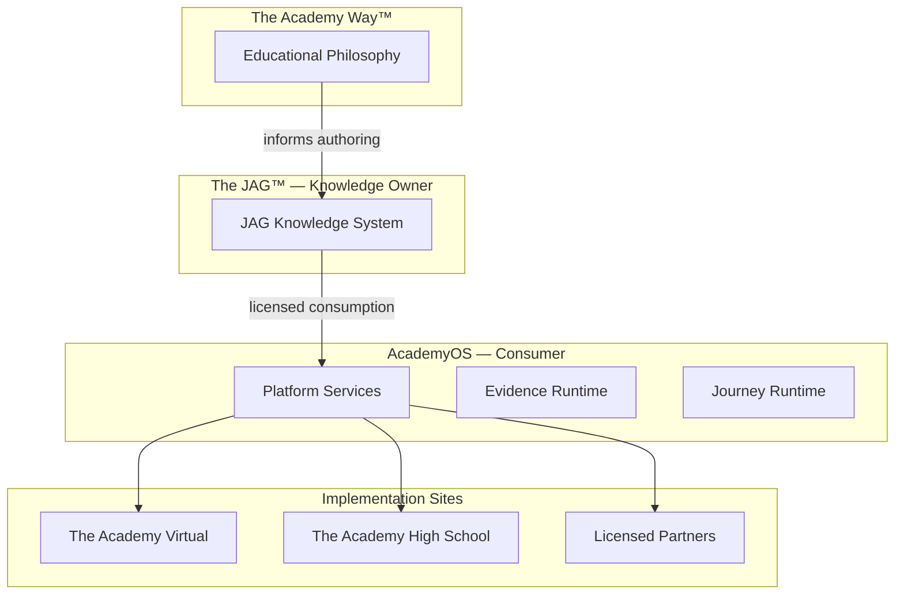

# DOCUMENT 57 — The JAG Knowledge System™

**The JAG™ — Knowledge System Foundational Governance**  
**Status:** Permanent Governance Architecture — No Implementation  
**Version:** 1.0  
**Effective:** June 27, 2026  
**Supersedes:** Implicit ownership assumptions in prior Academy Way blueprints

---

## 1. Foundational Directive

> **Every Knowledge Base, Concept Library, Competency Library, Atomic Skill Library, Assessment Library, Evidence Library, Instructional Resource Library, AI Model, Research Summary, Parent Resource, Teacher Guide, or future instructional asset shall be treated as a permanent intellectual property asset of The JAG.**

| Entity | Role |
|--------|------|
| **The JAG™** | **Owns** the knowledge system — all instructional knowledge assets |
| **The Academy Way™** | **Educational philosophy** — mastery, evidence, PAJ, domains |
| **AcademyOS** | **Technology platform** — consumes JAG assets; does not own them |
| **The Academy schools** | **Implementation sites** — The Academy Virtual™, The Academy High School™, partners |

**AcademyOS shall consume these assets. AcademyOS shall not own these assets.**

---

## 2. Charter

**The JAG Knowledge System™ (JAG-KS)** is the **complete hierarchy of instructional knowledge assets** authored, governed, versioned, and licensed by The JAG for consumption by AcademyOS, Academy schools, licensed partners, and authorized research entities.

JAG-KS is **not** software. It is the **enterprise knowledge estate** that AcademyOS references at runtime.

---

## 3. Ecosystem Architecture



---

## 4. Knowledge Asset Hierarchy

```
The JAG Knowledge System™
    └── Knowledge Domain (e.g., Structured Literacy)
            └── Knowledge Base
                    └── Concept Library
                            └── Competency Library
                                    └── Atomic Skill Library
                                            ├── Assessment Library (linked)
                                            ├── Evidence Library (taxonomy)
                                            ├── Instructional Resource Library (linked)
                                            ├── AI Reasoning Library (linked)
                                            ├── Parent Knowledge Library (linked)
                                            ├── Teacher Knowledge Library (linked)
                                            └── Research Library (linked)
                    └── Localization Library (overlays)
                    └── Translation Library (locales)
                    └── Publication Library (published packages)
```

**Rule:** Lower layers **derive from** upper layers — never duplicate canonical definitions.

---

## 5. Asset Class Definitions

### 5.1 Knowledge Bases

| Attribute | Definition |
|-----------|------------|
| **Purpose** | Domain-level canonical knowledge architecture |
| **Owner** | The JAG |
| **Example** | Structured Literacy Knowledge Base (Academy Way Docs 38–42) |
| **Contains** | Knowledge maps, relationship graphs, domain frameworks |
| **AcademyOS** | Reads via registry API — no local copy |
| **Asset key** | `jag.kb.{domain}` |

### 5.2 Concept Libraries

| Attribute | Definition |
|-----------|------------|
| **Purpose** | Permanent instructional knowledge model for one concept |
| **Owner** | The JAG |
| **Example** | Phonological Awareness Concept Library (Doc 51) |
| **Contains** | Definition, enhancement profiles (Docs 52–55), future derivation groups |
| **Precedes** | Competency libraries |
| **Asset key** | `jag.concept_library.{concept_key}` |

### 5.3 Competency Libraries

| Attribute | Definition |
|-----------|------------|
| **Purpose** | Collections of competencies derived from concept libraries |
| **Owner** | The JAG |
| **Schema** | Academy Way Doc 25 + JAG governance |
| **Example** | `library.structured_literacy` competency sets |
| **Asset key** | `jag.competency_library.{domain}` |

### 5.4 Atomic Skill Libraries

| Attribute | Definition |
|-----------|------------|
| **Purpose** | Smallest assessable units — ULR namespace |
| **Owner** | The JAG |
| **Schema** | Doc 12, 44 |
| **Immutable IDs** | Once published — `AW-{DOMAIN}-*` |
| **Asset key** | `jag.skill_library.{domain}` |

### 5.5 Assessment Libraries

| Attribute | Definition |
|-----------|------------|
| **Purpose** | Assessment methods, instruments, items |
| **Owner** | The JAG |
| **Schema** | Docs 21, 26, domain frameworks (Doc 40) |
| **Note** | No copyrighted third-party instruments reproduced |
| **Asset key** | `jag.assessment_library.{domain}` |

### 5.6 Evidence Libraries

| Attribute | Definition |
|-----------|------------|
| **Purpose** | Evidence type taxonomy, bundle rules, quality/confidence models |
| **Owner** | The JAG |
| **Schema** | Doc 27 |
| **Runtime instances** | AcademyOS KEE — not JAG-owned |
| **Asset key** | `jag.evidence_library.global` |

### 5.7 Instructional Resource Libraries

| Attribute | Definition |
|-----------|------------|
| **Purpose** | Lessons, practice, projects, media, AI tools — linked to competencies |
| **Owner** | The JAG |
| **Schema** | Doc 28 |
| **Boundary** | Resources reference external curriculum (Wilson) — do not embed proprietary content |
| **Asset key** | `jag.resource_library.{domain}` |

### 5.8 AI Reasoning Libraries

| Attribute | Definition |
|-----------|------------|
| **Purpose** | AI rule keys, reasoning profiles, explainability templates |
| **Owner** | The JAG |
| **Schema** | Docs 29, 41, 47, 55 |
| **Runtime** | AcademyOS Decision Engine executes — rules owned by JAG |
| **Asset key** | `jag.ai_reasoning_library.{domain}` |

### 5.9 Parent Knowledge Libraries

| Attribute | Definition |
|-----------|------------|
| **Purpose** | Parent activities, coaching cards, Family Journey content |
| **Owner** | The JAG |
| **Schema** | Docs 42, 43 parent review |
| **Asset key** | `jag.parent_library.{domain}` |

### 5.10 Teacher Knowledge Libraries

| Attribute | Definition |
|-----------|------------|
| **Purpose** | Teacher guides, fidelity rubrics, look-fors, professional content |
| **Owner** | The JAG |
| **Schema** | Docs 22, 54, educator panels |
| **Asset key** | `jag.teacher_library.{domain}` |

### 5.11 Research Libraries

| Attribute | Definition |
|-----------|------------|
| **Purpose** | Research summaries, citations, ARI findings, validation studies |
| **Owner** | The JAG |
| **Schema** | Doc 24 |
| **Asset key** | `jag.research_library.{topic}` |

### 5.12 Localization Libraries

| Attribute | Definition |
|-----------|------------|
| **Purpose** | Country/region overlays — examples, scenarios, compliance notes |
| **Owner** | The JAG |
| **Schema** | Global Education Docs A–D |
| **Asset key** | `jag.locale.{country}.{domain}` |

### 5.13 Translation Libraries

| Attribute | Definition |
|-----------|------------|
| **Purpose** | Locale packs — UI strings, parent content, concept display titles |
| **Owner** | The JAG |
| **Schema** | Doc A translation philosophy |
| **Asset key** | `jag.translation.{locale}.{asset}` |

### 5.14 Publication Libraries

| Attribute | Definition |
|-----------|------------|
| **Purpose** | Published packages — immutable release bundles |
| **Owner** | The JAG |
| **Schema** | Docs 49, 60 |
| **Asset key** | `jag.publication.{library}.{version}` |

---

## 6. Asset Metadata (Universal)

Every JAG knowledge asset **shall** carry:

```
JAGAssetRecord
    ├── asset_key
    ├── asset_class                 (§5)
    ├── owner                       The JAG — immutable
    ├── version                     semver
    ├── status                      lifecycle — Doc 60
    ├── academy_way_alignment[]   philosophy refs
    ├── academyos_consumer_refs[]   platform integration keys
    ├── license_tier                Doc 58
    ├── created_at
    ├── published_at
    ├── audit_trail_ref             Doc 61
    └── ip_notice                   The JAG™ — All Rights Reserved
```

---

## 7. Academy Way Blueprint Migration

| Prior Location | JAG Classification |
|----------------|-------------------|
| Academy Way Docs 38–42 | JAG Knowledge Base (SL) |
| Academy Way Doc 51+ | JAG Concept Libraries |
| Academy Way Docs 25–30 | JAG authoring standards (governed by JAG) |
| Academy Way Docs 52–56 | JAG Concept Library enhancement standards |

**Academy Way blueprints remain** as authoring lineage — **ownership transfers to JAG** per this directive.

---

## 8. AcademyOS Consumption Model

| Principle | Rule |
|-----------|------|
| **Reference not copy** | Platform reads JAG registry — no forked skill tables |
| **License gate** | Org must hold valid JAG license tier (Doc 58) |
| **Version pin** | Orgs may pin publication version — auto-update policy configurable |
| **Runtime separation** | Student evidence in KEE — JAG owns taxonomy not instances |
| **Attribution** | Published assets display JAG copyright notice |

---

## 9. Branding Hierarchy

| Brand | Use |
|-------|-----|
| **The JAG™** | Knowledge assets, IP, licensing, governance |
| **The Academy Way™** | Philosophy, mastery, instructional science |
| **AcademyOS** | Software, platform, APIs |
| **The Academy Virtual / High School** | Schools implementing Academy Way via AcademyOS |

**All future knowledge documents** use JAG asset headers and `jag.*` keys.

---

## 10. Related JAG Documents

| Document | Scope |
|----------|-------|
| **58** | Intellectual Property Framework |
| **59** | Knowledge Graph |
| **60** | Content Lifecycle |
| **61** | Knowledge Governance |

---

## 11. Governance Rules

| Rule | Requirement |
|------|-------------|
| **JAG-KS-1** | All instructional knowledge assets are JAG IP |
| **JAG-KS-2** | AcademyOS never claims ownership of JAG assets |
| **JAG-KS-3** | Asset class hierarchy immutable — extensions via amendment |
| **JAG-KS-4** | Publication packages versioned and auditable |
| **JAG-KS-5** | Concept Library Doc 62+ uses JAG headers |

---

*End of Document 57 — The JAG Knowledge System™*
