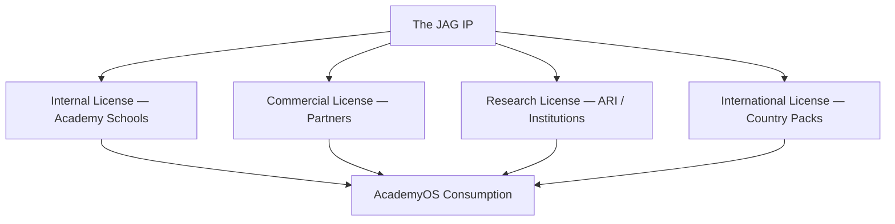

# DOCUMENT 58 — The JAG Intellectual Property Framework™

**The JAG™ — Knowledge System Foundational Governance**  
**Status:** Permanent IP Architecture — No Implementation  
**Version:** 1.0  
**Effective:** June 27, 2026  
**Parent:** Document 57 — The JAG Knowledge System™

---

## 1. Foundational Principle

> **The JAG owns all instructional knowledge assets. AcademyOS consumes under license.**

Intellectual property protection preserves the **integrity, quality, and commercial value** of The JAG Knowledge System while enabling Academy schools, partners, and research entities to deliver The Academy Way at scale.

---

## 2. Ownership

### 2.1 What The JAG Owns

| Asset Category | Ownership |
|----------------|-----------|
| Knowledge Bases, Concept Libraries, Competency/Skill Libraries | **The JAG** |
| Assessment, Evidence, Resource, AI Reasoning Libraries | **The JAG** |
| Parent, Teacher, Research Libraries | **The JAG** |
| Localization, Translation, Publication packages | **The JAG** |
| JAG Knowledge Graph definitions (Doc 59) | **The JAG** |
| Academy Way-authored content migrated to JAG-KS | **The JAG** |

### 2.2 What The JAG Does Not Own

| Asset | Owner |
|-------|-------|
| **AcademyOS software** | AcademyOS entity / platform operator |
| **Student evidence records** | Learner/org — governed by privacy law |
| **Wilson copyrighted materials** | Wilson Language Training — referenced only |
| **Third-party curriculum** | Respective publishers — licensed separately |
| **User-generated content** | Creator — subject to platform terms |

### 2.3 Work-for-Hire & Contribution

| Contribution Type | Default Ownership |
|-------------------|-------------------|
| JAG-commissioned authoring | The JAG |
| Employee authoring within scope | The JAG |
| Contractor authoring | The JAG via agreement |
| Partner co-development | Defined in partner agreement — default JAG canonical |

---

## 3. Versioning

| Element | Standard |
|---------|----------|
| **Scheme** | Semantic versioning `MAJOR.MINOR.PATCH` |
| **Immutable keys** | `competency_key`, `skill_id`, `concept_key` — never reused |
| **Publication packages** | Immutable once published (Doc 60) |
| **AcademyOS pins** | Orgs consume specific `jag.publication.*` version |
| **Changelog** | Required on every MAJOR/MINOR |

**Rule:** Consumers must know which JAG publication version they implement.

---

## 4. Licensing Model Overview

**AcademyOS** holds **platform integration license** — not asset ownership.

---

## 5. Reuse

| Reuse Type | Permitted | Conditions |
|------------|-----------|------------|
| **AcademyOS runtime reference** | Yes | Valid license; version pin |
| **Academy school instruction** | Yes | Academy Way implementation site |
| **Partner white-label** | Yes | Commercial/partner license |
| **Copy into non-AcademyOS platform** | No | Separate license required |
| **Modify canonical assets** | No | Localization overlays only via JAG process |
| **Extract skill libraries** | No | Anti-competition / integrity |
| **Research excerpt** | Yes | Research license — anonymized |

---

## 6. Publishing

| Stage | Authority |
|-------|-----------|
| **Authoring** | JAG editorial process (Doc 61) |
| **Publication approval** | JAG Publication Authority |
| **Publication package** | JAG Publication Library (Doc 57 §5.14) |
| **Distribution to AcademyOS** | Licensed feed — not open download |
| **Public research summaries** | JAG-approved excerpts only |

**Copyright notice on all published assets:**

> © The JAG™. All Rights Reserved. Licensed for use through AcademyOS and authorized implementations of The Academy Way™.

---

## 7. Distribution

| Channel | Description |
|---------|-------------|
| **AcademyOS Registry API** | Primary distribution to platform |
| **Academy school direct** | Via AcademyOS — not standalone files |
| **Partner SDK/API** | Commercial license tier |
| **Publication archive** | JAG internal + licensed auditors |
| **No public torrent/open repo** | Knowledge assets not open-source |

---

## 8. Commercial Licensing

| Tier | Audience | Scope |
|------|----------|-------|
| **Tier I — Academy** | The Academy Virtual, High School | Full JAG-KS for Academy Way delivery |
| **Tier II — Partner School** | Licensed private schools | Domain subsets or full — contract |
| **Tier III — Enterprise** | Districts, networks | Scale pricing — version pin |
| **Tier IV — Platform OEM** | Non-AcademyOS platforms | Rare — explicit IP agreement |

**Revenue model:** License fees — not sale of individual skill assets.

---

## 9. Partner Licensing

| Element | Terms |
|---------|-------|
| **Scope** | Defined domains, regions, student counts |
| **Branding** | Partner brand + "Powered by The Academy Way / JAG Knowledge" |
| **Modifications** | Prohibited on canonical assets — overlays via JAG |
| **Audit** | Annual compliance review |
| **Termination** | Access revoked — org pins frozen at last licensed version |

---

## 10. Research Licensing

| Type | Use |
|------|-----|
| **ARI internal** | Academy Research Institute — anonymized outcomes |
| **Institutional study** | IRB-approved — aggregated data only |
| **Asset excerpt** | Research license for citation — not full library |
| **Validation studies** | JAG retains findings — may update assets |

**Rule:** Research license **never** transfers ownership.

---

## 11. International Licensing

| Dimension | Approach |
|-----------|----------|
| **Country packs** | JAG Localization Libraries (Doc 57 §5.12) |
| **Regional licensee** | Optional country master licensee |
| **Translation rights** | JAG-owned translations — licensee uses via API |
| **Compliance** | Local law via Global Education Framework (Docs A–D) |
| **Data residency** | Platform concern — JAG assets jurisdiction-agnostic |

---

## 12. Wilson & Third-Party Boundary

| Content | IP Status |
|---------|-----------|
| **JAG concept/competency architecture** | The JAG |
| **Wilson WRS curriculum** | Wilson — Academy schools hold curriculum license |
| **JAG Wilson metadata** | The JAG — category/Step mapping only |
| **MAP norms** | NWEA — separate license |

JAG assets **reference** third-party — never **embed** proprietary content.

---

## 13. Enforcement

| Violation | Response |
|-----------|------------|
| Unauthorized copy | License termination + legal |
| Key fork in non-JAG system | Cease and desist |
| Missing attribution | Corrective notice |
| License expiry | API access disabled — read-only historical pin |

---

## 14. Governance Rules

| Rule | Requirement |
|------|-------------|
| **JAG-IP-1** | All new assets include IP notice |
| **JAG-IP-2** | No AcademyOS code assignment of JAG content ownership |
| **JAG-IP-3** | License tier recorded on org record |
| **JAG-IP-4** | Publication immutable — changes via new version |
| **JAG-IP-5** | International licenses align with country packs |

---

*End of Document 58 — The JAG Intellectual Property Framework™*
