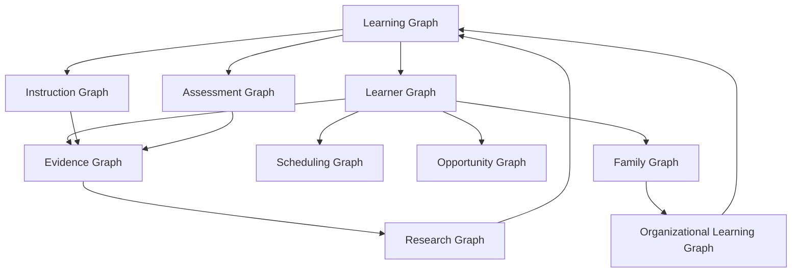

# DOCUMENT 59 — The JAG Knowledge Graph™

**The JAG™ — Knowledge System Foundational Governance**  
**Status:** Enterprise Knowledge Graph Architecture — **Partial runtime** (AcademyOS RC-4 unified graph at `src/lib/platform/knowledge-graph/`; full Doc 59 semantic layers not yet complete)  
**Version:** 1.0  
**Effective:** June 27, 2026  
**Parent:** Document 57 — The JAG Knowledge System™  
**Runtime map:** [`docs/platform/rc-packages.md`](../../platform/rc-packages.md)

---

## 1. Charter

**The JAG Knowledge Graph™ (JAG-KG)** is the **enterprise semantic layer** connecting all JAG knowledge assets, learner state (via AcademyOS), evidence, research, instruction, scheduling, opportunities, families, and organizational learning.

JAG-KG is **owned and defined by The JAG**. AcademyOS **materializes** graph instances at runtime — it does not own the graph schema.

---

## 2. Graph Architecture Overview

**Core principle:** **Learning Graph** is canonical JAG knowledge topology. **Learner Graph** is runtime overlay. **Evidence Graph** binds them.

---

## 3. Learning Graph

| Attribute | Definition |
|-----------|------------|
| **Purpose** | Canonical instructional knowledge topology |
| **Owner** | The JAG |
| **Nodes** | Domains, strands, concepts, competencies, atomic skills, prerequisites, progressions |
| **Edges** | `prerequisite`, `builds_to`, `cross_domain`, `generalizes_to`, `transfer_to` |
| **Source** | JAG Knowledge Bases, Concept Libraries, Competency/Skill Libraries |
| **AcademyOS** | Read-only consumption — Intelligence Graph (Doc 39) implements subset |

**Relationship to Academy Way Doc 39:** Doc 39 describes SL learning relationships — JAG-KG **generalizes** to all domains.

---

## 4. Learner Graph

| Attribute | Definition |
|-----------|------------|
| **Purpose** | Per-learner mastery, journey, and profile overlay |
| **Owner** | Runtime instance — schema JAG; data learner/org |
| **Nodes** | Learner, skill states, mastery records, PAJ milestones, learning profile dimensions |
| **Edges** | `has_mastery_on`, `attempted`, `enrolled_in`, `profile_indicates` |
| **Source** | AcademyOS PAJ, KEE, Learning Profile (Doc 19) |
| **Privacy** | FERPA/GDPR — not JAG-owned data |

**Connection:** Learner nodes **link to** Learning Graph skill nodes via `skill_id`.

---

## 5. Evidence Graph

| Attribute | Definition |
|-----------|------------|
| **Purpose** | Evidence bundles, confidence, mastery decisions |
| **Owner** | Taxonomy JAG (Doc 27); instances AcademyOS KEE |
| **Nodes** | Evidence types, bundles, observations, mastery decisions |
| **Edges** | `supports`, `contradicts`, `aggregates_to`, `decides_mastery_for` |
| **Source** | KEE + JAG Evidence Library |

**Connection:** Evidence **grounds** Learner Graph mastery claims on Learning Graph skills.

---

## 6. Research Graph

| Attribute | Definition |
|-----------|------------|
| **Purpose** | Research lineage, validation, ARI findings |
| **Owner** | The JAG |
| **Nodes** | Studies, citations, findings, asset validations |
| **Edges** | `validates`, `informs`, `supersedes`, `cites` |
| **Source** | JAG Research Libraries (Doc 24) |

**Connection:** Research **informs** Learning Graph asset revisions (Doc 60 Continuous Improvement).

---

## 7. Instruction Graph

| Attribute | Definition |
|-----------|------------|
| **Purpose** | Instructional resources, playbooks, decision models |
| **Owner** | The JAG |
| **Nodes** | Resources, playbooks, IDM rules, coach prompts |
| **Edges** | `teaches`, `remediates`, `extends`, `requires_fidelity` |
| **Source** | Docs 22, 28, 54, Instructional Resource Libraries |

**Connection:** Instruction nodes **target** Learning Graph competencies/skills; **triggered by** Learner Graph gaps.

---

## 8. Assessment Graph

| Attribute | Definition |
|-----------|------------|
| **Purpose** | Assessment methods, items, windows, diagnostic paths |
| **Owner** | The JAG |
| **Nodes** | Methods, items, windows, diagnostic rules |
| **Edges** | `assesses`, `screens_for`, `progress_monitors`, `feeds_evidence` |
| **Source** | Docs 21, 26, 40, Assessment Libraries |

**Connection:** Assessment **produces** Evidence Graph inputs; **aligned to** Learning Graph skills.

---

## 9. Scheduling Graph

| Attribute | Definition |
|-----------|------------|
| **Purpose** | Time, blocks, sessions, intervention slots |
| **Owner** | Schema JAG; instances AcademyOS |
| **Nodes** | Blocks, sessions, intervention windows, mastery gates |
| **Edges** | `scheduled_for`, `allocates_time_to`, `blocks_until_mastery` |
| **Source** | AcademyOS scheduling + JAG scheduling rules |

**Connection:** Scheduling **allocates** Instruction Graph resources to Learner Graph needs.

---

## 10. Opportunity Graph

| Attribute | Definition |
|-----------|------------|
| **Purpose** | Student opportunities, ventures, Life Lab, pathways |
| **Owner** | Schema JAG; instances AcademyOS |
| **Nodes** | Opportunities, prerequisites, applications, outcomes |
| **Edges** | `requires_mastery`, `unlocks`, `recommends` |
| **Source** | Doc 09, Life Lab, AI Venture Lab |

**Connection:** Opportunity nodes **require** Learning Graph mastery thresholds on Learner Graph.

---

## 11. Family Graph

| Attribute | Definition |
|-----------|------------|
| **Purpose** | Family Journey, parent activities, home support |
| **Owner** | Content JAG; relationships runtime |
| **Nodes** | Families, learners, parent activities, journey milestones |
| **Edges** | `supports_learner`, `assigned_activity`, `journey_stage` |
| **Source** | Doc 08, Parent Knowledge Libraries |

**Connection:** Family Graph **extends** Learner Graph with home context — feeds Instruction and Evidence (parent observations).

---

## 12. Organizational Learning Graph

| Attribute | Definition |
|-----------|------------|
| **Purpose** | School-wide fidelity, PD, implementation quality |
| **Owner** | The JAG schema; org data |
| **Nodes** | Schools, educators, fidelity scores, PD completions, implementation metrics |
| **Edges** | `implements`, `fidelity_on`, `pd_completed`, `org_mastery_rate` |
| **Source** | Doc 30 governance, teacher libraries, analytics |

**Connection:** Org Learning **aggregates** Learner Graph outcomes — **feeds back** to Research Graph and JAG asset improvement.

---

## 13. Cross-Graph Connection Matrix

| From | To | Edge Type | Example |
|------|-----|-----------|---------|
| Learning | Learner | `instantiated_as` | Skill → learner mastery state |
| Learner | Evidence | `produces` | Attempt → observation bundle |
| Evidence | Learner | `decides` | Bundle → mastery decision |
| Assessment | Evidence | `generates` | Item response → evidence |
| Instruction | Learning | `targets` | Resource → competency |
| Instruction | Learner | `prescribed_for` | IDM → learner gap |
| Research | Learning | `validates` | Study → concept revision |
| Scheduling | Instruction | `allocates` | Block → lesson |
| Opportunity | Learning | `requires` | Venture → skill threshold |
| Family | Learner | `supports` | Parent activity → learner |
| Org Learning | Research | `aggregates` | School outcomes → ARI |
| Learning | Learning | `prerequisite` | PA → Phonemic Awareness |

---

## 14. AcademyOS Integration

| Component | Graph Role |
|-----------|------------|
| **ULR / Registry** | Learning Graph API |
| **PAJ** | Learner Graph journey |
| **KEE** | Evidence Graph runtime |
| **Decision Engine** | Instruction Graph + IDM |
| **Intelligence Graph (Doc 39)** | SL Learning Graph traversal |
| **SOE (Doc 09)** | Opportunity Graph |
| **Family Journey (Doc 08)** | Family Graph |
| **Analytics (Doc 23)** | Cross-graph queries |

**Rule:** AcademyOS **queries** JAG-KG schema — **never** redefines canonical edges.

---

## 15. Governance Rules

| Rule | Requirement |
|------|-------------|
| **JAG-KG-1** | Learning Graph canonical — single source |
| **JAG-KG-2** | Cross-domain edges use Doc 46 standard |
| **JAG-KG-3** | Graph schema versioned with publication packages |
| **JAG-KG-4** | Learner data not merged into JAG canonical store |
| **JAG-KG-5** | Research validation edges required before MAJOR asset revision |

---

*End of Document 59 — The JAG Knowledge Graph™*
