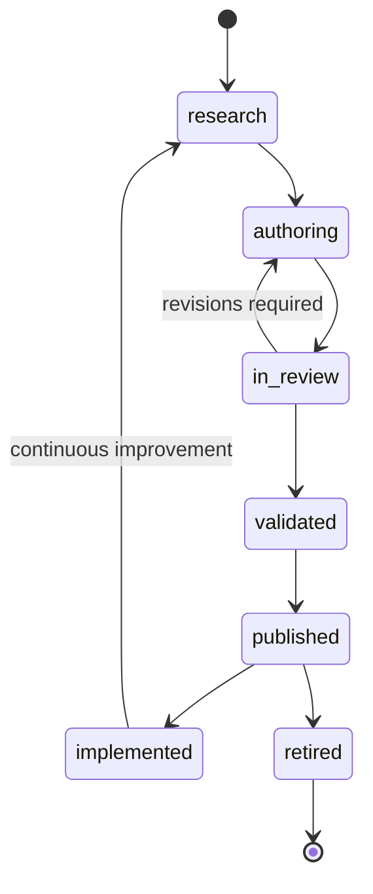

# DOCUMENT 60 — The JAG Content Lifecycle™

**The JAG™ — Knowledge System Foundational Governance**  
**Status:** Permanent Lifecycle Architecture — No Implementation  
**Version:** 1.0  
**Effective:** June 27, 2026  
**Parent:** Document 57 — The JAG Knowledge System™

---

## 1. Foundational Principle

> **Every knowledge asset moves through a governed lifecycle from research to retirement.**

No JAG asset reaches AcademyOS consumption without passing **defined gates**. No asset is deleted without **retirement protocol**.

---

## 2. Lifecycle Stages

```
Research
    ↓
Authoring
    ↓
Review
    ↓
Validation
    ↓
Publication
    ↓
Implementation
    ↓
Continuous Improvement
    ↓
Retirement
```

---

## 3. Stage Definitions

### 3.1 Research

| Element | Definition |
|---------|------------|
| **Purpose** | Establish evidence base before authoring |
| **Activities** | Literature review, ARI studies, cognitive science synthesis |
| **Outputs** | Research summaries, citation packs, authoring briefs |
| **Owner** | JAG Research function |
| **Exit gate** | Research brief approved — asset class identified |
| **Status code** | `research` |

**Connection:** Doc 24 Research Framework; Research Graph (Doc 59).

---

### 3.2 Authoring

| Element | Definition |
|---------|------------|
| **Purpose** | Create draft knowledge asset per JAG standards |
| **Activities** | Concept/competency/skill authoring, profile population (Docs 52–55) |
| **Outputs** | Draft asset with metadata, relationships, enhancement profiles |
| **Owner** | JAG editorial authors |
| **Exit gate** | Draft complete — self-check against authoring guide |
| **Status code** | `draft` |

**Rule:** Concept Libraries **before** competencies (Phase 4.2 sequence).

---

### 3.3 Review

| Element | Definition |
|---------|------------|
| **Purpose** | Multi-panel quality gate |
| **Activities** | Editorial, academic, Wilson boundary, international, accessibility, AI review |
| **Outputs** | Review records, required revisions |
| **Owner** | JAG Editorial Board (Doc 61) |
| **Exit gate** | All required reviews passed — CLQS for Concept Libraries (Doc 56) |
| **Status code** | `in_review` |

---

### 3.4 Validation

| Element | Definition |
|---------|------------|
| **Purpose** | Confirm asset meets technical and pedagogical standards |
| **Activities** | Schema validation, relationship integrity, prerequisite DAG check, AI metadata QA |
| **Outputs** | Validation certificate, version candidate |
| **Owner** | JAG QA function (Doc 48) |
| **Exit gate** | Validation certificate issued |
| **Status code** | `validated` |

---

### 3.5 Publication

| Element | Definition |
|---------|------------|
| **Purpose** | Immutable release to JAG Publication Library |
| **Activities** | Semver assignment, package build, IP notice, audit trail seal |
| **Outputs** | `jag.publication.{library}.{version}` |
| **Owner** | JAG Publication Authority (Doc 61) |
| **Exit gate** | Publication package registered — AcademyOS feed enabled |
| **Status code** | `published` |

**Rule:** Published assets **immutable** — changes require new version (Doc 58).

---

### 3.6 Implementation

| Element | Definition |
|---------|------------|
| **Purpose** | Consumption by AcademyOS and Academy schools |
| **Activities** | Registry sync, org version pin, educator PD, fidelity monitoring |
| **Outputs** | Live instructional delivery, learner evidence |
| **Owner** | AcademyOS + implementation sites |
| **Exit gate** | N/A — ongoing until improvement or retirement |
| **Status code** | `implemented` |

**Note:** Implementation is **runtime** — asset remains `published` in JAG registry.

---

### 3.7 Continuous Improvement

| Element | Definition |
|---------|------------|
| **Purpose** | Evolve assets based on evidence and research |
| **Activities** | ARI findings, educator feedback, analytics, error reports |
| **Outputs** | Improvement tickets, MINOR/PATCH or MAJOR revision drafts |
| **Owner** | JAG Editorial Board |
| **Trigger** | Research Graph validation, org learning metrics, scheduled review |
| **Status code** | Returns to `research` or `authoring` for revision branch |

**Rule:** MAJOR revisions require full Review + Validation cycle.

---

### 3.8 Retirement

| Element | Definition |
|---------|------------|
| **Purpose** | Orderly deprecation without breaking learner history |
| **Activities** | Successor assignment, migration map, sunset date, archive |
| **Outputs** | Retirement notice, `superseded_by` link |
| **Owner** | JAG Publication Authority |
| **Exit gate** | No active org pins without migration path |
| **Status code** | `retired` |

**Rule:** Retired skill IDs **never reused**. Learner history retains retired ID references.

---

## 4. Lifecycle by Asset Class

| Asset Class | Research | Authoring | Review | Validation | Publication |
|-------------|----------|-----------|--------|------------|-------------|
| Concept Library | Required | Full template | CLQS 8-panel | Schema + graph | Yes |
| Competency | Derived | Doc 43 | Competency QA | ULR integrity | Yes |
| Atomic Skill | Derived | Doc 44 | Skill QA | ID immutability | Yes |
| Assessment Item | Required | Doc 26 | Assessment panel | Psychometric check | Yes |
| AI Reasoning Profile | Required | Doc 55 | AI review | Rule key uniqueness | Yes |
| Localization overlay | Config | Country pack | International | Locale QA | Yes |
| Translation pack | N/A | Translator | Accessibility + native | Completeness | Yes |

---

## 5. Status State Machine



---

## 6. AcademyOS Sync Points

| JAG Status | AcademyOS Behavior |
|------------|-------------------|
| `draft`, `in_review`, `validated` | **Not visible** to production orgs |
| `published` | Available for org pin / auto-update |
| `implemented` | Active consumption |
| `retired` | Read-only historical — migration prompts |

---

## 7. Audit Requirements

Every lifecycle transition **shall** record:

```
LifecycleEvent
    ├── asset_key
    ├── from_status
    ├── to_status
    ├── actor
    ├── timestamp
    ├── review_refs[]        (if review stage)
    ├── validation_ref       (if validation)
    └── publication_version  (if published)
```

Full audit architecture: **Document 61**.

---

## 8. Governance Rules

| Rule | Requirement |
|------|-------------|
| **JAG-LC-1** | No skip of Review for published assets |
| **JAG-LC-2** | Concept Library before competency derivation |
| **JAG-LC-3** | Publication packages immutable |
| **JAG-LC-4** | Retirement requires successor or explicit orphan protocol |
| **JAG-LC-5** | Continuous improvement traceable to Research Graph |

---

*End of Document 60 — The JAG Content Lifecycle™*
