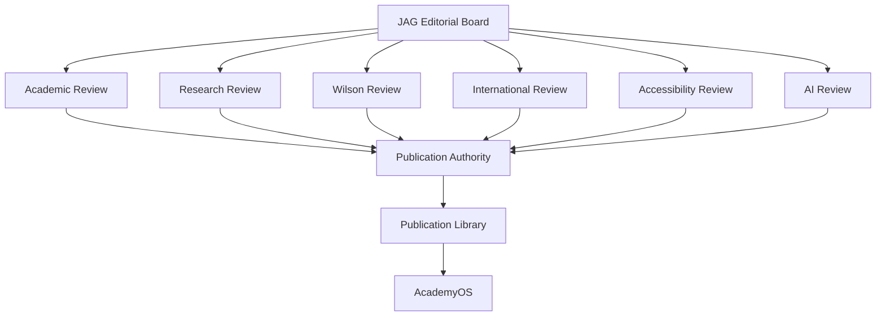

# DOCUMENT 61 — The JAG Knowledge Governance™

**The JAG™ — Knowledge System Foundational Governance**  
**Status:** Permanent Governance Architecture — No Implementation  
**Version:** 1.0  
**Effective:** June 27, 2026  
**Parent:** Document 57 — The JAG Knowledge System™

---

## 1. Charter

**The JAG Knowledge Governance™** defines **who decides, who reviews, and how quality is measured** for every JAG knowledge asset from research through retirement.

Governance ensures The Academy Way philosophy is **preserved in asset quality** while AcademyOS **consumes trusted, auditable knowledge**.

---

## 2. Governance Structure



---

## 3. Editorial Board

| Attribute | Definition |
|-----------|------------|
| **Purpose** | Ultimate accountability for JAG-KS quality and scope |
| **Composition** | JAG Chief Knowledge Officer, domain leads, Academy Way steward, legal/IP, ARI director |
| **Authority** | Approve asset class standards, appoint reviewers, escalate disputes |
| **Cadence** | Monthly asset pipeline review; quarterly domain audits |
| **Decisions** | Authoring priorities, MAJOR revision approval, retirement |

---

## 4. Review Panels

### 4.1 Academic Review

| Element | Scope |
|---------|-------|
| **Purpose** | Pedagogical accuracy, progression logic, age appropriateness |
| **Required for** | Concept Libraries, Competencies, Assessments |
| **Criteria** | Alignment with The Academy Way, ULR integrity, cognitive load |
| **Output** | Academic Review Record — pass / revise / reject |
| **Panel** | Certified educators, instructional scientists |

### 4.2 Research Review

| Element | Scope |
|---------|-------|
| **Purpose** | Evidence base, citation accuracy, claim proportionality |
| **Required for** | Concept enhancement profiles (Doc 52), Research Libraries, MAJOR revisions |
| **Criteria** | Doc 24 standards, no overstated claims |
| **Output** | Research Review Record |
| **Panel** | ARI researchers, external peer reviewers |

### 4.3 Wilson Review

| Element | Scope |
|---------|-------|
| **Purpose** | Structured Literacy fidelity **without** Wilson IP violation |
| **Required for** | All SL assets, Wilson registry references (Doc 13) |
| **Criteria** | Category/Step mapping only; OG principles; **no** copyrighted Wilson content |
| **Output** | Wilson Boundary Compliance Record |
| **Panel** | SL specialists trained on JAG-Wilson boundary policy |

### 4.4 International Review

| Element | Scope |
|---------|-------|
| **Purpose** | Global Education Framework alignment (Docs A–D) |
| **Required for** | Localization Libraries, country packs, culturally sensitive content |
| **Criteria** | Global by Design, Local by Configuration |
| **Output** | International Review Record |
| **Panel** | Regional education leads |

### 4.5 Accessibility Review

| Element | Scope |
|---------|-------|
| **Purpose** | WCAG, UDL, neurodiversity-as-information (VI-D) |
| **Required for** | All published assets, parent/teacher content, AI outputs templates |
| **Criteria** | Readable language, multiple modalities, no deficit framing |
| **Output** | Accessibility Review Record |
| **Panel** | Accessibility specialists, neurodiversity advisors |

### 4.6 AI Review

| Element | Scope |
|---------|-------|
| **Purpose** | AI reasoning profiles, rule keys, explainability, safety |
| **Required for** | AI Reasoning Libraries (Doc 55), coach prompts (Doc 41), metadata (Doc 47) |
| **Criteria** | No hallucination-prone open rules; human override paths; bias check |
| **Output** | AI Review Record |
| **Panel** | AI governance + instructional design |

---

## 5. Concept Library Quality Standard (CLQS)

For **Concept Libraries**, all six review types plus **Editorial Board sign-off** constitute the **8-review gate** (Doc 56):

| # | Review | Document |
|---|--------|----------|
| 1 | Editorial completeness | Doc 56 |
| 2 | Academic | §4.1 |
| 3 | Research | §4.2 |
| 4 | Wilson boundary | §4.3 |
| 5 | International | §4.4 |
| 6 | Accessibility | §4.5 |
| 7 | AI | §4.6 |
| 8 | Editorial Board | §3 |

**Exit:** `published_blueprint` status — eligible for Publication stage (Doc 60).

---

## 6. Quality Metrics

| Metric | Definition | Target |
|--------|------------|--------|
| **Review cycle time** | Authoring → published | Domain SLA TBD |
| **First-pass yield** | Assets passing review without major revision | ≥ 60% |
| **Citation coverage** | Research-backed claims with refs | 100% for cognitive claims |
| **Relationship integrity** | Valid prerequisite DAG | 100% |
| **Wilson compliance** | SL assets with Wilson record | 100% |
| **Accessibility pass rate** | First accessibility review pass | ≥ 90% |
| **Implementation fidelity** | Org-level alignment to published version | Monitored via Org Learning Graph |
| **Defect rate** | Post-publication errata per 1000 assets | < 2 |

---

## 7. Audit Trails

Every JAG asset maintains **immutable audit trail**:

```
JAGAuditTrail
    ├── asset_key
    ├── events[]
    │     ├── event_type        (create | edit | review | validate | publish | retire)
    │     ├── actor_id
    │     ├── actor_role
    │     ├── timestamp
    │     ├── diff_ref          (version diff)
    │     └── review_record_ref (if applicable)
    └── retention               permanent
```

| Requirement | Rule |
|-------------|------|
| **Tamper evidence** | Append-only log |
| **Reviewer identity** | Named on all review records |
| **Version linkage** | Every edit tied to semver candidate |
| **AcademyOS access** | Read-only audit for licensed org auditors |

---

## 8. Version History

| Element | Standard |
|---------|----------|
| **Retention** | All versions permanently archived |
| **Diff visibility** | MAJOR/MINOR changelogs required |
| **Comparison** | Any two publication versions comparable |
| **Learner impact** | Retirement/supersession documented per version |

Version history is **part of JAG IP record** (Doc 58) — not platform-owned.

---

## 9. Publication Authority

| Role | Authority |
|------|-----------|
| **JAG Publication Authority** | Sole power to set status `published` |
| **Delegation** | Domain leads may publish PATCH with pre-authorization |
| **MAJOR publication** | Editorial Board approval required |
| **Emergency retraction** | Publication Authority + Legal — rare |
| **AcademyOS feed** | Enabled only on Publication Authority action |

**No author self-publishes.** No AcademyOS admin publishes JAG assets.

---

## 10. Escalation & Disputes

| Level | Handler |
|-------|---------|
| Review disagreement | Domain lead mediation |
| Wilson boundary dispute | Wilson Review panel + Legal |
| Cross-domain conflict | Editorial Board |
| IP/licensing dispute | JAG Legal + Doc 58 |
| Safety-critical AI issue | Immediate hold — AI Review + Publication Authority |

---

## 11. Relationship to Academy Way Governance

| Academy Way Doc | JAG Governance |
|-----------------|----------------|
| Doc 30 Competency Library Governance | **Subsumed** by JAG Knowledge Governance for IP assets |
| Doc 48 QA Framework | Operational detail under JAG Validation |
| Doc 49 Publishing Pipeline | Executes JAG Publication Authority decisions |
| Doc 56 CLQS | Concept Library gate under §5 |

Academy Way docs remain **authoring standards** — **JAG governance owns publication authority**.

---

## 12. Governance Rules

| Rule | Requirement |
|------|-------------|
| **JAG-GOV-1** | No asset published without required reviews |
| **JAG-GOV-2** | Wilson Review mandatory for all SL assets |
| **JAG-GOV-3** | Audit trail append-only |
| **JAG-GOV-4** | Publication Authority separate from authors |
| **JAG-GOV-5** | Quality metrics reported to Editorial Board quarterly |

---

*End of Document 61 — The JAG Knowledge Governance™*
