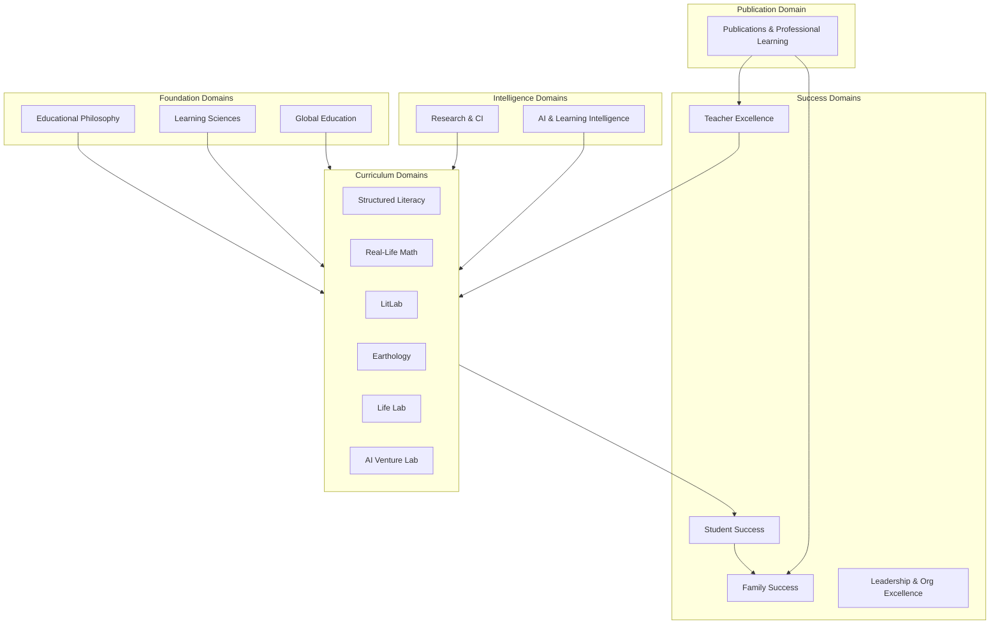

# DOCUMENT 78 — The JAG Knowledge Domains™

**The JAG™ — Knowledge Domains Foundational Organization Standard**  
**Status:** Permanent Domain Architecture — No Implementation  
**Version:** 1.0  
**Effective:** June 27, 2026  
**Parent:** Document 57 — The JAG Knowledge System™  
**Supersedes:** Flat blueprint organization for asset classification

---

## 1. Foundational Directive

> **All present and future knowledge assets shall be organized into permanent Knowledge Domains. Knowledge Domains become the primary organizational structure for every educational, operational, research, AI, governance, and publication asset owned by The JAG.**

| Entity | Role |
|--------|------|
| **The JAG™** | Owns and governs all Knowledge Domains |
| **AcademyOS** | Consumes domain assets under license |
| **The Academy Way™** | Philosophy domain — informs all domains |
| **The Academy schools** | Implementation sites |

**Domain key convention:** `jag.domain.{domain_key}`

---

## 2. Domain Architecture

---

## 3. Domain Catalog

---

### Domain 1 — Educational Philosophy

| Field | Definition |
|-------|------------|
| **domain_key** | `jag.domain.educational_philosophy` |
| **Purpose** | Preserve and govern The Academy Way™ — the philosophical foundation for all JAG knowledge |
| **Mission** | Ensure every asset aligns with mastery, evidence, open entry, PAJ, and human dignity |
| **Scope** | Mastery philosophy, learning journey model, graduation readiness philosophy, constitutional alignment |
| **Knowledge Assets** | Frameworks (Docs 1, 3, 6, 7), philosophy handbooks, policy statements, decision principles |
| **Relationships** | **Informs** all domains; **governed by** JAG Editorial Board (Doc 61) |
| **Future Expansion** | Partner philosophy overlays; licensed school alignment guides |

---

### Domain 2 — Learning Sciences

| Field | Definition |
|-------|------------|
| **domain_key** | `jag.domain.learning_sciences` |
| **Purpose** | Codify instructional science, cognitive science, and neuroscience foundations |
| **Mission** | Ground every instructional asset in evidence-based learning science |
| **Scope** | Instructional framework, learning profile, intervention, assessment science, analytics, cognitive/brain profiles (Docs 18–24, 52–53) |
| **Knowledge Assets** | Frameworks, research summaries, cognitive science profiles, brain development profiles, playbooks |
| **Relationships** | **Informs** all curriculum domains; **feeds** Research & CI domain |
| **Future Expansion** | Domain-specific learning science overlays; ARI validation libraries |

---

### Domain 3 — Structured Literacy

| Field | Definition |
|-------|------------|
| **domain_key** | `jag.domain.structured_literacy` |
| **Purpose** | Canonical literacy knowledge — OG-informed, Wilson-boundary compliant |
| **Mission** | Deliver complete SL knowledge base from phonological awareness through transfer |
| **Scope** | Knowledge map (Doc 38), learning relationships (Doc 39), 16 concept libraries, future competency/skill libraries, SL assessment/AI/parent frameworks (Docs 40–42) |
| **Knowledge Assets** | Knowledge Base, Concept Libraries (51, 62, 84–97), Assessment Framework, AI Coach, Parent Success Framework |
| **Relationships** | **Requires** Learning Sciences, Educational Philosophy; **connects to** LitLab (transfer), Student Success, Family Success |
| **Future Expansion** | Adolescent/adult SL; multilingual literacy packs; partner fidelity libraries |

---

### Domain 4 — Real-Life Math

| Field | Definition |
|-------|------------|
| **domain_key** | `jag.domain.real_life_math` |
| **Purpose** | Mathematics grounded in authentic application and mastery |
| **Mission** | Build numeracy, reasoning, and problem-solving through real-world contexts |
| **Scope** | RLM registry (Doc 14), future knowledge base, concept/competency libraries |
| **Knowledge Assets** | Registry, frameworks, future concept libraries, parent guides, assessment libraries |
| **Relationships** | **Informed by** Learning Sciences; **cross-domain** SL (word problems), Earthology (data), Life Lab |
| **Future Expansion** | Full concept library sequence; financial literacy modules; career math pathways |

---

### Domain 5 — LitLab

| Field | Definition |
|-------|------------|
| **domain_key** | `jag.domain.litlab` |
| **Purpose** | Independent reading, literature, composition, and literary analysis |
| **Mission** | Extend SL foundations into rich literacy experience and expression |
| **Scope** | LitLab registry (Doc 15), future knowledge base, cross-domain transfer from SL |
| **Knowledge Assets** | Registry, frameworks, reading libraries, composition guides, portfolio standards |
| **Relationships** | **Requires** SL transfer/generalization; **connects to** Written Expression, Vocabulary, AI Venture Lab |
| **Future Expansion** | Genre libraries; author studies; digital literacy integration |

---

### Domain 6 — Earthology

| Field | Definition |
|-------|------------|
| **domain_key** | `jag.domain.earthology` |
| **Purpose** | Environmental science, stewardship, and systems thinking |
| **Mission** | Develop ecological literacy and responsible citizenship |
| **Scope** | Earthology registry (Doc 16), future knowledge base, field study frameworks |
| **Knowledge Assets** | Registry, frameworks, project guides, research summaries, parent activities |
| **Relationships** | **Cross-domain** RLM (data), Life Lab (projects), Global Education (locale packs) |
| **Future Expansion** | Climate science libraries; regional biome packs; certification pathways |

---

### Domain 7 — Life Lab

| Field | Definition |
|-------|------------|
| **domain_key** | `jag.domain.life_lab` |
| **Purpose** | Life skills, wellness, citizenship, and practical competence |
| **Mission** | Prepare learners for independent, purposeful adult life |
| **Scope** | Life Lab framework (Doc 5), registry (Doc 17), competency pathways |
| **Knowledge Assets** | Frameworks, playbooks, project libraries, parent guides, assessment rubrics |
| **Relationships** | **Supports** Student Success, Family Success; **connects to** all curriculum domains |
| **Future Expansion** | Career pathways; wellness microcredentials; community service libraries |

---

### Domain 8 — AI Venture Lab

| Field | Definition |
|-------|------------|
| **domain_key** | `jag.domain.ai_venture_lab` |
| **Purpose** | Entrepreneurship, AI literacy, innovation, and venture creation |
| **Mission** | Develop creators who build ethical, purposeful ventures |
| **Scope** | AI Venture Lab framework (Doc 4), registry (Doc 17), venture templates |
| **Knowledge Assets** | Frameworks, venture playbooks, AI ethics guides, pitch rubrics, mentor guides |
| **Relationships** | **Requires** SL/LitLab communication; **connects to** AI & Learning Intelligence, Student Opportunity Engine |
| **Future Expansion** | Industry partner libraries; startup certification; AI tool governance packs |

---

### Domain 9 — Student Success

| Field | Definition |
|-------|------------|
| **domain_key** | `jag.domain.student_success` |
| **Purpose** | Learner journey, opportunity, portfolio, transcript, graduation readiness |
| **Mission** | Ensure every learner progresses toward mastery and meaningful opportunity |
| **Scope** | PAJ (Doc 3), SOE (Doc 9), Digital Portfolio (Doc 10), Mastery Transcript (Doc 11), Graduation Readiness (Doc 7) |
| **Knowledge Assets** | Frameworks, playbooks, rubrics, opportunity libraries, transcript standards |
| **Relationships** | **Consumes** all curriculum domains; **feeds** Family Success, Research & CI |
| **Future Expansion** | Alumni pathways; employer credential libraries; post-secondary readiness packs |

---

### Domain 10 — Family Success

| Field | Definition |
|-------|------------|
| **domain_key** | `jag.domain.family_success` |
| **Purpose** | Family Journey™, parent support, home learning partnership |
| **Mission** | Equip families as co-educators without replacing school instruction |
| **Scope** | Family Journey (Doc 8), parent frameworks (Doc 42, Global Doc C), parent knowledge libraries |
| **Knowledge Assets** | Parent guides, handbooks, activity libraries, coaching cards, academies content |
| **Relationships** | **Supports** all curriculum domains; **aligned with** Global Education, Publications domain |
| **Future Expansion** | Parent academies; multilingual parent packs; family coaching certification |

---

### Domain 11 — Teacher Excellence

| Field | Definition |
|-------|------------|
| **domain_key** | `jag.domain.teacher_excellence` |
| **Purpose** | Educator professional knowledge, fidelity, coaching, and growth |
| **Mission** | Build educator capacity to deliver The Academy Way with fidelity |
| **Scope** | Instructional playbook (Doc 22), teacher guides, fidelity rubrics, PD frameworks (Doc 81) |
| **Knowledge Assets** | Teacher guides, playbooks, look-fors, PD courses, certification manuals, coaching guides |
| **Relationships** | **Implements** all curriculum domains; **feeds** Leadership domain; **published via** Publications domain |
| **Future Expansion** | Wilson fidelity training (boundary-compliant); microcredentials; mentor libraries |

---

### Domain 12 — Leadership & Organizational Excellence

| Field | Definition |
|-------|------------|
| **domain_key** | `jag.domain.leadership_organizational_excellence` |
| **Purpose** | School leadership, operations, governance, and organizational learning |
| **Mission** | Enable Academy schools and partners to operate with excellence and fidelity |
| **Scope** | Competency library governance (Doc 30), org learning graph (Doc 59), handbook framework (Doc 82) |
| **Knowledge Assets** | Administrator guides, policies, handbooks, decision trees, org learning frameworks |
| **Relationships** | **Governs** implementation of all domains; **feeds** Research & CI with org metrics |
| **Future Expansion** | Partner school onboarding; district licensing ops; board governance libraries |

---

### Domain 13 — Research & Continuous Improvement

| Field | Definition |
|-------|------------|
| **domain_key** | `jag.domain.research_continuous_improvement` |
| **Purpose** | ARI research, validation, evidence synthesis, asset improvement |
| **Mission** | Continuously validate and improve JAG knowledge through rigorous research |
| **Scope** | Research framework (Doc 24), research libraries, validation studies, maturity advancement (Doc 83) |
| **Knowledge Assets** | Research summaries, validation reports, ARI findings, improvement tickets |
| **Relationships** | **Validates** all domains; **feeds** Content Lifecycle (Doc 60) continuous improvement |
| **Future Expansion** | Institutional research partnerships; longitudinal outcome libraries |

---

### Domain 14 — Artificial Intelligence & Learning Intelligence

| Field | Definition |
|-------|------------|
| **domain_key** | `jag.domain.ai_learning_intelligence` |
| **Purpose** | AI reasoning, coaching, metadata, decision models, learning intelligence |
| **Mission** | Govern AI-augmented instruction with explainability, safety, and human gates |
| **Scope** | AI coach (Doc 29), AI metadata (Doc 47), AI reasoning profiles (Doc 55), SL AI coach (Doc 41), decision engine rules |
| **Knowledge Assets** | AI reasoning libraries, rule registries, reasoning profiles, explainability templates, AI knowledge packages |
| **Relationships** | **Embeds in** all curriculum domains; **governed by** AI Review (Doc 61) |
| **Future Expansion** | Domain-specific AI coaches; partner AI governance packs; model card libraries |

---

### Domain 15 — Global Education

| Field | Definition |
|-------|------------|
| **domain_key** | `jag.domain.global_education` |
| **Purpose** | Global by Design, Local by Configuration — international readiness |
| **Mission** | Enable AcademyOS and JAG assets to serve any locale without redesign |
| **Scope** | Global Education Framework (Docs A–D), localization libraries, translation libraries, country packs |
| **Knowledge Assets** | Constitutional frameworks, locale overlays, translation packs, international review standards |
| **Relationships** | **Overlays** all domains; **required for** maturity Level 8 Internationalized (Doc 83) |
| **Future Expansion** | Country master licenses; regional compliance libraries; multilingual asset pipelines |

---

### Domain 16 — Publications & Professional Learning

| Field | Definition |
|-------|------------|
| **domain_key** | `jag.domain.publications_professional_learning` |
| **Purpose** | Publish, distribute, and credential JAG knowledge externally and internally |
| **Mission** | Transform JAG assets into books, courses, certifications, and professional learning products |
| **Scope** | Publication framework (Doc 80), professional learning framework (Doc 81), publication libraries |
| **Knowledge Assets** | Books, manuals, courses, certifications, digital libraries, AI knowledge packages |
| **Relationships** | **Publishes from** all domains; **feeds** Teacher Excellence, Family Success, Leadership |
| **Future Expansion** | Commercial catalog; partner white-label publications; conference content pipeline |

---

## 4. Domain Assignment Rules

| Rule | Requirement |
|------|-------------|
| **JAG-KD-1** | Every JAG asset declares exactly one primary `domain_key` |
| **JAG-KD-2** | Cross-domain assets declare `secondary_domains[]` — primary domain owns governance |
| **JAG-KD-3** | New domains require Editorial Board amendment |
| **JAG-KD-4** | Domain completeness tracked via maturity model (Doc 83) |
| **JAG-KD-5** | Concept libraries assign to curriculum domain — not Learning Sciences |

---

## 5. Academy Way Blueprint Migration

| Prior Organization | New Domain |
|--------------------|------------|
| Docs 1–11 | Educational Philosophy + Student Success + Family Success |
| Docs 18–24 | Learning Sciences |
| Docs 38–42, 51, 62, 84–97 | Structured Literacy |
| Docs 14–17 | Respective curriculum domains |
| Docs 57–61, 78–83 | Cross-cutting governance — assign `jag.domain.leadership_organizational_excellence` or domain-specific |

---

## 6. Related Documents

| Document | Scope |
|----------|-------|
| **79** | Asset Classification |
| **80** | Publication Framework |
| **81** | Professional Learning Framework |
| **82** | Handbook Framework |
| **83** | Knowledge Maturity Model |

---

*End of Document 78 — The JAG Knowledge Domains™*
