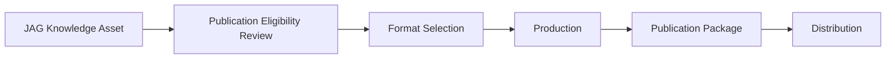

# DOCUMENT 80 — The JAG Publication Framework™

**The JAG™ — Knowledge Domains Foundational Organization Standard**  
**Status:** Permanent Publication Architecture — No Implementation  
**Version:** 1.0  
**Effective:** June 27, 2026  
**Parent:** Document 78 — The JAG Knowledge Domains™ · Document 58 — IP Framework

---

## 1. Foundational Principle

> **Every knowledge asset shall support future publication.**

Publication transforms JAG knowledge from internal governance assets into **books, courses, credentials, and distributed knowledge products** — under JAG IP control (Doc 58).

---

## 2. Publication Pipeline



**Gate:** Minimum maturity Level 7 (Published) for external publication (Doc 83).

---

## 3. Publication Formats

### 3.1 Print & Long-Form

| Format Key | Description | Typical Source Assets |
|------------|-------------|----------------------|
| `pub.book` | Full-length book | Knowledge bases, frameworks, concept libraries (compiled) |
| `pub.teacher_manual` | Classroom implementation manual | Teacher guides, playbooks, IDM profiles |
| `pub.parent_handbook` | Family-facing handbook | Parent guides, Family Journey content |
| `pub.administrator_guide` | Leadership and ops guide | Policies, implementation guides, org frameworks |

### 3.2 Professional Learning

| Format Key | Description | Typical Source Assets |
|------------|-------------|----------------------|
| `pub.professional_learning_course` | Structured PD course | PD guides, training modules (Doc 81) |
| `pub.certification_program` | Credential pathway | Certification manuals, rubrics, assessments |
| `pub.online_course` | Self-paced digital course | Training modules, video scripts, quizzes |

### 3.3 Research & Academic

| Format Key | Description | Typical Source Assets |
|------------|-------------|----------------------|
| `pub.research_paper` | Formal research document | Research summaries, ARI findings |
| `pub.conference_presentation` | Slide deck + speaker notes | Framework excerpts, validation data |
| `pub.journal_article` | Peer-review formatted article | Research summaries with citations |

### 3.4 Digital & Media

| Format Key | Description | Typical Source Assets |
|------------|-------------|----------------------|
| `pub.digital_library` | Searchable digital collection | Concept libraries, reference guides |
| `pub.ai_knowledge_package` | Structured AI-consumable bundle | AI reasoning libraries, rule registries |
| `pub.podcast_series` | Audio episodic content | Philosophy, parent, teacher topics |
| `pub.video_series` | Instructional video sequence | PD modules, parent academies |

---

## 4. Format Metadata Schema

```
PublicationFormatRecord
    ├── format_key
    ├── title
    ├── source_asset_keys[]
    ├── domain_key
    ├── audience[]              teacher | parent | admin | researcher | learner
    ├── license_tier              Doc 58
    ├── version
    ├── isbn_or_identifier        (when applicable)
    ├── locale
    ├── accessibility_standard    WCAG target
    ├── ai_search_enabled         boolean
    └── distribution_channels[]   academyos | partner | commercial | research
```

---

## 5. Publication Eligibility

| Criterion | Requirement |
|-----------|-------------|
| **Maturity** | ≥ Level 7 Published (Doc 83) for external release |
| **Governance** | Publication Authority approval (Doc 61) |
| **IP clearance** | No embedded third-party copyrighted content |
| **Review complete** | Domain-appropriate review panels passed |
| **Accessibility** | Accessibility review for audience-facing formats |
| **Version pin** | Immutable publication package version |

---

## 6. Multi-Format Derivation

One source asset **may** publish in multiple formats:

| Source | Example Publications |
|--------|---------------------|
| SL Concept Library (Doc 84) | Digital library entry, teacher manual chapter, AI knowledge package |
| Teacher Playbook (Doc 22) | Professional learning course, quick guide, video series |
| Family Journey (Doc 8) | Parent handbook, podcast series, online course |

**Rule:** Each format is a **separate publication package** with own version.

---

## 7. Distribution Channels

| Channel | Audience | License |
|---------|----------|---------|
| **AcademyOS internal** | Academy schools | Tier I Academy |
| **Partner SDK/API** | Licensed partners | Tier II–III |
| **Commercial catalog** | External market | Tier IV — explicit agreement |
| **Research repository** | ARI, institutions | Research license |
| **Handbook generation** | Employees, families | Doc 82 dynamic output |

---

## 8. AI Knowledge Packages

| Element | Definition |
|---------|------------|
| **Purpose** | Structured bundles for AcademyOS AI consumption |
| **Contains** | Rule keys, reasoning profiles, concept summaries, decision trees |
| **Not** | Raw LLM weights — JAG owns rules and profiles |
| **Governance** | AI Review required (Doc 61) |
| **Versioning** | Pinned by org — same as other publications |

---

## 9. International Publication

| Dimension | Approach |
|-----------|-------------|
| **Locale packs** | Translation libraries (Doc 57, Domain 15) |
| **Maturity gate** | Level 8 Internationalized for locale-specific external pub |
| **Master + overlay** | English master publication + locale overlay package |

---

## 10. Governance Rules

| Rule | Requirement |
|------|-------------|
| **JAG-PUB-1** | Every asset_class declares eligible `publication_formats[]` |
| **JAG-PUB-2** | External publication requires IP notice on all formats |
| **JAG-PUB-3** | Publication packages immutable — revisions = new version |
| **JAG-PUB-4** | Wilson copyrighted content never in published formats |
| **JAG-PUB-5** | AI knowledge packages require AI Review sign-off |

---

*End of Document 80 — The JAG Publication Framework™*
