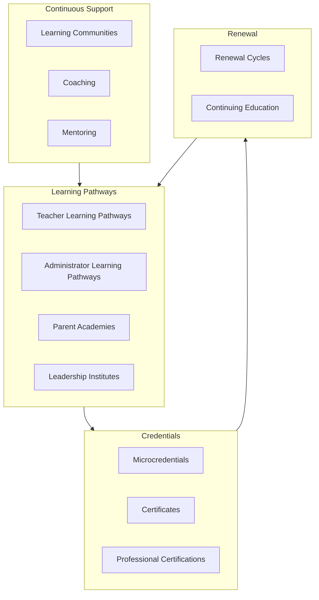

# DOCUMENT 81 — The JAG Professional Learning Framework™

**The JAG™ — Knowledge Domains Foundational Organization Standard**  
**Status:** Permanent Professional Learning Architecture — No Implementation  
**Version:** 1.0  
**Effective:** June 27, 2026  
**Parent:** Document 78 — Knowledge Domains™ · Document 80 — Publication Framework

---

## 1. Charter

**The JAG Professional Learning Framework™ (JAG-PLF)** designs the **complete professional learning ecosystem** for educators, administrators, parents, and leaders implementing The Academy Way.

All PL content is **JAG-owned** — delivered through AcademyOS, publications, and academy sites.

---

## 2. Ecosystem Architecture

---

## 3. Teacher Learning Pathways

| Pathway Key | Audience | Scope | Source Assets |
|-------------|----------|-------|---------------|
| `pl.teacher.foundation` | New Academy teachers | Academy Way philosophy, PAJ, evidence, classroom basics | Docs 1, 3, 6, 18, 22 |
| `pl.teacher.structured_literacy` | Literacy educators | SL fidelity, concept libraries, Wilson boundary | Docs 38–42, 51, 62, 84–97 |
| `pl.teacher.domain.{domain}` | Domain specialists | RLM, LitLab, Earthology, Life Lab, AVL | Domain registries |
| `pl.teacher.intervention` | Intervention staff | Tiers, dosage, EF supports | Docs 20, 54 |
| `pl.teacher.assessment` | Assessment leads | Evidence, probes, mastery validation | Docs 21, 27, 40 |
| `pl.teacher.ai_coach` | All teachers | AI coach usage, human gates, explainability | Docs 29, 41, 47, 55 |

**Structure:** Modules → practice → fidelity observation → credential checkpoint

---

## 4. Administrator Learning Pathways

| Pathway Key | Audience | Scope |
|-------------|----------|-------|
| `pl.admin.implementation` | Principals, ops leads | AcademyOS deployment, registry consumption, version pins |
| `pl.admin.fidelity` | Instructional leaders | Org learning graph, fidelity metrics, PD planning |
| `pl.admin.data` | Data stewards | Analytics, privacy, evidence audit |
| `pl.admin.global` | International admins | Global Education Framework, locale configuration |
| `pl.admin.partner` | Partner school admins | Licensing, branding, compliance |

---

## 5. Parent Academies

| Academy Key | Audience | Content |
|-------------|----------|---------|
| `pl.parent.foundation` | All families | Academy Way for parents, Family Journey, evidence partnership |
| `pl.parent.literacy` | Primary parents | Home literacy support — no Wilson curriculum (Doc 42) |
| `pl.parent.math` | Primary parents | RLM home activities |
| `pl.parent.teen` | Secondary parents | Graduation readiness, opportunity engine, portfolio |
| `pl.parent.global` | International families | Locale-specific parent handbook sections |

**Delivery:** Online course, workshop series, handbook sections (Doc 82)

---

## 6. Leadership Institutes

| Institute Key | Audience | Duration | Outcome |
|---------------|----------|----------|---------|
| `pl.leadership.academy_way` | Aspiring leaders | Multi-day | Academy Way leadership certificate |
| `pl.leadership.instructional` | Instructional directors | Semester | Instructional excellence certification |
| `pl.leadership.research` | ARI fellows | Ongoing | Research collaborator credential |
| `pl.leadership.partner` | Partner executives | Custom | Partner implementation certification |

---

## 7. Credential Types

### 7.1 Microcredentials

| Attribute | Definition |
|-----------|------------|
| **Scope** | Single skill or concept fidelity |
| **Duration** | 2–8 hours |
| **Assessment** | Observation, quiz, or portfolio artifact |
| **Renewal** | 2 years or upon major asset MAJOR version |
| **Example** | `micro.sl.phonemic_awareness_fidelity` |

### 7.2 Certificates

| Attribute | Definition |
|-----------|------------|
| **Scope** | Pathway completion — multi-module |
| **Duration** | 20–40 hours |
| **Assessment** | Capstone + fidelity observation |
| **Renewal** | 3 years + continuing education hours |
| **Example** | `cert.teacher.structured_literacy_foundation` |

### 7.3 Professional Certifications

| Attribute | Definition |
|-----------|------------|
| **Scope** | Full domain or role mastery |
| **Duration** | 80+ hours + practicum |
| **Assessment** | Multi-method validation, org fidelity data |
| **Renewal** | 5 years + CE + fidelity audit |
| **Example** | `profcert.teacher.structured_literacy` |

**Note:** JAG certifications ≠ Wilson WRS certification — separate publisher credential.

---

## 8. Renewal Cycles

| Credential Tier | Renewal Period | Requirements |
|-----------------|----------------|--------------|
| Microcredential | 2 years | 4 CE hours; asset version update module if MAJOR |
| Certificate | 3 years | 12 CE hours; fidelity observation |
| Professional certification | 5 years | 30 CE hours; org audit; practicum update |

**Failure to renew:** Credential marked `lapsed` — AcademyOS may restrict role assignments.

---

## 9. Continuing Education

| CE Source | Credit Value |
|-----------|--------------|
| JAG training modules | 1 CE hour per hour completed |
| JAG conferences | Per session schedule |
| ARI research participation | Approved research CE |
| External PD (approved) | Petition — max 25% of renewal requirement |
| Mentoring / coaching hours | 0.5 CE per hour documented |

---

## 10. Learning Communities

| Community Type | Purpose |
|----------------|---------|
| **Domain PLCs** | Structured Literacy, RLM, etc. — fidelity sharing |
| **Cohort communities** | Pathway cohort discussion |
| **Mentor circles** | New teacher support |
| **Parent communities** | Moderated family support — not diagnosis |
| **Leadership forums** | Admin best practices |
| **Research collaboratives** | ARI practitioner-researcher partnership |

---

## 11. Coaching & Mentoring

| Model | Provider | Focus |
|-------|----------|-------|
| **Instructional coaching** | Certified coach | Fidelity, IDM application, evidence use |
| **AI-augmented coaching** | AcademyOS AI Coach + human | Doc 29 — human gate on Tier 2+ |
| **Peer mentoring** | Experienced teacher | Classroom routines, culture |
| **Leadership mentoring** | Admin mentor | Implementation, org learning |
| **Parent coaching** | Family success staff | Home partnership — not tutoring proprietary curriculum |

---

## 12. Asset Classification Mapping (Doc 79)

| PL Deliverable | Asset Class |
|----------------|-------------|
| Pathway curriculum | `training_module`, `professional_development_guide` |
| Credential requirements | `certification_manual` |
| Capstone rubric | `rubric` |
| Published course | `publication` — `pub.professional_learning_course` |

---

## 13. Governance Rules

| Rule | Requirement |
|------|-------------|
| **JAG-PLF-1** | All credentials map to JAG knowledge assets — not platform features |
| **JAG-PLF-2** | SL credentials include Wilson boundary training |
| **JAG-PLF-3** | Parent academies never teach proprietary Wilson content |
| **JAG-PLF-4** | Renewal tied to asset version pins where applicable |
| **JAG-PLF-5** | CE tracked as JAG records — AcademyOS displays |

---

*End of Document 81 — The JAG Professional Learning Framework™*
