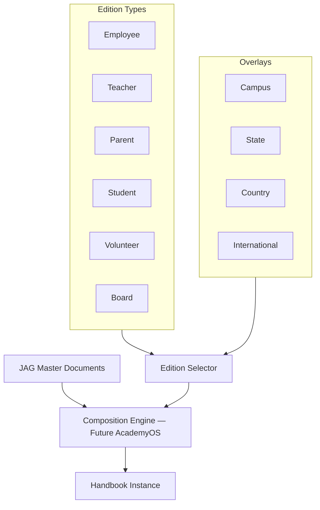

# DOCUMENT 82 — The JAG Handbook Framework™

**The JAG™ — Knowledge Domains Foundational Organization Standard**  
**Status:** Permanent Handbook Architecture — No Implementation  
**Version:** 1.0  
**Effective:** June 27, 2026  
**Parent:** Document 78 — Knowledge Domains™ · Document 80 — Publication Framework

---

## 1. Charter

**The JAG Handbook Framework™ (JAG-HBF)** designs **intelligent handbook generation** from JAG master documents. Handbooks are **dynamic compositions** — not static copies — assembled from governed source sections with version control, translation, and AI search.

---

## 2. Generation Architecture



**Ownership:** Master sections are JAG IP. Generated handbook instances are licensed outputs.

---

## 3. Handbook Types

| Handbook Key | Primary Audience | Master Source Domains |
|--------------|------------------|----------------------|
| `handbook.employee` | All staff | Leadership, Teacher Excellence, Policies |
| `handbook.teacher` | Educators | Teacher Excellence, Curriculum domains, SL/RLM guides |
| `handbook.parent` | Families | Family Success, Parent guides, Family Journey |
| `handbook.student` | Learners | Student Success, age-appropriate policies |
| `handbook.volunteer` | Volunteers | Leadership, safety policies |
| `handbook.board` | Board members | Leadership, governance, constitutional docs |

---

## 4. Edition Overlays

| Overlay Key | Applies | Content |
|-------------|---------|---------|
| `overlay.campus.{id}` | Campus-specific | Local contacts, schedules, facilities, campus policies |
| `overlay.state.{code}` | US state | State compliance, reporting, homeschool law notes |
| `overlay.country.{code}` | Country | Legal, data residency notes, cultural configuration |
| `overlay.international` | Non-US default | Global Education Framework defaults |

**Rule:** Overlays **extend** master — never override JAG canonical instructional content without amendment.

---

## 5. Handbook Section Schema

Every handbook section **shall** support:

```
HandbookSection
    ├── section_key
    ├── title
    ├── audience[]                    employee | teacher | parent | student | volunteer | board
    ├── content_ref                   JAG source asset_key
    ├── section_type                  policy | training | acknowledgement | faq | reference
    ├── policy_metadata               (if policy — authority, effective, supersession)
    ├── training_metadata             (if training — module ref, CE credit, completion)
    ├── acknowledgement_required      boolean
    ├── acknowledgement_text
    ├── ai_search_indexed             boolean — default true
    ├── translation_keys[]            locale pack refs
    ├── version_history_ref           Doc 61 audit
    ├── related_policies[]            cross-links
    ├── related_training[]            cross-links
    ├── faq_entries[]                 structured Q&A
    ├── overlay_applicability[]       campus | state | country filters
    └── maturity_level                Doc 83 — min Level 7 for handbook inclusion
```

---

## 6. Section Capabilities

### 6.1 Policy

| Element | Requirement |
|---------|-------------|
| **Authority** | Named policy owner |
| **Effective date** | Versioned |
| **Supersession** | Links to prior policy section |
| **Acknowledgement** | Required for binding policies |

### 6.2 Training

| Element | Requirement |
|---------|-------------|
| **Module link** | JAG training_module asset |
| **Completion tracking** | AcademyOS records — schema future |
| **CE credit** | Per Doc 81 when applicable |

### 6.3 Acknowledgement

| Element | Requirement |
|---------|-------------|
| **Required signatures** | Employee, parent, student (age-appropriate), volunteer |
| **Re acknowledgement** | On MAJOR handbook version or policy change |
| **Audit trail** | Append-only — Doc 61 |

### 6.4 AI Search

| Element | Requirement |
|---------|-------------|
| **Indexed content** | Section body + FAQ + related links |
| **Scope** | Audience-filtered — parents cannot search employee-only sections |
| **Explainability** | AI cites section_key and version |
| **Human escalation** | Contact path for policy questions |

### 6.5 Translation

| Element | Requirement |
|---------|-------------|
| **Master language** | English — Global by Design |
| **Locale packs** | Translation libraries (Domain 15) |
| **Fallback** | English when translation pending — with notice |

### 6.6 Version History

| Element | Requirement |
|---------|-------------|
| **Diff visibility** | Section-level changelog |
| **User notification** | Re-acknowledgement on material change |
| **Archive** | All prior versions retained |

### 6.7 Related Policies & FAQ

| Element | Requirement |
|---------|-------------|
| **Cross-links** | Bidirectional where applicable |
| **FAQ** | Plain-language summaries per section |
| **Search optimization** | FAQ indexed for AI search |

---

## 7. Composition Rules

| Rule | Definition |
|------|------------|
| **Include** | Section matches audience + overlay filters + maturity ≥ 7 |
| **Exclude** | Retired sections — show supersession notice only |
| **Order** | Domain-defined handbook templates per type |
| **Branding** | JAG / Academy Way / school overlay hierarchy |

---

## 8. Publication Mapping (Doc 80)

| Handbook | Publication Formats |
|----------|---------------------|
| Parent | `pub.parent_handbook`, `pub.digital_library` |
| Teacher | `pub.teacher_manual`, `pub.digital_library` |
| Employee | `pub.administrator_guide` (internal), print on demand |
| All | AI search index as `pub.ai_knowledge_package` subset |

---

## 9. Governance Rules

| Rule | Requirement |
|------|-------------|
| **JAG-HBF-1** | Handbook sections are JAG assets — not school-authored ad hoc |
| **JAG-HBF-2** | Campus overlays cannot weaken instructional standards |
| **JAG-HBF-3** | Policy sections require Legal + Publication Authority |
| **JAG-HBF-4** | AI search respects audience boundaries |
| **JAG-HBF-5** | International editions require International Review (Doc 61) |

---

*End of Document 82 — The JAG Handbook Framework™*
