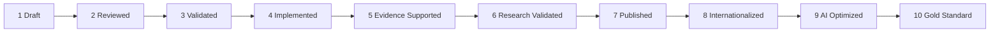

# DOCUMENT 83 — The JAG Knowledge Maturity Model™

**The JAG™ — Knowledge Domains Foundational Organization Standard**  
**Status:** Permanent Maturity Architecture — No Implementation  
**Version:** 1.0  
**Effective:** June 27, 2026  
**Parent:** Document 60 — Content Lifecycle™ · Document 78 — Knowledge Domains™

---

## 1. Charter

**The JAG Knowledge Maturity Model™ (JAG-KMM)** defines **ten maturity levels** for every JAG knowledge asset. Maturity is **independent of lifecycle status** (Doc 60) but **aligned** — higher maturity requires lifecycle gates.

**Maturity key on every asset:** `maturity_level` (1–10)

---

## 2. Maturity Scale Overview

```
Level 1  Draft
Level 2  Reviewed
Level 3  Validated
Level 4  Implemented
Level 5  Evidence Supported
Level 6  Research Validated
Level 7  Published
Level 8  Internationalized
Level 9  AI Optimized
Level 10 Gold Standard
```



---

## 3. Level Definitions & Advancement Criteria

### Level 1 — Draft

| Element | Definition |
|---------|------------|
| **Meaning** | Initial authoring in progress |
| **Lifecycle alignment** | `draft`, `authoring` |
| **Advancement criteria** | Authoring complete per template; self-check passed; metadata populated; assigned to domain |
| **Authority** | Author |
| **Exit artifact** | Complete draft record |

---

### Level 2 — Reviewed

| Element | Definition |
|---------|------------|
| **Meaning** | Required review panels completed |
| **Lifecycle alignment** | `in_review` |
| **Advancement criteria** | All required reviews passed (Doc 61); revision cycles complete; CLQS for concept libraries (Doc 56) |
| **Authority** | Editorial Board delegate |
| **Exit artifact** | Review records bundle |

---

### Level 3 — Validated

| Element | Definition |
|---------|------------|
| **Meaning** | Technical and pedagogical validation complete |
| **Lifecycle alignment** | `validated` |
| **Advancement criteria** | Schema validation; relationship integrity; prerequisite DAG check; QA certificate (Doc 48) |
| **Authority** | JAG QA function |
| **Exit artifact** | Validation certificate |

---

### Level 4 — Implemented

| Element | Definition |
|---------|------------|
| **Meaning** | Consumed by at least one Academy implementation site via AcademyOS |
| **Lifecycle alignment** | `published` + `implemented` |
| **Advancement criteria** | Registry sync live; ≥ 1 org version pin active; educator PD delivered; fidelity observation initiated |
| **Authority** | Implementation lead + Publication Authority |
| **Exit artifact** | Implementation record |

---

### Level 5 — Evidence Supported

| Element | Definition |
|---------|------------|
| **Meaning** | Implementation produces learner evidence confirming asset usability |
| **Advancement criteria** | ≥ 1 pilot cohort; evidence bundles collected per Doc 27; mastery decisions recorded; no critical defect reports; usability feedback incorporated |
| **Authority** | Domain lead + QA |
| **Exit artifact** | Evidence support report |

---

### Level 6 — Research Validated

| Element | Definition |
|---------|------------|
| **Meaning** | ARI or approved study validates instructional claims |
| **Advancement criteria** | Research Review passed; validation study complete or meta-analysis cited; claims proportionate to evidence; Research Graph edge `validates` (Doc 59) |
| **Authority** | ARI director + Editorial Board |
| **Exit artifact** | Research validation record |

---

### Level 7 — Published

| Element | Definition |
|---------|------------|
| **Meaning** | External-quality publication package released |
| **Lifecycle alignment** | `published` — Doc 60 |
| **Advancement criteria** | Publication Authority approval; immutable package in Publication Library; IP notice; eligible formats declared (Doc 80); handbook inclusion enabled (Doc 82) |
| **Authority** | JAG Publication Authority |
| **Exit artifact** | `jag.publication.{asset}.{version}` |

---

### Level 8 — Internationalized

| Element | Definition |
|---------|------------|
| **Meaning** | Locale overlays and translations available for target markets |
| **Advancement criteria** | International Review passed; ≥ 1 locale pack complete; translation QA; Global Education alignment (Docs A–D); no cultural harm review flags |
| **Authority** | Global Education domain lead |
| **Exit artifact** | Locale publication packages |

---

### Level 9 — AI Optimized

| Element | Definition |
|---------|------------|
| **Meaning** | AI reasoning profiles complete, tested, and explainability verified |
| **Advancement criteria** | AI Review passed; rule keys unique and documented; human override paths defined; AI knowledge package published; pilot AI coach usage without safety incidents |
| **Authority** | AI governance panel |
| **Exit artifact** | AI optimization record + `pub.ai_knowledge_package` |

---

### Level 10 — Gold Standard

| Element | Definition |
|---------|------------|
| **Meaning** | Exemplar asset for domain — reference for all similar assets |
| **Advancement criteria** | Levels 1–9 complete; Editorial Board designation; used as template (e.g., Doc 51); cross-domain citation; ≥ 2 years implemented without MAJOR errata; maturity maintained on renewal audit |
| **Authority** | JAG Editorial Board |
| **Exit artifact** | Gold Standard designation record |
| **Note** | Not all assets reach Level 10 — designation is selective |

---

## 4. Maturity by Asset Class

| Asset Class | Typical Target | Minimum for Production |
|-------------|----------------|------------------------|
| Concept Library | Level 10 (gold exemplars) | Level 7 Published |
| Competency Library | Level 7 | Level 7 |
| Atomic Skill Library | Level 7 | Level 7 |
| Framework | Level 7 | Level 3 Validated |
| Teacher Guide | Level 7 | Level 5 |
| Policy | Level 7 | Level 7 |
| Handbook section | Level 7 | Level 7 |
| AI Reasoning Library | Level 9 | Level 9 for production AI |
| Research Summary | Level 6 | Level 6 for citation in assets |

---

## 5. Regression & Demotion

| Trigger | Action |
|---------|--------|
| Critical safety defect | Hold at current level — fix required |
| MAJOR errata post-publication | May demote to Level 3 until re-validated |
| Research contradiction | Review at Level 6 — may require revision |
| License violation | Publication hold — Level 7 suspended |
| Failed renewal audit (credentials) | Related assets flagged — not demoted automatically |

**Rule:** Demotion requires Publication Authority + Editorial Board notification.

---

## 6. Domain Completeness Metrics

| Domain | Completeness Indicator |
|--------|------------------------|
| Structured Literacy | 16 concept libraries ≥ Level 7; KB ≥ Level 10 |
| Each curriculum domain | Knowledge base ≥ Level 7; ≥ 1 concept library ≥ Level 7 |
| Teacher Excellence | Core pathways ≥ Level 7 |
| Publications | ≥ 1 format per major asset class published |

---

## 7. Integration with Other Frameworks

| Framework | Integration |
|-----------|-------------|
| **Doc 60 Lifecycle** | Lifecycle status gates maturity advancement |
| **Doc 61 Governance** | Reviews required at Levels 2, 3, 6, 7, 8, 9 |
| **Doc 80 Publication** | Level 7+ for external publication |
| **Doc 81 PL** | Credentials require source assets ≥ Level 7 |
| **Doc 82 Handbook** | Sections require ≥ Level 7 |

---

## 8. Governance Rules

| Rule | Requirement |
|------|-------------|
| **JAG-KMM-1** | Every asset declares current maturity_level |
| **JAG-KMM-2** | Advancement requires exit artifact — no skip levels |
| **JAG-KMM-3** | Level 10 designation is Editorial Board only |
| **JAG-KMM-4** | Production AcademyOS feed requires ≥ Level 7 for instructional assets |
| **JAG-KMM-5** | Maturity history append-only — Doc 61 audit |

---

*End of Document 83 — The JAG Knowledge Maturity Model™*
