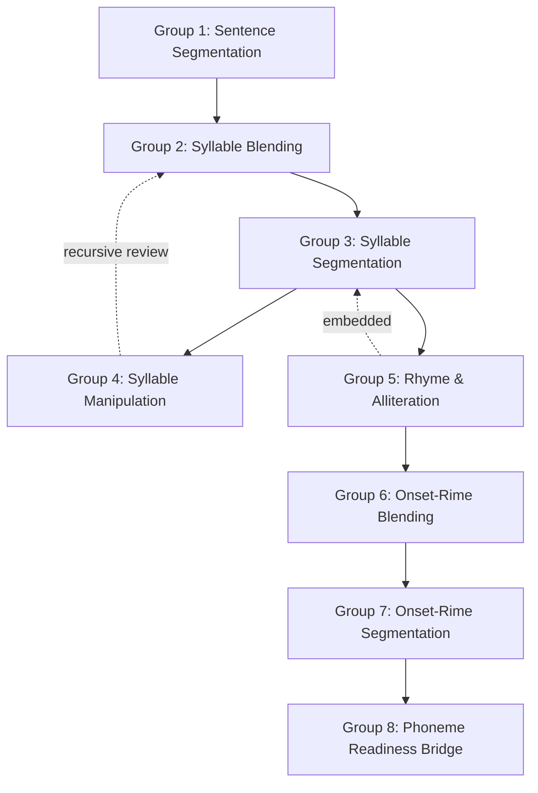

# DOCUMENT 98 — Foundational Phonological Awareness Competency Library™

**The JAG™ — Phase 4.3 · Structured Literacy**  
**Library Key:** `competency_library.foundational_phonological_awareness`  
**Concept Source:** `SL-CONCEPT-PHONOLOGICAL_AWARENESS` (Document 51)  
**Domain:** `jag.domain.structured_literacy` · `domain.structured_literacy`  
**Strand:** `domain.structured_literacy.strand.phonological_awareness`  
**Version:** 1.0.0  
**Status:** Reference Implementation — Gold Standard Exemplar  
**Authority:** First production-quality Competency Library in The JAG Knowledge System™  
**Schema:** Document 25 — Canonical Competency Specification™  
**Authoring Process:** Documents 43–50 · Enhancement Profiles 52–56  
**Governance:** Documents 57–61, 78–83 · Document 30

---

## Constitutional & Content Boundaries

| Rule | Requirement |
|------|-------------|
| **No Wilson copyrighted content** | No lesson scripts, manuals, worksheets, or proprietary assessments |
| **Permitted sources** | Educational science, Orton-Gillingham principles, publicly available research, Academy Way instructional philosophy |
| **Neurodiversity framing** | Learning profile information — not diagnostic identity |
| **Atomic Skills** | **Not authored** — placeholder references only (Document 44 namespace) |
| **Scope limit** | Foundational Phonological Awareness only — no additional concept areas |

---

## Part I — Library Charter

### 1. Purpose

This Competency Library is the **first production-quality competency population** in The JAG Knowledge System™. It establishes the **permanent authoring pattern** every future competency library must follow.

| Stakeholder | Purpose |
|-------------|---------|
| **Learner** | Observable, mastery-based phonological awareness outcomes — foundation for reading and spelling |
| **Educator** | Explicit, sequential PA competencies aligned to evidence and Orton-Gillingham-informed instruction |
| **Parent** | Plain-language understanding of what their child is learning and how to reinforce at home |
| **Platform (AcademyOS)** | Canonical ULR competency records for PAJ, KEE, AIC, SIE, GRE, Portfolio, Transcript |
| **The JAG™** | Permanent instructional knowledge asset — licensed for consumption, not platform-owned |
| **Research & PD** | Replicable competency definitions for outcome studies and professional learning |

Phonological awareness instruction exists to **prevent and remediate reading difficulty** by establishing sound-structure competence before and alongside print instruction (Document 51).

---

### 2. Scope

**In scope:**

- All competencies derived from Document 51 progression stages 1–8
- Sentence segmentation through phonemic-awareness bridge
- Rhyme and alliteration embedded across syllable and onset-rime stages
- Full Document 25 schema on every competency record
- AI metadata per Document 47
- Cross-domain connections per Document 46
- Placeholder Atomic Skill Library references per Document 44

**Out of scope:**

- Phonemic awareness competencies (Phonemic Awareness Competency Library — future)
- Alphabetic principle, decoding, encoding, and downstream SL libraries
- Atomic Skill population (Phase 4.3A — future)
- Assessment item authoring (Document 26 — future)
- Instructional resource text (Document 28 — future)

---

### 3. Competency Architecture

```
The JAG Knowledge System™
    └── jag.domain.structured_literacy
            └── Knowledge Base (Docs 38–42)
                    └── Concept Library: Phonological Awareness (Doc 51)
                            └── Competency Library (THIS DOCUMENT — Doc 98)
                                    └── Atomic Skill Library (FUTURE — placeholders only)
```

| Layer | Object | Count |
|-------|--------|-------|
| **Concept** | `SL-CONCEPT-PHONOLOGICAL_AWARENESS` | 1 |
| **Competency Groups** | 8 functional groups (Doc 51 §45) | 8 |
| **Competencies** | Full CCS records | **24** |
| **Atomic Skill Libraries** | Placeholder groups | 24 groups (~40–55 skills estimated) |

**Competency ID convention:** `AW-SL-PA-{SEQ}-v{semver}`  
**Atomic Skill placeholder convention:** `AW-SL-PA-{COMP-SEQ}-AS-{SKILL-SEQ}-v1.0.0` (future)

---

### 4. Competency Sequencing

Primary progression type: **Linear** with **Recursive** cumulative review (Documents 45, 51 §4.2).



**Sequencing rules:**

| Rule | Requirement |
|------|-------------|
| **PA-SEQ-1** | Sentence segmentation precedes syllable work |
| **PA-SEQ-2** | Syllable blending precedes syllable segmentation |
| **PA-SEQ-3** | Syllable segmentation stable before manipulation |
| **PA-SEQ-4** | Rhyme discrimination embedded from Stage 2; formalized in Group 5 |
| **PA-SEQ-5** | Onset-rime blending precedes onset-rime segmentation |
| **PA-SEQ-6** | All Group 7 competencies at L3 before Group 8 handoff |
| **PA-SEQ-7** | Recursive review of prior groups every 2–3 sessions (SIE) |
| **PA-SEQ-8** | Age is guidance only — placement uses evidence (Doc 6, 51 §4.1) |

---

### 5. Developmental Progression

*Guidance only — not enrollment gates (CCS-4, CL-PA-5).*

| Stage | Competency Group | Typical Capability | Competency Keys |
|-------|------------------|-------------------|-----------------|
| **1** | Sentence Segmentation | Clap/count words in sentences | PA-001, PA-002 |
| **2** | Syllable Blending | Combine spoken syllables into words | PA-003, PA-004, PA-005 |
| **3** | Syllable Segmentation | Separate words into syllables | PA-006, PA-007, PA-008 |
| **4** | Syllable Manipulation | Delete/add/substitute syllables | PA-009, PA-010, PA-021 |
| **5** | Rhyme & Alliteration | Recognize, produce, discriminate rhyme | PA-011, PA-012, PA-013, PA-018 |
| **6** | Onset-Rime Blending | Blend onset + rime orally | PA-014, PA-015 |
| **7** | Onset-Rime Segmentation | Split onset from rime | PA-016, PA-017, PA-023 |
| **8** | Phoneme Readiness | Bridge to Phonemic Awareness library | PA-019, PA-020, PA-024 |

| Age Band (Guidance) | Typical Entry Point |
|---------------------|---------------------|
| 3–4 | Rhyme enjoyment; emerging syllable play |
| 4–5 | Syllable segmentation with support |
| 5–6 | Onset-rime with instruction |
| 6–7 | Consolidation; phoneme readiness |
| 7+ | Instructional response at evidence-identified gap — not retention |

---

### 6. Estimated Competency Count

| Category | Count |
|----------|-------|
| **Authored in this document** | 24 competencies |
| **Competency groups** | 8 |
| **Prerequisite graph depth** | 8 levels |
| **Cross-domain links (library total)** | 12 canonical links |
| **Future atomic skills (estimated)** | 40–55 across 24 skill groups |
| **Future assessment instruments (estimated)** | 8 instrument groups (Doc 51 §47) |

---

### 7. Future Atomic Skill Library Placeholders

Atomic Skills are **not authored** in this document. Each competency declares `future_atomic_skill_refs[]` — placeholder keys for Phase 4.3A population.

| Skill Library Group Key | Parent Competency | Est. Skills | Status |
|-------------------------|-------------------|-------------|--------|
| `pa.skill.sentence.segment.5word` | AW-SL-PA-001 | 3–4 | PLACEHOLDER |
| `pa.skill.sentence.count.words` | AW-SL-PA-002 | 2–3 | PLACEHOLDER |
| `pa.skill.syllable.blend.2syllable` | AW-SL-PA-003 | 3–5 | PLACEHOLDER |
| `pa.skill.syllable.blend.3syllable` | AW-SL-PA-004 | 3–5 | PLACEHOLDER |
| `pa.skill.syllable.blend.multisyllable` | AW-SL-PA-005 | 3–5 | PLACEHOLDER |
| `pa.skill.syllable.identify.count` | AW-SL-PA-006 | 2–4 | PLACEHOLDER |
| `pa.skill.syllable.segment.2syllable` | AW-SL-PA-007 | 3–5 | PLACEHOLDER |
| `pa.skill.syllable.segment.3plus` | AW-SL-PA-008 | 3–5 | PLACEHOLDER |
| `pa.skill.syllable.delete` | AW-SL-PA-009 | 3–4 | PLACEHOLDER |
| `pa.skill.syllable.add` | AW-SL-PA-010 | 3–4 | PLACEHOLDER |
| `pa.skill.rhyme.identify` | AW-SL-PA-011 | 2–4 | PLACEHOLDER |
| `pa.skill.rhyme.produce` | AW-SL-PA-012 | 2–4 | PLACEHOLDER |
| `pa.skill.rhyme.discriminate` | AW-SL-PA-013 | 2–4 | PLACEHOLDER |
| `pa.skill.onset_rime.blend.single` | AW-SL-PA-014 | 4–6 | PLACEHOLDER |
| `pa.skill.onset_rime.blend.cluster` | AW-SL-PA-015 | 4–6 | PLACEHOLDER |
| `pa.skill.onset_rime.segment.single` | AW-SL-PA-016 | 4–6 | PLACEHOLDER |
| `pa.skill.onset_rime.segment.cluster` | AW-SL-PA-017 | 4–6 | PLACEHOLDER |
| `pa.skill.alliteration.identify` | AW-SL-PA-018 | 2–3 | PLACEHOLDER |
| `pa.skill.phoneme.isolate.initial` | AW-SL-PA-019 | 3–5 | PLACEHOLDER |
| `pa.skill.pa.integrated.review` | AW-SL-PA-020 | 4–6 | PLACEHOLDER |
| `pa.skill.syllable.substitute` | AW-SL-PA-021 | 3–4 | PLACEHOLDER |
| `pa.skill.syllable.count.explicit` | AW-SL-PA-022 | 2–3 | PLACEHOLDER |
| `pa.skill.onset_rime.manipulate` | AW-SL-PA-023 | 3–5 | PLACEHOLDER |
| `pa.skill.pa.capstone.handoff` | AW-SL-PA-024 | 3–4 | PLACEHOLDER |

**Publish rule:** Competency library must reach `published` before any child Atomic Skill publishes (Document 25 §5).

---

## Part II — Library-Wide Standards

### Shared Instructional Parameters

| Parameter | Value | Source |
|-----------|-------|--------|
| Session duration | 10–15 minutes PA-focused | Doc 51 §34 |
| Frequency | 4–5× per week when PA is active target | Doc 51 §34 |
| Group size default | Pairs or small group (3–6) | Doc 51 §34 |
| Review ratio | 70% new : 30% cumulative review | Doc 51 §C |
| Mastery probe threshold | ≥ 4/5 trials | Doc 51 §D |
| Evidence bundle (L3) | ≥ 2 types; ≥ 1 educator-sourced; confidence ≥ 0.75 | Doc 51 §52 |
| EF demand (library default) | Moderate | Doc 51 §9 |
| Wilson session metadata | PA may precede WRS block — link only, no proprietary content | Doc 25 §7 |

### Shared Research Sources

| Key | Source | Application |
|-----|--------|-------------|
| `research.sl.pa.nrp2000` | National Reading Panel (2000) | Explicit PA instruction effectiveness |
| `research.sl.pa.og_principles` | Orton-Gillingham instructional literature | Sequential, cumulative, multisensory delivery |
| `research.sl.pa.meta_analytic` | Meta-analyses on PA → reading | Dosage and systematic delivery |
| `research.sl.pa.dyslexia` | Dyslexia research literature | Intensive response for PA deficits |
| `research.sl.pa.multilingual` | Cross-linguistic PA transfer research | Multilingual strength framing |
| `research.sl.pa.working_memory` | Cognitive load / WM literature | Session length, chunking |

### Shared Graduation & Transcript Defaults

| Field | Library Default |
|-------|-----------------|
| `graduation_readiness_domain_keys[]` | `readiness.academic.literacy` (indirect — via decoding pathway) |
| `graduation_weight` | 0.05 (foundational internal — not graduation gate alone) |
| `transcript_eligible` | false (foundational internal progress) |
| `readiness_narrative` | "Demonstrates foundational phonological awareness skills supporting literacy development" |
| `portfolio_eligible` | true (optional foundational artifacts) |

### Teacher Guidance Framework (Document 42 · Document 18)

| Principle | Guidance |
|-----------|----------|
| **Delivery** | Explicit, sequential, cumulative — one PA task type per micro-block; model before independent response |
| **Session design** | 10–15 min PA burst; 3–5 min recursive review of prior competencies each session |
| **Pacing** | 70% new competency : 30% review; advance on evidence (≥ 4/5), not calendar |
| **Grouping** | Default pairs/small group (3–6); homogeneity by PA stage; 1:1 for Tier 3 or EF shutdown |
| **Observation** | Use teacher look-fors on each competency; calibrate with colleague quarterly |
| **Intervention** | Flat probe 3 sessions → Tier 2 review; never skip prerequisite competencies |
| **Print boundary** | PA is oral — do not require letter knowledge for PA evidence |
| **Wilson context** | PA may precede WRS block — fidelity metadata only; no proprietary lesson delivery |
| **Multilingual** | PA practice in home language strengthens metalinguistic skill — strength framing |
| **Documentation** | Record probe scores + observation checklist; link evidence to competency_key |

**Playbook reference:** `playbook.sl.pa.v1.0.0` (Document 22)  
**Intervention reference:** Documents 18, 20 — `intervention.tier1_boost`, `intervention.tier2_plan`, `intervention.micro.reteach`

### Parent Guidance Framework (Document 42)

| Principle | Guidance |
|-----------|----------|
| **Role** | Reinforce and observe — parents are **not** primary PA instructors |
| **Capacity** | 5–10 min/day supplementary play; stop before fatigue |
| **Activities** | Rhyme time, syllable clapping (name, objects), rhythmic read-aloud, sound listening walk |
| **Language** | Plain language — "play with word parts" not technical jargon |
| **Evidence weight** | Home logs supplementary (max 0.55 confidence alone); teacher verifies for mastery |
| **Celebration** | Acknowledge L3 milestones — strength-based messaging |
| **Boundaries** | Do not diagnose dyslexia; escalate struggles to teacher via home log |
| **Multilingual** | Rhyme and syllable play in any language counts — bridge to English with teacher coordination |
| **EF support** | Short bursts; visual routine card; movement breaks between games |

**Activity registry (future):** `pa.parent.rhyme_time`, `pa.parent.syllable_clap`, `pa.parent.sound_walk`, `pa.parent.read_aloud_rhythm` (Document 51 §49)

### Executive Function Considerations (Library-Wide)

| EF Component | PA Demand | Support Strategy |
|--------------|-----------|------------------|
| Working memory | High on blend/manipulation | Chunk units; tap-track; reduce inter-stimulus interval |
| Attention | High — sustained auditory | 10–15 min max; 2-min break per 10 min for high-EF profiles |
| Task initiation | Moderate | Preview task; visual schedule; first trial modeled |
| Cognitive flexibility | Moderate on mixed review | Label task type initially; fade labels |
| Inhibition | Moderate — avoid guessing | Wait for full prompt; accept "think time" |

**Default `executive_function_demand`:** moderate (sentence/rhyme) → high (multisyllabic blend, manipulation, capstone)

---

## Part III — Competency Records

*Every record satisfies Document 25 §4 in full. Status: `draft` pending Doc 48 QA and Doc 49 publishing pipeline.*

**Record format:** Competencies **AW-SL-PA-001** and **AW-SL-PA-024** are fully expanded gold-standard exemplars. Competencies **002–023** contain all required schema fields; shared library defaults (Part II) apply unless overridden. Every record includes: identity, relationships, mastery definition, diagnostics, teacher/parent guidance (look-fors), EF/accommodations/differentiation, assessment/evidence, outcomes, instructional linkage, AI metadata, scheduling metadata, cross-domain connections, and future atomic skill references.

---

### Competency AW-SL-PA-001-v1.0.0 — Segment Spoken Sentences into Words

#### 4.1 Identity & Taxonomy

| Field | Value |
|-------|-------|
| `competency_key` | `AW-SL-PA-001-v1.0.0` |
| `version` | 1.0.0 |
| `status` | draft |
| `learning_domain_key` | `domain.structured_literacy` |
| `strand_key` | `domain.structured_literacy.strand.phonological_awareness` |
| `sub_strand_key` | `domain.structured_literacy.sub_strand.sentence_awareness` |
| `concept_keys[]` | `SL-CONCEPT-PHONOLOGICAL_AWARENESS`, `SL-CONCEPT-LANGUAGE_PROCESSING` |
| `competency_group_key` | `pa.competency.sentence_segmentation` |
| `title` | Segment Spoken Sentences into Words |
| `title_educator` | Sentence Segmentation — Word Boundary Identification |
| `description` | The learner hears a spoken sentence and identifies each word as a separate unit by clapping, tapping, or counting aloud. This competency establishes the largest phonological unit — the word — as distinct from sentences and syllables. Instruction is oral and auditory; print is not required. |
| `purpose` | Establish word-level awareness as the entry point to phonological analysis — prerequisite for all syllable and onset-rime work. |
| `why_it_matters` | Before children can play with sounds inside words, they must hear that sentences are made of separate words. This skill supports later reading (parsing written sentences) and clear oral communication. |
| `why_it_matters_educator` | Word segmentation is Stage 1 in the OG-informed PA sequence; skipping it produces downstream guessing in syllable tasks. |
| `developmental_notes` | Emerges with explicit instruction and rhyme/song play. Some learners consolidate quickly; others need extended guided practice. Not an age gate. |
| `suggested_developmental_range` | `{ ageMin: 3, ageMax: 7, gradeBandOptional: "PreK–1" }` |
| `research_sources[]` | `research.sl.pa.nrp2000`, `research.sl.pa.og_principles` |

#### 4.2 Relationships & Progression

| Field | Value |
|-------|-------|
| `prerequisite_competency_keys[]` | `[]` — entry competency; requires oral language exposure |
| `prerequisite_skill_keys[]` | `[]` |
| `prerequisite_rationale` | Learner must respond to spoken language in conversation (language processing exposure). |
| `next_competency_keys[]` | `AW-SL-PA-002-v1.0.0` |
| `cross_domain_connections[]` | `{ competencyKey: "LL-LISTENING-001", linkType: "supports", rationale: "Active listening supports word boundary detection" }`; `{ competencyKey: "RLM-WORD-PROBLEM-PARSE", linkType: "supports", rationale: "Sentence segmentation supports parsing math story problems" }` |

#### 4.3 Mastery Definition

**Success criteria:**

- Segments 5-word spoken sentences into correct word count on ≥ 4/5 trials
- Uses consistent method (clap, tap, or count) without teacher modeling on ≥ 4/5 trials
- Correctly segments sentences containing multisyllabic words without splitting syllables as separate words on ≥ 4/5 trials

| Field | Value |
|-------|-------|
| `minimum_atomic_skills_l3` | 3 (when atomic skills authored) |
| `requires_all_skills_l3` | true |

**Observable behaviors:**

| Behavior | Context | Frequency |
|----------|---------|-----------|
| Claps or taps once per word in a 5-word sentence | Teacher oral prompt | 4/5 trials |
| States correct word count after segmentation | After clapping | 4/5 trials |
| Maintains word boundaries on multisyllable words (e.g., "basketball" = 1 word) | Varied sentences | 4/5 trials |

**Mastery level definitions:**

| Level | Key | Descriptor |
|-------|-----|------------|
| 0 | not_started | No evidence of word segmentation |
| 1 | emerging | Inconsistent clapping; splits multisyllabic words |
| 2 | developing | Correct on 2–3/5; needs modeling |
| 3 | proficient | All success criteria met |
| 4 | advanced | Segments 7+ word sentences; teaches peer |

#### 4.4 Diagnostics & Observation

**Common misconceptions:**

| Misconception | Correction | Reteach |
|---------------|------------|---------|
| "Each syllable is a word" | Words can have multiple syllables but count as one word | Use compound word contrast; clap whole word once |
| "Pauses mean word boundaries" | Connected speech may blur boundaries | Exaggerate pauses initially; slow model |

**Common error patterns:**

| Pattern | Look-For | Intervention |
|---------|----------|--------------|
| Syllable-as-word splitting | "Bas-ket-ball" = 3 claps | Explicit multisyllabic word practice |
| Random clapping | No correlation to words | Return to 3-word sentences; teacher hand-over-hand tap |

**Teacher look-fors:**

| Indicator | Proficient | Not Yet |
|-----------|------------|---------|
| Word count accuracy | 4/5 sentences | ≤ 2/5 |
| Multisyllabic word handling | Whole word = 1 unit | Splits syllables |
| Method consistency | Same method each trial | Random or none |
| Engagement | Persists 10 min | Shutdown < 5 min |

**Student look-fors:**

- "I can clap each word in a sentence without help."
- "I know that 'butterfly' is one word even though it has parts."

**Parent look-fors:**

- Child claps or taps along with words in a short rhyme or song
- Child can repeat a sentence one word at a time slowly

| Field | Value |
|-------|-------|
| `parent_activity_refs[]` | `pa.parent.read_aloud_rhythm`, `pa.parent.syllable_clap` |

#### 4.5 Support & Differentiation

| Field | Value |
|-------|-------|
| `executive_function_demand` | moderate |
| `ef_skills_engaged[]` | `working_memory`, `attention`, `task_initiation` |
| `ef_support_hints[]` | Preview sentence length; use visual finger count; chunk to 3-word sentences first |
| `accommodation_considerations[]` | Extended response time; quiet environment; allow physical tap instead of clap; preview task steps on visual schedule |
| `accommodation_refs[]` | `accomm.extended_time`, `accomm.quiet_space`, `accomm.visual_schedule` |

**Differentiation:**

| Band | Strategies |
|------|------------|
| approaching | Start with 3-word sentences; teacher models every trial; exaggerated pauses |
| on_level | 5-word sentences; fade modeling |
| extension | 7-word sentences; child creates own sentence for peer to segment |

#### 4.6 Intelligence & Assessment

| Field | Value |
|-------|-------|
| `ai_coaching_rule_keys[]` | `sl.aic.pa.strategy`, `sl.aic.pa.assess`, `sl.aic.pa.intervention` |
| `ai_coaching_notes` | AI may suggest stage-appropriate sentence length; must not diagnose; mastery requires educator observation |
| `assessment_method_keys[]` | `assess.sl.probe.pa`, `assess.sl.observation`, `measurement.formative` |
| `primary_assessment_method_key` | `assess.sl.observation` |
| `evidence_type_keys[]` | `observation.instructional`, `observation.checklist`, `measurement.formative` |
| `minimum_evidence_count` | 2 |
| `evidence_bundle_rules` | ≥ 1 educator observation + ≥ 1 probe or formative; aggregate confidence ≥ 0.75; parent log max 0.55 alone |

#### 4.7 Outcomes & Eligibility

| Field | Value |
|-------|-------|
| `portfolio_eligible` | true |
| `portfolio_artifact_types[]` | `media.audio` (sentence clap recording), `self.reflection` |
| `graduation_readiness_domain_keys[]` | `readiness.academic.literacy` |
| `graduation_weight` | 0.02 |
| `transcript_eligible` | false |
| `transcript_relationship` | Internal progress; readiness narrative only |
| `career_connections[]` | `[]` — foundational |
| `entrepreneurship_connections[]` | `[]` |

#### 4.8 Instructional Linkage

| Field | Value |
|-------|-------|
| `instructional_strategy_keys[]` | `instr.explicit`, `instr.modeling`, `instr.multisensory`, `instr.errorless` |
| `intervention_strategy_keys[]` | `intervention.tier1_boost`, `intervention.micro.reteach` |
| `instructional_resource_refs[]` | `[]` — future Doc 28 |
| `playbook_template_version` | `playbook.sl.pa.v1.0.0` |
| `estimated_instructional_hours` | 2–4 |
| `locale_overlay_keys[]` | `[]` — pending international review |

#### 4.9 AI Instructional Metadata (Document 47)

```
ai_metadata
    ai_coaching_rule_keys: [sl.aic.pa.strategy, sl.aic.pa.assess]
    confidence_thresholds:
        recommendation_surface_min: 0.60
        mastery_suggestion_min: 0.75
        auto_action_ceiling: 0.00
    human_review_triggers: [hr.mastery_validation, hr.tier2_intervention]
    scheduling_preferences:
        min_duration_minutes: 10
        max_duration_minutes: 15
        optimal_frequency_per_week: 4
        virtual_eligible: true
        requires_certified_teacher: false
    grouping_preferences:
        default_group_type: small_group
        min_group_size: 2
        max_group_size: 6
    parent_coaching_rules: [sl.aic.pa.parent]
    ai_usage_constraints: No auto-mastery; no dyslexia diagnosis from PA data
```

#### 4.10 Scheduling Metadata

| Field | Value |
|-------|-------|
| `scheduling_rule_keys[]` | `sl.schedule.pa.daily_burst`, `sl.schedule.pa.review_cluster` |
| `session_type` | oral_pa_burst |
| `cumulative_review_keys[]` | `[]` — first in sequence |
| `spacing_days_review` | 2 |

#### 4.11 Future Atomic Skill References

| Placeholder Key | Title (Future) | Status |
|-----------------|----------------|--------|
| `AW-SL-PA-001-AS-001-v1.0.0` | Segment 3-word sentences | PLACEHOLDER |
| `AW-SL-PA-001-AS-002-v1.0.0` | Segment 5-word sentences | PLACEHOLDER |
| `AW-SL-PA-001-AS-003-v1.0.0` | Segment sentences with multisyllabic words | PLACEHOLDER |

---

### Competency AW-SL-PA-002-v1.0.0 — Count Words in Spoken Sentences

#### 4.1 Identity & Taxonomy

| Field | Value |
|-------|-------|
| `competency_key` | `AW-SL-PA-002-v1.0.0` |
| `version` | 1.0.0 |
| `status` | draft |
| `learning_domain_key` | `domain.structured_literacy` |
| `strand_key` | `domain.structured_literacy.strand.phonological_awareness` |
| `sub_strand_key` | `domain.structured_literacy.sub_strand.sentence_awareness` |
| `concept_keys[]` | `SL-CONCEPT-PHONOLOGICAL_AWARENESS` |
| `competency_group_key` | `pa.competency.sentence_segmentation` |
| `title` | Count Words in Spoken Sentences |
| `title_educator` | Sentence Segmentation — Verbal Word Count |
| `description` | The learner hears a spoken sentence and states the total number of words without necessarily clapping or tapping. This competency verifies metalinguistic word-boundary knowledge independent of motor accompaniment. |
| `purpose` | Confirm word-boundary awareness through verbal response — reduces dependence on motor scaffolding before syllable work. |
| `why_it_matters` | Being able to count words in a sentence helps children understand how language is built and prepares them for reading sentences in books. |
| `why_it_matters_educator` | Verbal count validates segmentation without motor support — diagnostic for transfer readiness. |
| `developmental_notes` | Typically follows successful clap/tap segmentation. Some learners can count before they can segment motorically — accept either path with evidence. |
| `suggested_developmental_range` | `{ ageMin: 4, ageMax: 7, gradeBandOptional: "PreK–1" }` |
| `research_sources[]` | `research.sl.pa.nrp2000`, `research.sl.pa.working_memory` |

#### 4.2 Relationships & Progression

| Field | Value |
|-------|-------|
| `prerequisite_competency_keys[]` | `AW-SL-PA-001-v1.0.0` |
| `prerequisite_rationale` | Motor or procedural segmentation must be established before verbal-only count is expected. |
| `next_competency_keys[]` | `AW-SL-PA-003-v1.0.0` |
| `cross_domain_connections[]` | `{ competencyKey: "RLM-WORD-PROBLEM-PARSE", linkType: "supports", rationale: "Word counting supports identifying key quantities in oral math stories" }` |

#### 4.3 Mastery Definition

**Success criteria:**

- States correct word count for 5-word sentences on ≥ 4/5 trials without clapping
- Self-corrects after initial error when prompted "Try again" on ≥ 3/5 self-correction opportunities
- Maintains accuracy when sentence includes a multisyllabic word on ≥ 4/5 trials

| Field | Value |
|-------|-------|
| `minimum_atomic_skills_l3` | 2 |
| `requires_all_skills_l3` | true |

**Observable behaviors:**

| Behavior | Context | Frequency |
|----------|---------|-----------|
| States correct word number after hearing sentence | Oral only — no motor | 4/5 trials |
| Explains "how many words" when asked | Follow-up probe | 3/5 trials |
| Rejects syllable count as word count | Contrast probe | 4/5 trials |

**Mastery level definitions:**

| Level | Key | Descriptor |
|-------|-----|------------|
| 0 | not_started | Cannot count words |
| 1 | emerging | Counts syllables as words |
| 2 | developing | 2–3/5 correct verbal counts |
| 3 | proficient | All success criteria met |
| 4 | advanced | Counts 7+ word sentences; creates sentences for peers |

#### 4.4 Diagnostics & Observation

**Common misconceptions:** Same as PA-001 — syllable-as-word.

**Common error patterns:**

| Pattern | Look-For | Intervention |
|---------|----------|--------------|
| Off-by-one errors | Count includes/excludes function words | Slow sentence replay; finger count allowed temporarily |
| Syllable counting | Count matches syllable total | Contrast activity: clap words vs. clap syllables |

**Teacher look-fors:** Verbal count 4/5; no motor dependency; self-correction; multisyllabic accuracy.

**Student look-fors:** "I can tell how many words are in a sentence." / "I don't count syllables as words."

**Parent look-fors:** Child answers "how many words?" after a short rhyme line.

| Field | Value |
|-------|-------|
| `parent_activity_refs[]` | `pa.parent.read_aloud_rhythm` |

#### 4.5 Support & Differentiation

| Field | Value |
|-------|-------|
| `executive_function_demand` | moderate |
| `ef_skills_engaged[]` | `working_memory`, `attention` |
| `ef_support_hints[]` | Allow finger count as bridge; reduce sentence length |
| `accommodation_considerations[]` | Extended time; repeat sentence up to 2×; quiet space |
| `differentiation.approaching[]` | 3-word sentences; allow tap-then-count |
| `differentiation.on_level[]` | 5-word verbal count |
| `differentiation.extension[]` | 7-word; dual sentences compare |

#### 4.6 Intelligence & Assessment

| Field | Value |
|-------|-------|
| `ai_coaching_rule_keys[]` | `sl.aic.pa.strategy`, `sl.aic.pa.assess` |
| `ai_coaching_notes` | Flag syllable-count pattern for discrimination micro-intervention |
| `assessment_method_keys[]` | `assess.sl.probe.pa`, `measurement.formative` |
| `primary_assessment_method_key` | `assess.sl.probe.pa` |
| `evidence_type_keys[]` | `measurement.progress`, `observation.instructional` |
| `minimum_evidence_count` | 2 |
| `evidence_bundle_rules` | Educator probe required for L3 |

#### 4.7 Outcomes & Eligibility

| Field | Value |
|-------|-------|
| `portfolio_eligible` | false |
| `graduation_readiness_domain_keys[]` | `readiness.academic.literacy` |
| `graduation_weight` | 0.02 |
| `transcript_eligible` | false |
| `career_connections[]` | `[]` |
| `entrepreneurship_connections[]` | `[]` |

#### 4.8 Instructional Linkage

| Field | Value |
|-------|-------|
| `instructional_strategy_keys[]` | `instr.explicit`, `instr.retrieval` |
| `intervention_strategy_keys[]` | `intervention.micro.reteach` |
| `estimated_instructional_hours` | 1–2 |
| `playbook_template_version` | `playbook.sl.pa.v1.0.0` |

#### 4.9 AI Instructional Metadata

```
ai_metadata:
    human_review_triggers: [hr.mastery_validation]
    scheduling_preferences: { min_duration_minutes: 10, optimal_frequency_per_week: 4 }
    ai_usage_constraints: No auto-mastery
```

#### 4.10 Scheduling Metadata

| Field | Value |
|-------|-------|
| `scheduling_rule_keys[]` | `sl.schedule.pa.daily_burst` |
| `cumulative_review_keys[]` | `AW-SL-PA-001-v1.0.0` |

#### 4.11 Future Atomic Skill References

| Placeholder Key | Title (Future) | Status |
|-----------------|----------------|--------|
| `AW-SL-PA-002-AS-001-v1.0.0` | Verbal count 3-word sentences | PLACEHOLDER |
| `AW-SL-PA-002-AS-002-v1.0.0` | Verbal count 5-word sentences | PLACEHOLDER |

---

### Competency AW-SL-PA-003-v1.0.0 — Blend Two Spoken Syllables into Words

#### 4.1 Identity & Taxonomy

| Field | Value |
|-------|-------|
| `competency_key` | `AW-SL-PA-003-v1.0.0` |
| `version` | 1.0.0 |
| `status` | draft |
| `learning_domain_key` | `domain.structured_literacy` |
| `strand_key` | `domain.structured_literacy.strand.phonological_awareness` |
| `sub_strand_key` | `domain.structured_literacy.sub_strand.syllable_awareness` |
| `concept_keys[]` | `SL-CONCEPT-PHONOLOGICAL_AWARENESS` |
| `competency_group_key` | `pa.competency.syllable_blend` |
| `title` | Blend Two Spoken Syllables into Words |
| `title_educator` | Syllable Blending — Bisyllabic Oral Synthesis |
| `description` | The learner hears two separately spoken syllables (e.g., "pen" … "cil") and blends them orally into a recognizable word ("pencil") without print support. |
| `purpose` | Introduce syllable as a phonological unit and develop oral synthesis — foundation for decoding blend tasks. |
| `why_it_matters` | Blending syllables is like putting puzzle pieces together to hear a whole word — a skill readers use when sounding out longer words. |
| `why_it_matters_educator` | Syllable blending is Stage 2 PA; failure here predicts phoneme blend difficulty. |
| `developmental_notes` | May lag segmentation; blending often taught before or alongside segmentation with evidence-based placement. |
| `suggested_developmental_range` | `{ ageMin: 4, ageMax: 7, gradeBandOptional: "PreK–1" }` |
| `research_sources[]` | `research.sl.pa.nrp2000`, `research.sl.pa.working_memory` |

#### 4.2 Relationships & Progression

| Field | Value |
|-------|-------|
| `prerequisite_competency_keys[]` | `AW-SL-PA-002-v1.0.0` |
| `prerequisite_rationale` | Word-level awareness must be stable before syllable manipulation. |
| `next_competency_keys[]` | `AW-SL-PA-004-v1.0.0`, `AW-SL-PA-006-v1.0.0`, `AW-SL-PA-011-v1.0.0` |
| `cross_domain_connections[]` | `{ competencyKey: "SL-PMA-BLEND-001", linkType: "supports", rationale: "Syllable blend precedes phoneme blend" }` |

#### 4.3 Mastery Definition

**Success criteria:** Blends 2-syllable real words on ≥ 4/5 trials with ≤ 3 sec latency; blends 2-syllable nonsense syllables on ≥ 4/5 trials (isolates PA from vocabulary).

| Field | Value |
|-------|-------|
| `minimum_atomic_skills_l3` | 3 |
| `requires_all_skills_l3` | true |

**Observable behaviors:** Immediate oral blend after syllable presentation (4/5); blends nonsense syllables (4/5); maintains blend when syllables separated by 2-sec pause (4/5).

**Mastery levels:** 0=none; 1=inconsistent/partial; 2=2–3/5; 3=all criteria; 4=blends 3-syllable without instruction.

#### 4.4 Diagnostics & Observation

**Misconceptions:** "Blend means guess a word from first syllable" → require full syllable presentation.

**Error patterns:** Blend collapse (loses syllable); guessing from first syllable → shorter pause; slower pace.

**Teacher look-fors:** Latency ≤ 3 sec; nonsense word accuracy; no guessing; engagement 10 min.

**Student look-fors:** "I can put two syllable parts together to make a word." / "I wait for both parts before I answer."

**Parent look-fors:** Child combines name parts in play ("Em … ma" → Emma).

| `parent_activity_refs[]` | `pa.parent.syllable_clap` |

#### 4.5 Support & Differentiation

| Field | Value |
|-------|-------|
| `executive_function_demand` | moderate |
| `ef_skills_engaged[]` | `working_memory`, `attention`, `subvocal_rehearsal` |
| `ef_support_hints[]` | Shorter inter-syllable pause initially; tap each syllable then sweep |
| `accommodation_considerations[]` | Extended time; visual/kinesthetic tap; reduced trial set |
| `differentiation.approaching[]` | Continuous syllable presentation (no pause) |
| `differentiation.on_level[]` | 2-sec pause between syllables |
| `differentiation.extension[]` | 3-sec pause; nonsense-only block |

#### 4.6 Intelligence & Assessment

| Field | Value |
|-------|-------|
| `ai_coaching_rule_keys[]` | `sl.aic.pa.strategy`, `sl.aic.pa.assess`, `sl.aic.pa.intervention` |
| `ai_coaching_notes` | Flag blend collapse pattern; suggest WM scaffolds |
| `assessment_method_keys[]` | `assess.sl.probe.pa`, `assess.sl.observation` |
| `primary_assessment_method_key` | `assess.sl.probe.pa` |
| `evidence_type_keys[]` | `measurement.progress`, `observation.instructional`, `media.audio` |
| `minimum_evidence_count` | 2 |
| `evidence_bundle_rules` | PA-L3-bundle (Doc 51 §52) |

#### 4.7 Outcomes & Eligibility

| Field | Value |
|-------|-------|
| `portfolio_eligible` | true |
| `portfolio_artifact_types[]` | `media.audio` |
| `graduation_readiness_domain_keys[]` | `readiness.academic.literacy` |
| `graduation_weight` | 0.02 |
| `transcript_eligible` | false |
| `career_connections[]` | `[]` |
| `entrepreneurship_connections[]` | `[]` |

#### 4.8–4.11 Instructional, AI, Scheduling, Atomic Skills

| Field | Value |
|-------|-------|
| `instructional_strategy_keys[]` | `instr.explicit`, `instr.modeling`, `instr.multisensory` |
| `intervention_strategy_keys[]` | `intervention.tier1_boost`, `intervention.micro.ef` |
| `estimated_instructional_hours` | 3–5 |
| `playbook_template_version` | `playbook.sl.pa.v1.0.0` |
| `ai_metadata.human_review_triggers[]` | `hr.mastery_validation`, `hr.tier2_intervention` |
| `scheduling_rule_keys[]` | `sl.schedule.pa.daily_burst` |
| `cumulative_review_keys[]` | `AW-SL-PA-001-v1.0.0`, `AW-SL-PA-002-v1.0.0` |
| `future_atomic_skill_refs[]` | `AW-SL-PA-003-AS-001` (real words), `AW-SL-PA-003-AS-002` (nonsense), `AW-SL-PA-003-AS-003` (delayed blend) — PLACEHOLDER |

---

### Competency AW-SL-PA-004-v1.0.0 — Blend Three Spoken Syllables into Words

#### 4.1 Identity & Taxonomy

| Field | Value |
|-------|-------|
| `competency_key` | `AW-SL-PA-004-v1.0.0` |
| `title` | Blend Three Spoken Syllables into Words |
| `title_educator` | Syllable Blending — Trisyllabic Oral Synthesis |
| `description` | The learner blends three separately spoken syllables into a recognizable word (e.g., "bas" … "ket" … "ball") orally without print. |
| `purpose` | Extend working-memory demand for syllable synthesis — prepares for multisyllabic word reading. |
| `why_it_matters` | Many everyday words have three or more parts — blending them helps children unlock longer words when reading. |
| `developmental_notes` | Higher WM load than bisyllabic blend; allow scaffold fade. |
| `suggested_developmental_range` | `{ ageMin: 5, ageMax: 8, gradeBandOptional: "K–2" }` |
| `competency_group_key` | `pa.competency.syllable_blend` |
| `concept_keys[]` | `SL-CONCEPT-PHONOLOGICAL_AWARENESS` |
| `research_sources[]` | `research.sl.pa.working_memory`, `research.sl.pa.nrp2000` |

#### 4.2 Relationships

| Field | Value |
|-------|-------|
| `prerequisite_competency_keys[]` | `AW-SL-PA-003-v1.0.0` |
| `next_competency_keys[]` | `AW-SL-PA-005-v1.0.0` |
| `cross_domain_connections[]` | `{ competencyKey: "SL-DEC-MULTI-001", linkType: "supports", rationale: "Trisyllabic oral blend supports multisyllabic decoding" }` |

#### 4.3 Mastery Definition

**Success criteria:** Blends 3-syllable words ≥ 4/5; blends 3-syllable nonsense ≥ 4/5; latency ≤ 5 sec.

| `minimum_atomic_skills_l3` | 3 |
| **Observable behaviors:** 3-syllable blend accuracy; holds all three units in WM; self-corrects partial blends.
| **Mastery levels:** Standard 0–4 scale; L3 = all criteria.

#### 4.4 Diagnostics

**Misconceptions:** Dropping middle syllable is "close enough" → require all three units.

**Error patterns:** Middle syllable drop; first+last guess → chunk practice "bas-ket" then add "ball".

**Teacher/Student/Parent look-fors:** 4/5 trisyllabic accuracy; child claps three parts then blends; home: clap full name syllables.

#### 4.5 Support & Differentiation

| `executive_function_demand` | high |
| `ef_support_hints[]` | Chunk into 2+1; tap-track; max 8 trials/session |
| `accommodation_considerations[]` | Break after 5 trials; allow subvocal rehearsal |
| Differentiation: approaching = 2+1 chunk; on_level = 3 separate; extension = 3-sec pauses |

#### 4.6–4.11 Assessment, Outcomes, Instruction, AI, Scheduling, Atomic Skills

| Field | Value |
|-------|-------|
| `assessment_method_keys[]` | `assess.sl.probe.pa`, `measurement.formative` |
| `evidence_type_keys[]` | `measurement.progress`, `observation.instructional` |
| `portfolio_eligible` | false |
| `transcript_eligible` | false |
| `graduation_weight` | 0.02 |
| `instructional_strategy_keys[]` | `instr.explicit`, `instr.chunking` |
| `estimated_instructional_hours` | 3–6 |
| `ai_coaching_rule_keys[]` | `sl.aic.pa.strategy`, `sl.aic.pa.schedule` |
| `scheduling_rule_keys[]` | `sl.schedule.pa.break_ef` |
| `future_atomic_skill_refs[]` | `AW-SL-PA-004-AS-001` through `AS-003` — PLACEHOLDER |

---

### Competency AW-SL-PA-005-v1.0.0 — Blend Multisyllabic Spoken Words

#### 4.1 Identity & Taxonomy

| Field | Value |
|-------|-------|
| `competency_key` | `AW-SL-PA-005-v1.0.0` |
| `title` | Blend Multisyllabic Spoken Words |
| `title_educator` | Syllable Blending — Four+ Syllable Oral Synthesis |
| `description` | The learner blends four or more separately spoken syllables into recognizable multisyllabic words orally. |
| `purpose` | Establish syllable blending ceiling for PA strand before segmentation emphasis and onset-rime work. |
| `why_it_matters` | Long words in science, history, and everyday life become approachable when children can hear the parts come together. |
| `competency_group_key` | `pa.competency.syllable_blend` |
| `research_sources[]` | `research.sl.pa.working_memory`, `research.sl.pa.og_principles` |

#### 4.2 Relationships

| Field | Value |
|-------|-------|
| `prerequisite_competency_keys[]` | `AW-SL-PA-004-v1.0.0` |
| `next_competency_keys[]` | `AW-SL-PA-014-v1.0.0` |
| `cross_domain_connections[]` | `{ competencyKey: "EO-ORAL-INQUIRY-001", linkType: "supports", rationale: "Multisyllabic vocabulary in inquiry" }` |

#### 4.3 Mastery Definition

**Success criteria:** Blends 4-syllable words ≥ 4/5; blends 5-syllable words ≥ 3/5; uses consistent strategy (chunking acceptable).

| `minimum_atomic_skills_l3` | 4 |
| **Mastery levels:** L4 = blends 5-syllable ≥ 4/5 and teaches strategy.

#### 4.4–4.5 Diagnostics & Support

**Error patterns:** WM overload shutdown → reduce to 4-syllable max; increase breaks.

| `executive_function_demand` | high |
| `ef_support_hints[]` | Mandatory 2-min break per 10 min; pair chunking |
| `differentiation.extension[]` | Academic vocabulary words (e.g., "hippopotamus") |

#### 4.6–4.11 Assessment, Outcomes, AI, Atomic Skills

| Field | Value |
|-------|-------|
| `assessment_method_keys[]` | `assess.sl.probe.pa`, `assess.sl.mastery_bundle` |
| `evidence_type_keys[]` | `measurement.progress`, `observation.checklist`, `media.audio` |
| `portfolio_eligible` | true |
| `graduation_weight` | 0.03 |
| `estimated_instructional_hours` | 4–8 |
| `future_atomic_skill_refs[]` | `AW-SL-PA-005-AS-001` (4-syl), `AS-002` (5-syl), `AS-003` (chunking strategy) — PLACEHOLDER |

---

### Competency AW-SL-PA-006-v1.0.0 — Distinguish Single- from Multisyllabic Words

#### 4.1 Identity & Taxonomy

| Field | Value |
|-------|-------|
| `competency_key` | `AW-SL-PA-006-v1.0.0` |
| `title` | Distinguish Single- from Multisyllabic Words |
| `title_educator` | Syllable Awareness — Unit Size Discrimination |
| `description` | The learner hears spoken words and classifies each as one syllable or more than one syllable without full segmentation. |
| `purpose` | Establish syllable as a discriminable unit before segmentation tasks — reduces over-segmentation of monosyllables. |
| `why_it_matters` | Knowing whether a word has one part or many parts helps children choose the right strategy when reading or spelling. |
| `competency_group_key` | `pa.competency.syllable_segment` |
| `research_sources[]` | `research.sl.pa.nrp2000` |

#### 4.2 Relationships

| Field | Value |
|-------|-------|
| `prerequisite_competency_keys[]` | `AW-SL-PA-003-v1.0.0` |
| `next_competency_keys[]` | `AW-SL-PA-007-v1.0.0`, `AW-SL-PA-022-v1.0.0` |
| `cross_domain_connections[]` | `[]` |

#### 4.3 Mastery Definition

**Success criteria:** Correctly classifies 10 mixed mono/multisyllabic words ≥ 8/10; explains "one part" vs. "more than one part" on ≥ 3/5 prompts.

| `minimum_atomic_skills_l3` | 2 |
| **Observable behaviors:** Sort words into one-part/many-parts; clap once for "cat" and twice for "happy".

#### 4.4–4.5 Diagnostics & Support

**Misconceptions:** All short words are one syllable ("go" vs. "no" — both one) → contrast minimal pairs.

| `executive_function_demand` | moderate |
| `accommodation_considerations[]` | Allow tap; picture cards optional (oral primary) |

#### 4.6–4.11 Assessment, Outcomes, AI, Atomic Skills

| Field | Value |
|-------|-------|
| `assessment_method_keys[]` | `assess.sl.probe.pa`, `measurement.formative` |
| `evidence_type_keys[]` | `observation.instructional`, `measurement.progress` |
| `transcript_eligible` | false |
| `estimated_instructional_hours` | 2–3 |
| `future_atomic_skill_refs[]` | `AW-SL-PA-006-AS-001`, `AS-002` — PLACEHOLDER |

---

### Competency AW-SL-PA-007-v1.0.0 — Segment Two-Syllable Spoken Words

#### 4.1 Identity & Taxonomy

| Field | Value |
|-------|-------|
| `competency_key` | `AW-SL-PA-007-v1.0.0` |
| `title` | Segment Two-Syllable Spoken Words |
| `title_educator` | Syllable Segmentation — Bisyllabic Analysis |
| `description` | The learner hears a two-syllable spoken word and segments it into its syllable parts orally (e.g., "happy" → "hap" … "py"). |
| `purpose` | Develop analytic syllable skill — inverse of blending; required for spelling segmentation and onset-rime work. |
| `why_it_matters` | Breaking words into syllable parts helps with spelling and reading longer words. |
| `competency_group_key` | `pa.competency.syllable_segment` |
| `concept_keys[]` | `SL-CONCEPT-PHONOLOGICAL_AWARENESS` |
| `research_sources[]` | `research.sl.pa.nrp2000`, `research.sl.pa.og_principles` |
| `developmental_notes` | Segmentation often harder than blending; allow extended practice. |
| `suggested_developmental_range` | `{ ageMin: 4, ageMax: 7, gradeBandOptional: "PreK–1" }` |

#### 4.2–4.3 Relationships & Mastery

| Field | Value |
|-------|-------|
| `prerequisite_competency_keys[]` | `AW-SL-PA-006-v1.0.0` |
| `next_competency_keys[]` | `AW-SL-PA-008-v1.0.0`, `AW-SL-PA-022-v1.0.0` |
| `cross_domain_connections[]` | `{ competencyKey: "SL-ENC-SYLL-001", linkType: "supports", rationale: "Syllable segmentation supports spelling by syllable" }` |
| **Success criteria** | Segments 2-syllable words ≥ 4/5; segments with clap/tap ≥ 4/5; maintains boundary on nonsense words ≥ 4/5 |
| `minimum_atomic_skills_l3` | 3 |
| **Mastery levels** | L3 = all criteria; L4 = segments while spelling aloud pattern |

#### 4.4 Diagnostics & Observation

**Misconceptions:** Splitting between phonemes not syllables ("ha-ppy" wrong boundary) → teach syllable types at concept level.

**Error patterns:** Over-segmentation of monosyllables; under-segmentation → contrast mono/bi sets.

**Teacher look-fors:** 4/5 accuracy; consistent clap; nonsense word performance.

**Student look-fors:** "I can break a word into two parts." / "I clap once for each syllable part."

**Parent look-fors:** Child claps syllables in own name or favorite words.

| `parent_activity_refs[]` | `pa.parent.syllable_clap` |

#### 4.5–4.11 Support, Assessment, Outcomes, AI, Atomic Skills

| Field | Value |
|-------|-------|
| `executive_function_demand` | moderate |
| `ef_support_hints[]` | Tap syllables; mouth movement cue |
| `accommodation_considerations[]` | Extended time; reduced set; quiet space |
| `differentiation.approaching[]` | Words with clear syllable boundaries (open/closed) |
| `differentiation.extension[]` | Nonsense 2-syllable only block |
| `assessment_method_keys[]` | `assess.sl.probe.pa`, `assess.sl.observation` |
| `evidence_type_keys[]` | `observation.checklist`, `measurement.progress`, `media.audio` |
| `portfolio_eligible` | true |
| `transcript_eligible` | false |
| `graduation_weight` | 0.03 |
| `instructional_strategy_keys[]` | `instr.explicit`, `instr.multisensory` |
| `estimated_instructional_hours` | 4–6 |
| `ai_coaching_rule_keys[]` | `sl.aic.pa.strategy`, `sl.aic.pa.intervention` |
| `scheduling_rule_keys[]` | `sl.schedule.pa.daily_burst`, `sl.schedule.pa.review_cluster` |
| `cumulative_review_keys[]` | `AW-SL-PA-003-v1.0.0` |
| `future_atomic_skill_refs[]` | `AW-SL-PA-007-AS-001` (real 2-syl), `AS-002` (nonsense), `AS-003` (clap segment) — PLACEHOLDER |

---

### Competency AW-SL-PA-008-v1.0.0 — Segment Three- and Four-Syllable Words

#### 4.1 Identity & Taxonomy

| Field | Value |
|-------|-------|
| `competency_key` | `AW-SL-PA-008-v1.0.0` |
| `title` | Segment Three- and Four-Syllable Words |
| `description` | The learner segments spoken words of three or four syllables into constituent syllable parts orally. |
| `purpose` | Extend segmentation to multisyllabic words — prerequisite for syllable manipulation and academic vocabulary. |
| `why_it_matters` | Science and social studies words often have three or more syllables — this skill unlocks them orally before reading. |
| `competency_group_key` | `pa.competency.syllable_segment` |
| `research_sources[]` | `research.sl.pa.working_memory` |

#### 4.2–4.3 Relationships & Mastery

| Field | Value |
|-------|-------|
| `prerequisite_competency_keys[]` | `AW-SL-PA-007-v1.0.0` |
| `next_competency_keys[]` | `AW-SL-PA-009-v1.0.0`, `AW-SL-PA-020-v1.0.0` |
| **Success criteria** | 3-syllable ≥ 4/5; 4-syllable ≥ 4/5; self-correction on boundary errors ≥ 3/5 |
| `minimum_atomic_skills_l3` | 4 |
| `executive_function_demand` | high |

#### 4.4–4.11 Diagnostics through Atomic Skills

**Error patterns:** Syllable over/under segmentation on compound words → explicit compound practice.

| Field | Value |
|-------|-------|
| `assessment_method_keys[]` | `assess.sl.probe.pa`, `assess.sl.mastery_bundle` |
| `evidence_type_keys[]` | `measurement.progress`, `observation.instructional` |
| `portfolio_eligible` | false |
| `estimated_instructional_hours` | 5–8 |
| `future_atomic_skill_refs[]` | `AW-SL-PA-008-AS-001` (3-syl), `AS-002` (4-syl), `AS-003` (compound) — PLACEHOLDER |

---

### Competency AW-SL-PA-009-v1.0.0 — Delete a Syllable from Spoken Words

#### 4.1 Identity & Taxonomy

| Field | Value |
|-------|-------|
| `competency_key` | `AW-SL-PA-009-v1.0.0` |
| `title` | Delete a Syllable from Spoken Words |
| `title_educator` | Syllable Manipulation — Deletion |
| `description` | The learner hears a word and a syllable-deletion prompt (e.g., "Say cupcake without cup") and responds with the remaining word ("cake"). |
| `purpose` | Develop syllable manipulation — confirms syllable representation is operational not rote. |
| `why_it_matters` | Playing with syllable parts strengthens brain pathways for reading and spelling flexibility. |
| `competency_group_key` | `pa.competency.syllable_manipulate` |
| `research_sources[]` | `research.sl.pa.nrp2000` |

#### 4.2–4.3 Relationships & Mastery

| Field | Value |
|-------|-------|
| `prerequisite_competency_keys[]` | `AW-SL-PA-008-v1.0.0` |
| `next_competency_keys[]` | `AW-SL-PA-010-v1.0.0` |
| **Success criteria** | Initial syllable deletion ≥ 4/5; final syllable deletion ≥ 4/5; responds within 5 sec |
| `minimum_atomic_skills_l3` | 3 |
| `executive_function_demand` | high |

#### 4.4–4.11 Full Linkage

**Misconceptions:** Delete phoneme instead of syllable → clarify "whole syllable part."

| Field | Value |
|-------|-------|
| `assessment_method_keys[]` | `assess.sl.probe.pa`, `measurement.formative` |
| `evidence_type_keys[]` | `observation.instructional`, `measurement.progress` |
| `instructional_strategy_keys[]` | `instr.explicit`, `instr.errorless` |
| `intervention_strategy_keys[]` | `intervention.tier2_plan` |
| `parent_activity_refs[]` | `pa.parent.syllable_clap` |
| `estimated_instructional_hours` | 3–5 |
| `future_atomic_skill_refs[]` | `AW-SL-PA-009-AS-001` (delete initial), `AS-002` (delete final) — PLACEHOLDER |

---

### Competency AW-SL-PA-010-v1.0.0 — Add a Syllable to Spoken Words

#### 4.1 Identity & Taxonomy

| Field | Value |
|-------|-------|
| `competency_key` | `AW-SL-PA-010-v1.0.0` |
| `title` | Add a Syllable to Spoken Words |
| `description` | The learner adds a spoken syllable to a base word to form a new word (e.g., "Say cake, now say it with cup at the beginning" → "cupcake"). |
| `purpose` | Complete syllable manipulation pair (delete/add) — supports morphological awareness emergence. |
| `why_it_matters` | Adding parts to words mirrors how prefixes and compound words work in reading. |
| `competency_group_key` | `pa.competency.syllable_manipulate` |

#### 4.2–4.3 Relationships & Mastery

| Field | Value |
|-------|-------|
| `prerequisite_competency_keys[]` | `AW-SL-PA-009-v1.0.0` |
| `next_competency_keys[]` | `AW-SL-PA-021-v1.0.0` |
| `cross_domain_connections[]` | `{ competencyKey: "SL-MOR-COMP-001", linkType: "supports", rationale: "Syllable add/delete foreshadows compound morphology" }` |
| **Success criteria** | Add initial syllable ≥ 4/5; add syllable to create compound ≥ 4/5 |
| `minimum_atomic_skills_l3` | 2 |

#### 4.4–4.11 Full Linkage

| Field | Value |
|-------|-------|
| `executive_function_demand` | high |
| `assessment_method_keys[]` | `assess.sl.probe.pa` |
| `evidence_type_keys[]` | `measurement.progress`, `observation.instructional` |
| `estimated_instructional_hours` | 3–5 |
| `future_atomic_skill_refs[]` | `AW-SL-PA-010-AS-001`, `AS-002` — PLACEHOLDER |

---

### Competency AW-SL-PA-011-v1.0.0 — Identify Rhyming Word Pairs

#### 4.1 Identity & Taxonomy

| Field | Value |
|-------|-------|
| `competency_key` | `AW-SL-PA-011-v1.0.0` |
| `title` | Identify Rhyming Word Pairs |
| `title_educator` | Rhyme Recognition — Auditory Same-Rime Detection |
| `description` | The learner hears pairs of spoken words and identifies whether they rhyme based on shared ending sound pattern. |
| `purpose` | Develop rime awareness embedded across PA sequence — supports onset-rime blending and spelling patterns. |
| `why_it_matters` | Rhyming games build ear for word patterns that help with reading and enjoying language. |
| `competency_group_key` | `pa.competency.rhyme_recognition` |
| `research_sources[]` | `research.sl.pa.nrp2000`, `research.sl.pa.multilingual` |

#### 4.2–4.3 Relationships & Mastery

| Field | Value |
|-------|-------|
| `prerequisite_competency_keys[]` | `AW-SL-PA-003-v1.0.0` |
| `next_competency_keys[]` | `AW-SL-PA-012-v1.0.0`, `AW-SL-PA-013-v1.0.0`, `AW-SL-PA-018-v1.0.0` |
| **Success criteria** | Identify rhyme in word pairs ≥ 4/5; identify non-rhyme ≥ 4/5; explain "sounds the same at the end" ≥ 3/5 |
| `minimum_atomic_skills_l3` | 3 |
| `executive_function_demand` | moderate |

#### 4.4 Diagnostics

**Misconceptions:** Words starting the same rhyme (cat/car) → discrimination focus on ending.

**Error patterns:** False rhyme on shared onset → `pa.intervention.micro.reteach` rime focus.

**Parent look-fors:** Child notices rhymes in songs/books.

| `parent_activity_refs[]` | `pa.parent.rhyme_time`, `pa.parent.read_aloud_rhythm` |

#### 4.5–4.11 Full Linkage

| Field | Value |
|-------|-------|
| `assessment_method_keys[]` | `assess.sl.probe.pa`, `assess.sl.observation` |
| `evidence_type_keys[]` | `observation.instructional`, `measurement.formative`, `observation.parent` |
| `portfolio_eligible` | true |
| `portfolio_artifact_types[]` | `media.audio` |
| `ai_coaching_rule_keys[]` | `sl.aic.pa.parent`, `sl.aic.pa.strategy` |
| `estimated_instructional_hours` | 3–5 |
| `future_atomic_skill_refs[]` | `AW-SL-PA-011-AS-001` (rhyme yes), `AS-002` (rhyme no), `AS-003` (odd one out) — PLACEHOLDER |

---

### Competency AW-SL-PA-012-v1.0.0 — Produce Rhyming Words

#### 4.1 Identity & Taxonomy

| Field | Value |
|-------|-------|
| `competency_key` | `AW-SL-PA-012-v1.0.0` |
| `title` | Produce Rhyming Words |
| `description` | The learner generates a spoken word that rhymes with a target word (real or nonsense). |
| `purpose` | Active rime manipulation — stronger than recognition alone; supports encoding rime families. |
| `why_it_matters` | Making up rhymes strengthens flexible use of word patterns — fun and foundational. |
| `competency_group_key` | `pa.competency.rhyme_recognition` |

#### 4.2–4.3 Relationships & Mastery

| Field | Value |
|-------|-------|
| `prerequisite_competency_keys[]` | `AW-SL-PA-011-v1.0.0` |
| `next_competency_keys[]` | `AW-SL-PA-014-v1.0.0` |
| **Success criteria** | Produce rhyme for target ≥ 4/5; produce 2+ rhymes when prompted ≥ 3/5; nonsense rhyme ≥ 4/5 |
| `minimum_atomic_skills_l3` | 3 |

#### 4.4–4.11 Full Linkage

**Error patterns:** Semantic association instead of rhyme (cat/dog) → rime isolation reteach.

| Field | Value |
|-------|-------|
| `parent_activity_refs[]` | `pa.parent.rhyme_time` |
| `assessment_method_keys[]` | `assess.sl.probe.pa`, `media.audio` |
| `evidence_type_keys[]` | `measurement.progress`, `media.audio`, `observation.parent` |
| `portfolio_eligible` | true |
| `estimated_instructional_hours` | 4–6 |
| `future_atomic_skill_refs[]` | `AW-SL-PA-012-AS-001` (single rhyme), `AS-002` (multiple rhymes) — PLACEHOLDER |

---

### Competency AW-SL-PA-013-v1.0.0 — Distinguish Rhyming from Non-Rhyming Pairs

#### 4.1 Identity & Taxonomy

| Field | Value |
|-------|-------|
| `competency_key` | `AW-SL-PA-013-v1.0.0` |
| `title` | Distinguish Rhyming from Non-Rhyming Pairs |
| `title_educator` | Rhyme Discrimination — Rime vs. Onset Confusion Resolution |
| `description` | The learner accurately sorts or identifies word pairs as rhyming or not rhyming, including foil pairs sharing onset but not rime (cat/car). |
| `purpose` | Resolve common onset-rime confusion before formal onset-rime instruction. |
| `why_it_matters` | Learning to listen for the ending sound prevents reading mistakes where words look similar at the start. |
| `competency_group_key` | `pa.competency.rhyme_recognition` |
| `research_sources[]` | `research.sl.pa.nrp2000` |

#### 4.2–4.3 Relationships & Mastery

| Field | Value |
|-------|-------|
| `prerequisite_competency_keys[]` | `AW-SL-PA-011-v1.0.0` |
| `next_competency_keys[]` | `AW-SL-PA-020-v1.0.0` |
| **Success criteria** | Correct sort of 10 mixed pairs ≥ 8/10; reject onset-only foils ≥ 4/5; explain difference ≥ 3/5 |
| `minimum_atomic_skills_l3` | 2 |
| `executive_function_demand` | moderate |

#### 4.4 Diagnostics

**Error patterns:** cat/car accepted as rhyme → auditory discrimination micro-intervention (Doc 51 §27).

**Teacher look-fors:** Rejects onset foils; consistent criterion (ending sound).

#### 4.5–4.11 Full Linkage

| Field | Value |
|-------|-------|
| `assessment_method_keys[]` | `assess.sl.probe.pa`, `measurement.formative` |
| `evidence_type_keys[]` | `measurement.progress`, `observation.instructional` |
| `intervention_strategy_keys[]` | `intervention.micro.reteach` |
| `estimated_instructional_hours` | 2–4 |
| `future_atomic_skill_refs[]` | `AW-SL-PA-013-AS-001` (sort task), `AS-002` (onset foil set) — PLACEHOLDER |

---

### Competency AW-SL-PA-014-v1.0.0 — Blend Single-Consonant Onset and Rime

#### 4.1 Identity & Taxonomy

| Field | Value |
|-------|-------|
| `competency_key` | `AW-SL-PA-014-v1.0.0` |
| `title` | Blend Single-Consonant Onset and Rime |
| `title_educator` | Onset-Rime Blending — CVC Oral Synthesis |
| `description` | The learner blends a single consonant onset with a rime orally (e.g., /c/ + at → "cat") without print. |
| `purpose` | Introduce onset-rime as sub-syllabic unit — direct bridge to phoneme blending and decoding. |
| `why_it_matters` | Onset-rime blending is how many early words are built — cat, bat, hat share patterns children learn to hear. |
| `competency_group_key` | `pa.competency.onset_rime_blend` |
| `research_sources[]` | `research.sl.pa.og_principles`, `research.sl.pa.nrp2000` |

#### 4.2–4.3 Relationships & Mastery

| Field | Value |
|-------|-------|
| `prerequisite_competency_keys[]` | `AW-SL-PA-005-v1.0.0`, `AW-SL-PA-012-v1.0.0` |
| `prerequisite_rationale` | Multisyllabic syllable blend and rhyme production stabilize rime unit. |
| `next_competency_keys[]` | `AW-SL-PA-015-v1.0.0`, `AW-SL-PA-016-v1.0.0` |
| `cross_domain_connections[]` | `{ competencyKey: "SL-PMA-BLEND-001", linkType: "requires", rationale: "Onset-rime blend precedes phoneme-level blend" }`; `{ competencyKey: "SL-AP-001", linkType: "supports", rationale: "Rime families preview alphabetic patterns" }` |
| **Success criteria** | Blend onset+rime ≥ 4/5 real words; ≥ 4/5 nonsense; latency ≤ 3 sec |
| `minimum_atomic_skills_l3` | 4 |
| `executive_function_demand` | moderate |

#### 4.4 Diagnostics

**Misconceptions:** Onset includes vowel ("ca" + t) → explicit onset = consonant(s) before vowel.

**Error patterns:** Blend collapse; rime-only response → slower separation of onset/rime.

**Parent look-fors:** Child plays "what's /m/ + op?" games.

| `parent_activity_refs[]` | `pa.parent.rhyme_time` |

#### 4.5–4.11 Full Linkage

| Field | Value |
|-------|-------|
| `assessment_method_keys[]` | `assess.sl.probe.pa`, `assess.sl.mastery_bundle` |
| `evidence_type_keys[]` | `measurement.progress`, `observation.checklist`, `media.audio` |
| `portfolio_eligible` | true |
| `instructional_strategy_keys[]` | `instr.explicit`, `instr.multisensory` |
| `ai_coaching_rule_keys[]` | `sl.aic.pa.strategy`, `sl.aic.pa.assess` |
| `estimated_instructional_hours` | 5–8 |
| `future_atomic_skill_refs[]` | `AW-SL-PA-014-AS-001` through `AS-004` (CVC sets) — PLACEHOLDER |

---

### Competency AW-SL-PA-015-v1.0.0 — Blend Consonant-Cluster Onset and Rime

#### 4.1 Identity & Taxonomy

| Field | Value |
|-------|-------|
| `competency_key` | `AW-SL-PA-015-v1.0.0` |
| `title` | Blend Consonant-Cluster Onset and Rime |
| `description` | The learner blends consonant cluster onsets with rimes (e.g., /st/ + op → "stop"; /bl/ + ack → "black"). |
| `purpose` | Extend onset-rime blending to CCVC patterns — matches early decoding complexity. |
| `why_it_matters` | Words like stop, black, and frog need two consonant sounds at the start — this skill prepares readers for them. |
| `competency_group_key` | `pa.competency.onset_rime_blend` |

#### 4.2–4.3 Relationships & Mastery

| Field | Value |
|-------|-------|
| `prerequisite_competency_keys[]` | `AW-SL-PA-014-v1.0.0` |
| `next_competency_keys[]` | `AW-SL-PA-017-v1.0.0` |
| **Success criteria** | L-blend, R-blend, S-blend onset+rime each ≥ 4/5; cluster maintained without deletion |
| `minimum_atomic_skills_l3` | 4 |
| `executive_function_demand` | high |

#### 4.4–4.11 Full Linkage

**Error patterns:** Cluster reduction (stop → "sop") → articulatory clarity support; slow blend.

| Field | Value |
|-------|-------|
| `accommodation_considerations[]` | Speech production support coordination; extended time |
| `assessment_method_keys[]` | `assess.sl.probe.pa` |
| `evidence_type_keys[]` | `measurement.progress`, `observation.instructional` |
| `estimated_instructional_hours` | 5–10 |
| `future_atomic_skill_refs[]` | `AW-SL-PA-015-AS-001` (L-blends), `AS-002` (R-blends), `AS-003` (S-blends) — PLACEHOLDER |

---

### Competency AW-SL-PA-016-v1.0.0 — Segment Single-Consonant Onset from Rime

#### 4.1 Identity & Taxonomy

| Field | Value |
|-------|-------|
| `competency_key` | `AW-SL-PA-016-v1.0.0` |
| `title` | Segment Single-Consonant Onset from Rime |
| `description` | The learner segments a spoken word into onset and rime parts (e.g., "cat" → /c/ … at). |
| `purpose` | Analytic onset-rime skill — inverse of blending; supports spelling by pattern. |
| `why_it_matters` | Splitting words into beginning and ending chunks helps with spelling and word families. |
| `competency_group_key` | `pa.competency.onset_rime_segment` |

#### 4.2–4.3 Relationships & Mastery

| Field | Value |
|-------|-------|
| `prerequisite_competency_keys[]` | `AW-SL-PA-014-v1.0.0` |
| `next_competency_keys[]` | `AW-SL-PA-017-v1.0.0`, `AW-SL-PA-023-v1.0.0` |
| **Success criteria** | Segment CVC words ≥ 4/5; isolate onset orally ≥ 4/5; isolate rime orally ≥ 4/5 |
| `minimum_atomic_skills_l3` | 4 |

#### 4.4–4.11 Full Linkage

**Error patterns:** Onset-rime conflation (cannot separate /c/ from at) → recursive onset-rime blend/segment alternation.

| Field | Value |
|-------|-------|
| `cross_domain_connections[]` | `{ competencyKey: "SL-ENC-PATTERN-001", linkType: "supports", rationale: "Rime segmentation supports spelling patterns" }` |
| `estimated_instructional_hours` | 5–8 |
| `future_atomic_skill_refs[]` | `AW-SL-PA-016-AS-001` through `AS-003` — PLACEHOLDER |

---

### Competency AW-SL-PA-017-v1.0.0 — Segment Consonant-Cluster Onset from Rime

#### 4.1 Identity & Taxonomy

| Field | Value |
|-------|-------|
| `competency_key` | `AW-SL-PA-017-v1.0.0` |
| `title` | Segment Consonant-Cluster Onset from Rime |
| `description` | The learner segments CCVC and related words into cluster onset and rime orally. |
| `purpose` | Complete onset-rime segmentation for common English patterns before phoneme readiness. |
| `why_it_matters` | Segmenting complex beginnings prepares children for accurate decoding of blend words. |
| `competency_group_key` | `pa.competency.onset_rime_segment` |

#### 4.2–4.3 Relationships & Mastery

| Field | Value |
|-------|-------|
| `prerequisite_competency_keys[]` | `AW-SL-PA-015-v1.0.0`, `AW-SL-PA-016-v1.0.0` |
| `next_competency_keys[]` | `AW-SL-PA-019-v1.0.0`, `AW-SL-PA-023-v1.0.0`, `AW-SL-PA-020-v1.0.0` |
| **Success criteria** | Segment cluster onset words ≥ 4/5; maintain full cluster ≥ 4/5 |
| `minimum_atomic_skills_l3` | 4 |
| `executive_function_demand` | high |

#### 4.4–4.11 Full Linkage

| Field | Value |
|-------|-------|
| `assessment_method_keys[]` | `assess.sl.probe.pa`, `assess.sl.mastery_bundle` |
| `evidence_type_keys[]` | `observation.checklist`, `measurement.progress` |
| `estimated_instructional_hours` | 6–10 |
| `future_atomic_skill_refs[]` | `AW-SL-PA-017-AS-001` (L-cluster), `AS-002` (R-cluster), `AS-003` (S-cluster) — PLACEHOLDER |

---

### Competency AW-SL-PA-018-v1.0.0 — Identify Alliterative Word Pairs

#### 4.1 Identity & Taxonomy

| Field | Value |
|-------|-------|
| `competency_key` | `AW-SL-PA-018-v1.0.0` |
| `title` | Identify Alliterative Word Pairs |
| `title_educator` | Alliteration — Shared Initial Sound Detection |
| `description` | The learner identifies word pairs sharing the same initial sound (alliteration) — distinct from rhyme. |
| `purpose` | Reinforce onset awareness through initial-sound focus; complements rhyme and onset-rime work. |
| `why_it_matters` | Alliteration games (Peter Piper) build attention to beginning sounds — a stepping stone to phoneme work. |
| `competency_group_key` | `pa.competency.rhyme_recognition` |
| `research_sources[]` | `research.sl.pa.nrp2000` |

#### 4.2–4.3 Relationships & Mastery

| Field | Value |
|-------|-------|
| `prerequisite_competency_keys[]` | `AW-SL-PA-011-v1.0.0` |
| `next_competency_keys[]` | `AW-SL-PA-019-v1.0.0` |
| `cross_domain_connections[]` | `{ competencyKey: "SL-PMA-ISOLATE-001", linkType: "supports", rationale: "Alliteration supports initial phoneme isolation" }` |
| **Success criteria** | Identify alliteration ≥ 4/5; distinguish alliteration from rhyme ≥ 4/5 |
| `minimum_atomic_skills_l3` | 2 |

#### 4.4–4.11 Full Linkage

**Misconceptions:** Same letter = same sound (cat/kite) → focus on oral sound not letter.

| Field | Value |
|-------|-------|
| `parent_activity_refs[]` | `pa.parent.rhyme_time`, `pa.parent.sound_walk` |
| `portfolio_eligible` | true |
| `estimated_instructional_hours` | 2–4 |
| `future_atomic_skill_refs[]` | `AW-SL-PA-018-AS-001`, `AS-002` — PLACEHOLDER |

---

### Competency AW-SL-PA-019-v1.0.0 — Isolate Initial Phoneme in Spoken Words

#### 4.1 Identity & Taxonomy

| Field | Value |
|-------|-------|
| `competency_key` | `AW-SL-PA-019-v1.0.0` |
| `title` | Isolate Initial Phoneme in Spoken Words |
| `title_educator` | Phoneme Readiness — Initial Phoneme Isolation (Bridge) |
| `description` | The learner isolates and produces the first phoneme in spoken words (e.g., first sound in "sun" → /s/). This is the **bridge competency** to the Phonemic Awareness library — still oral, no print required. |
| `purpose` | Transition from onset-rime (which may include consonant cluster as onset) to single-phoneme manipulation — handoff preparation per Doc 51 §4.1 Stage 8. |
| `why_it_matters` | Finding the very first sound in a word is the gateway to reading letters and sounds together. |
| `competency_group_key` | `pa.competency.phoneme_readiness` |
| `research_sources[]` | `research.sl.pa.nrp2000`, `research.sl.pa.og_principles` |
| `developmental_notes` | First phoneme task in PA sequence; full phoneme library follows in separate competency library. |

#### 4.2–4.3 Relationships & Mastery

| Field | Value |
|-------|-------|
| `prerequisite_competency_keys[]` | `AW-SL-PA-017-v1.0.0`, `AW-SL-PA-018-v1.0.0` |
| `prerequisite_rationale` | Onset-rime segmentation stable; alliteration awareness supports phoneme focus. |
| `next_competency_keys[]` | `AW-SL-PA-024-v1.0.0` |
| `cross_domain_connections[]` | `{ competencyKey: "AW-SL-PMA-001-v1.0.0", linkType: "requires", rationale: "PA library handoff — phonemic awareness entry" }`; `{ competencyKey: "RLM-WORD-PROBLEM-PARSE", linkType: "supports", rationale: "Phoneme awareness supports language of math" }` |
| **Success criteria** | Isolate initial phoneme ≥ 4/5 CVC words; ≥ 4/5 words with cluster (first phoneme only); produce sound not letter name ≥ 4/5 |
| `minimum_atomic_skills_l3` | 4 |
| `executive_function_demand` | high |

#### 4.4 Diagnostics

**Misconceptions:** Letter name instead of phoneme ("sun" → "ess") → model pure sound production.

**Error patterns:** Onset given instead of single phoneme ("st" for stop) → clarify first sound only.

**Teacher look-fors:** Pure phoneme production; no letter names; cluster words handled.

**Student look-fors:** "I can tell you the first sound in a word." / "I say the sound, not the letter name."

**Parent look-fors:** Child plays first-sound guessing games at home.

| `parent_activity_refs[]` | `pa.parent.sound_walk`, `pa.parent.rhyme_time` |

#### 4.5–4.11 Full Linkage

| Field | Value |
|-------|-------|
| `accommodation_considerations[]` | Speech production differences — accept valid phoneme production; extended time |
| `assessment_method_keys[]` | `assess.sl.probe.pa`, `assess.sl.mastery_bundle` |
| `evidence_type_keys[]` | `observation.instructional`, `measurement.progress`, `media.audio` |
| `portfolio_eligible` | true |
| `graduation_weight` | 0.04 |
| `transcript_eligible` | false |
| `instructional_strategy_keys[]` | `instr.explicit`, `instr.modeling` |
| `ai_coaching_rule_keys[]` | `sl.aic.pa.assess`, `sl.aic.pa.advance` |
| `ai_coaching_notes` | AI may suggest phonemic awareness library entry when PA-024 L3 — human gate required |
| `human_review_triggers[]` | `hr.mastery_validation`, `hr.cross_domain_unlock` |
| `estimated_instructional_hours` | 4–8 |
| `scheduling_rule_keys[]` | `sl.schedule.pa.daily_burst` |
| `future_atomic_skill_refs[]` | `AW-SL-PA-019-AS-001` (CVC initial), `AS-002` (cluster initial), `AS-003` (sound not letter) — PLACEHOLDER |

---

### Competency AW-SL-PA-020-v1.0.0 — Perform Integrated PA Review Across Stages

#### 4.1 Identity & Taxonomy

| Field | Value |
|-------|-------|
| `competency_key` | `AW-SL-PA-020-v1.0.0` |
| `title` | Perform Integrated PA Review Across Stages |
| `title_educator` | Cumulative PA Integration — Multi-Task Oral Performance |
| `description` | The learner performs mixed phonological awareness tasks spanning sentence, syllable, rhyme, and onset-rime levels in a single session without explicit task-type cueing. |
| `purpose` | Validate recursive cumulative review (Doc 45 §2.3) — ensures PA is operational not task-dependent. |
| `why_it_matters` | Real reading uses many sound skills together — this checks that skills stick beyond single drills. |
| `competency_group_key` | `pa.competency.phoneme_readiness` |

#### 4.2–4.3 Relationships & Mastery

| Field | Value |
|-------|-------|
| `prerequisite_competency_keys[]` | `AW-SL-PA-008-v1.0.0`, `AW-SL-PA-013-v1.0.0`, `AW-SL-PA-017-v1.0.0` |
| `next_competency_keys[]` | `AW-SL-PA-024-v1.0.0` |
| **Success criteria** | Mixed probe battery ≥ 80% overall; no task-type below 3/5; performance in 2 varied contexts |
| `minimum_atomic_skills_l3` | 5 |
| `requires_all_skills_l3` | true |

#### 4.4–4.11 Full Linkage

| Field | Value |
|-------|-------|
| `executive_function_demand` | high |
| `ef_support_hints[]` | Preview task menu; allow task-type label initially then fade |
| `assessment_method_keys[]` | `assess.sl.mastery_bundle`, `assess.sl.diagnostic.pa` |
| `evidence_type_keys[]` | `observation.checklist`, `measurement.progress`, `observation.parent` |
| `evidence_bundle_rules` | Multi-method bundle required; retention probe at 2-week spacing |
| `portfolio_eligible` | true |
| `estimated_instructional_hours` | 4–6 (review-intensive) |
| `ai_coaching_rule_keys[]` | `sl.aic.pa.schedule`, `sl.aic.pa.assess` |
| `future_atomic_skill_refs[]` | `AW-SL-PA-020-AS-001` through `AS-005` (mixed task sets) — PLACEHOLDER |

---

### Competency AW-SL-PA-021-v1.0.0 — Substitute Syllables in Spoken Words

#### 4.1 Identity & Taxonomy

| Field | Value |
|-------|-------|
| `competency_key` | `AW-SL-PA-021-v1.0.0` |
| `title` | Substitute Syllables in Spoken Words |
| `description` | The learner substitutes one syllable for another in a spoken word to create a new word (e.g., "Say cupcake, now say it with pan instead of cup" → "pancake"). |
| `purpose` | Advanced syllable manipulation — confirms flexible syllable representation. |
| `why_it_matters` | Swapping word parts builds mental flexibility used in reading, spelling, and vocabulary. |
| `competency_group_key` | `pa.competency.syllable_manipulate` |

#### 4.2–4.3 Relationships & Mastery

| Field | Value |
|-------|-------|
| `prerequisite_competency_keys[]` | `AW-SL-PA-010-v1.0.0` |
| **Success criteria** | Substitute initial syllable ≥ 4/5; substitute medial/final in compound words ≥ 3/5 |
| `minimum_atomic_skills_l3` | 3 |
| `executive_function_demand` | high |

#### 4.4–4.11 Full Linkage

| Field | Value |
|-------|-------|
| `assessment_method_keys[]` | `assess.sl.probe.pa` |
| `evidence_type_keys[]` | `measurement.progress`, `observation.instructional` |
| `estimated_instructional_hours` | 3–5 |
| `future_atomic_skill_refs[]` | `AW-SL-PA-021-AS-001`, `AS-002` — PLACEHOLDER |

---

### Competency AW-SL-PA-022-v1.0.0 — Count Syllables in Spoken Words

#### 4.1 Identity & Taxonomy

| Field | Value |
|-------|-------|
| `competency_key` | `AW-SL-PA-022-v1.0.0` |
| `title` | Count Syllables in Spoken Words |
| `description` | The learner states the number of syllables in spoken words without full oral segmentation — metalinguistic syllable counting. |
| `purpose` | Efficient syllable quantification for placement and progress monitoring. |
| `why_it_matters` | Quickly knowing how many parts a word has helps choose reading and spelling strategies. |
| `competency_group_key` | `pa.competency.syllable_segment` |

#### 4.2–4.3 Relationships & Mastery

| Field | Value |
|-------|-------|
| `prerequisite_competency_keys[]` | `AW-SL-PA-007-v1.0.0` |
| **Success criteria** | Count syllables 1–4 ≥ 8/10 words; count without clapping ≥ 4/5 |
| `minimum_atomic_skills_l3` | 2 |

#### 4.4–4.11 Full Linkage

| Field | Value |
|-------|-------|
| `assessment_method_keys[]` | `assess.sl.screen.pa`, `assess.sl.probe.pa` |
| `evidence_type_keys[]` | `measurement.progress`, `measurement.formative` |
| `estimated_instructional_hours` | 2–3 |
| `future_atomic_skill_refs[]` | `AW-SL-PA-022-AS-001`, `AS-002` — PLACEHOLDER |

---

### Competency AW-SL-PA-023-v1.0.0 — Manipulate Onset-Rime Units

#### 4.1 Identity & Taxonomy

| Field | Value |
|-------|-------|
| `competency_key` | `AW-SL-PA-023-v1.0.0` |
| `title` | Manipulate Onset-Rime Units |
| `title_educator` | Onset-Rime Manipulation — Delete/Substitute Rime |
| `description` | The learner deletes or substitutes rime units in spoken words (e.g., "Say cat without /at/" → /k/; "Change /at/ to /op/" → cop). |
| `purpose` | Advanced onset-rime manipulation — final PA analytic skill before phoneme library. |
| `why_it_matters` | Changing word endings orally mirrors phoneme substitution used in advanced reading. |
| `competency_group_key` | `pa.competency.onset_rime_segment` |

#### 4.2–4.3 Relationships & Mastery

| Field | Value |
|-------|-------|
| `prerequisite_competency_keys[]` | `AW-SL-PA-017-v1.0.0` |
| `next_competency_keys[]` | `AW-SL-PA-024-v1.0.0` |
| **Success criteria** | Delete rime ≥ 4/5; substitute rime ≥ 4/5; delete onset ≥ 4/5 |
| `minimum_atomic_skills_l3` | 4 |
| `executive_function_demand` | high |

#### 4.4–4.11 Full Linkage

| Field | Value |
|-------|-------|
| `cross_domain_connections[]` | `{ competencyKey: "AW-SL-PMA-SUB-001", linkType: "supports", rationale: "Rime substitution foreshadows phoneme substitution" }` |
| `assessment_method_keys[]` | `assess.sl.probe.pa`, `assess.sl.mastery_bundle` |
| `evidence_type_keys[]` | `measurement.progress`, `observation.checklist` |
| `estimated_instructional_hours` | 5–8 |
| `future_atomic_skill_refs[]` | `AW-SL-PA-023-AS-001` (delete rime), `AS-002` (substitute rime), `AS-003` (delete onset) — PLACEHOLDER |

---

### Competency AW-SL-PA-024-v1.0.0 — Demonstrate PA Mastery for Phonemic Awareness Handoff

#### 4.1 Identity & Taxonomy

| Field | Value |
|-------|-------|
| `competency_key` | `AW-SL-PA-024-v1.0.0` |
| `title` | Demonstrate PA Mastery for Phonemic Awareness Handoff |
| `title_educator` | PA Capstone — Phonemic Awareness Library Entry Validation |
| `description` | The learner demonstrates consolidated phonological awareness across all PA competency groups at proficiency (L3), validated by multi-method evidence bundle, qualifying for entry to the Phonemic Awareness Competency Library (future Doc 99+). |
| `purpose` | Capstone and library exit gate — ensures complete PA foundation before phoneme-level instruction intensifies. |
| `why_it_matters` | This milestone confirms your child has the sound-awareness foundation needed to learn individual letter sounds and reading. |
| `why_it_matters_educator` | Required handoff gate per Doc 39 `requires` chain: PA → PMA. |
| `competency_group_key` | `pa.competency.phoneme_readiness` |
| `research_sources[]` | `research.sl.pa.nrp2000`, `research.sl.pa.og_principles`, `research.sl.pa.dyslexia` |

#### 4.2 Relationships & Progression

| Field | Value |
|-------|-------|
| `prerequisite_competency_keys[]` | `AW-SL-PA-019-v1.0.0`, `AW-SL-PA-020-v1.0.0`, `AW-SL-PA-023-v1.0.0` |
| `prerequisite_rationale` | Initial phoneme isolation, integrated review, and onset-rime manipulation all required. |
| `next_competency_keys[]` | `AW-SL-PMA-001-v1.0.0` (future Phonemic Awareness library — not authored) |
| `cross_domain_connections[]` | `{ competencyKey: "AW-SL-PMA-001-v1.0.0", linkType: "requires", rationale: "PA capstone unlocks phonemic awareness library" }`; `{ competencyKey: "SL-CONCEPT-PHONEMIC_AWARENESS", linkType: "requires", rationale: "Concept graph handoff Doc 39" }`; `{ competencyKey: "readiness.academic.literacy", linkType: "supports", rationale: "PA foundation supports literacy readiness narrative" }` |

#### 4.3 Mastery Definition

**Success criteria:**

- All prerequisite competencies at L3 within 90-day window
- Capstone mixed probe ≥ 85% with no subscale below 4/5
- Retention probe at 2-week spacing ≥ 4/5
- Educator confirmation of generalization in ≥ 2 contexts (classroom + home or alternate setting)
- Initial phoneme isolation (PA-019) at L3

| Field | Value |
|-------|-------|
| `minimum_atomic_skills_l3` | 6 |
| `requires_all_skills_l3` | true |

**Observable behaviors:**

| Behavior | Context | Frequency |
|----------|---------|-----------|
| Passes capstone mixed PA battery | Structured assessment session | Once — pass |
| Performs PA task in novel context | Home or alternate setting | Educator-verified |
| Maintains performance at 2-week retention | Spaced probe | ≥ 4/5 |

**Mastery level definitions:**

| Level | Key | Descriptor |
|-------|-----|------------|
| 0 | not_started | Capstone not attempted |
| 1 | emerging | Partial prerequisites at L3 |
| 2 | developing | All prerequisites L3 but capstone not passed |
| 3 | proficient | All success criteria met — **handoff authorized** |
| 4 | advanced | L3 + teach-back of PA strategies to peer |

#### 4.4 Diagnostics & Observation

**Common misconceptions:** "One strong area compensates for weak syllable skills" → all subscales must meet threshold.

**Teacher look-fors:** Capstone pass; retention; generalization evidence; handoff documentation complete.

**Student look-fors:** "I'm ready to learn the smallest sounds in words." / "I can do syllable and rhyme tasks without help."

**Parent look-fors:** Child demonstrates rhyme and syllable play confidently at home; teacher confirms school performance.

| `parent_activity_refs[]` | `pa.parent.rhyme_time`, `pa.parent.syllable_clap`, `pa.parent.read_aloud_rhythm` |

#### 4.5 Support & Differentiation

| Field | Value |
|-------|-------|
| `executive_function_demand` | high |
| `ef_support_hints[]` | Split capstone across 2 sessions if needed; preview full battery |
| `accommodation_considerations[]` | Extended capstone window; alternate setting for generalization evidence |
| `differentiation.approaching[]` | Targeted reteach on lowest subscale before re-attempt |
| `differentiation.extension[]` | Teach-back portfolio artifact |

#### 4.6 Intelligence & Assessment

| Field | Value |
|-------|-------|
| `ai_coaching_rule_keys[]` | `sl.aic.pa.assess`, `sl.aic.pa.advance`, `sl.aic.pa.intervention` |
| `ai_coaching_notes` | AI may suggest handoff readiness — **never** auto-unlock PMA library; educator + `hr.cross_domain_unlock` required |
| `assessment_method_keys[]` | `assess.sl.mastery_bundle`, `assess.sl.diagnostic.pa`, `assess.sl.probe.pa` |
| `primary_assessment_method_key` | `assess.sl.mastery_bundle` |
| `evidence_type_keys[]` | `observation.checklist`, `measurement.progress`, `measurement.retention`, `observation.parent`, `media.audio` |
| `minimum_evidence_count` | 3 |
| `evidence_bundle_rules` | PA-L3-bundle + retention probe + generalization observation; educator confirmation mandatory |

#### 4.7 Outcomes & Eligibility

| Field | Value |
|-------|-------|
| `portfolio_eligible` | true |
| `portfolio_artifact_types[]` | `media.audio`, `self.reflection`, `mastery.validation` |
| `graduation_readiness_domain_keys[]` | `readiness.academic.literacy` |
| `graduation_weight` | 0.05 |
| `transcript_eligible` | false |
| `transcript_relationship` | Readiness narrative: "Completed foundational phonological awareness pathway — entered phonemic awareness instruction" |
| `readiness_narrative_key` | `narrative.sl.pa.foundation_complete` |
| `career_connections[]` | `[]` |
| `entrepreneurship_connections[]` | `[]` |

#### 4.8 Instructional Linkage

| Field | Value |
|-------|-------|
| `instructional_strategy_keys[]` | `instr.explicit`, `instr.retrieval`, `instr.generalization` |
| `intervention_strategy_keys[]` | `intervention.tier2_plan`, `intervention.tier3_intensive` |
| `estimated_instructional_hours` | 2–4 (assessment-focused — cumulative hours ~60–90 for full library) |
| `playbook_template_version` | `playbook.sl.pa.v1.0.0` |

#### 4.9 AI Instructional Metadata

```
ai_metadata:
    ai_coaching_rule_keys: [sl.aic.pa.assess, sl.aic.pa.advance]
    confidence_thresholds:
        mastery_suggestion_min: 0.80
        auto_action_ceiling: 0.00
    human_review_triggers: [hr.mastery_validation, hr.cross_domain_unlock]
    scheduling_preferences:
        optimal_frequency_per_week: 1 (capstone week)
    ai_usage_constraints: Handoff to PMA library requires educator authorization — no automated unlock
    parent_coaching_rules: [sl.aic.pa.parent — celebration draft on L3]
```

#### 4.10 Scheduling Metadata

| Field | Value |
|-------|-------|
| `scheduling_rule_keys[]` | `sl.schedule.pa.review_cluster` |
| `session_type` | capstone_validation |
| `cumulative_review_keys[]` | All PA-001 through PA-023 |

#### 4.11 Future Atomic Skill References

| Placeholder Key | Title (Future) | Status |
|-----------------|----------------|--------|
| `AW-SL-PA-024-AS-001-v1.0.0` | Capstone mixed probe — Form A | PLACEHOLDER |
| `AW-SL-PA-024-AS-002-v1.0.0` | Capstone mixed probe — Form B | PLACEHOLDER |
| `AW-SL-PA-024-AS-003-v1.0.0` | Retention probe — 2-week spacing | PLACEHOLDER |
| `AW-SL-PA-024-AS-004-v1.0.0` | Generalization performance task | PLACEHOLDER |

**Handoff rule (CLIB-PA-6):** Phonemic Awareness Competency Library entry requires PA-024 at L3 + educator confirmation + Doc 39 edge satisfied.

---


---

## Part IV — Competency Index

| Seq | Competency Key | Title | Group | Prerequisites |
|-----|----------------|-------|-------|---------------|
| 001 | AW-SL-PA-001-v1.0.0 | Segment Spoken Sentences into Words | Sentence Segmentation | — |
| 002 | AW-SL-PA-002-v1.0.0 | Count Words in Spoken Sentences | Sentence Segmentation | PA-001 |
| 003 | AW-SL-PA-003-v1.0.0 | Blend Two Spoken Syllables into Words | Syllable Blending | PA-002 |
| 004 | AW-SL-PA-004-v1.0.0 | Blend Three Spoken Syllables into Words | Syllable Blending | PA-003 |
| 005 | AW-SL-PA-005-v1.0.0 | Blend Multisyllabic Spoken Words | Syllable Blending | PA-004 |
| 006 | AW-SL-PA-006-v1.0.0 | Distinguish Single- from Multisyllabic Words | Syllable Segmentation | PA-003 |
| 007 | AW-SL-PA-007-v1.0.0 | Segment Two-Syllable Spoken Words | Syllable Segmentation | PA-006 |
| 008 | AW-SL-PA-008-v1.0.0 | Segment Three- and Four-Syllable Words | Syllable Segmentation | PA-007 |
| 009 | AW-SL-PA-009-v1.0.0 | Delete a Syllable from Spoken Words | Syllable Manipulation | PA-008 |
| 010 | AW-SL-PA-010-v1.0.0 | Add a Syllable to Spoken Words | Syllable Manipulation | PA-009 |
| 011 | AW-SL-PA-011-v1.0.0 | Identify Rhyming Word Pairs | Rhyme & Alliteration | PA-003 |
| 012 | AW-SL-PA-012-v1.0.0 | Produce Rhyming Words | Rhyme & Alliteration | PA-011 |
| 013 | AW-SL-PA-013-v1.0.0 | Distinguish Rhyming from Non-Rhyming Pairs | Rhyme & Alliteration | PA-011 |
| 014 | AW-SL-PA-014-v1.0.0 | Blend Single-Consonant Onset and Rime | Onset-Rime Blending | PA-005, PA-012 |
| 015 | AW-SL-PA-015-v1.0.0 | Blend Consonant-Cluster Onset and Rime | Onset-Rime Blending | PA-014 |
| 016 | AW-SL-PA-016-v1.0.0 | Segment Single-Consonant Onset from Rime | Onset-Rime Segmentation | PA-014 |
| 017 | AW-SL-PA-017-v1.0.0 | Segment Consonant-Cluster Onset from Rime | Onset-Rime Segmentation | PA-015, PA-016 |
| 018 | AW-SL-PA-018-v1.0.0 | Identify Alliterative Word Pairs | Rhyme & Alliteration | PA-011 |
| 019 | AW-SL-PA-019-v1.0.0 | Isolate Initial Phoneme in Spoken Words | Phoneme Readiness | PA-017 |
| 020 | AW-SL-PA-020-v1.0.0 | Perform Integrated PA Review Across Stages | Phoneme Readiness | PA-008, PA-013, PA-017 |
| 021 | AW-SL-PA-021-v1.0.0 | Substitute Syllables in Spoken Words | Syllable Manipulation | PA-010 |
| 022 | AW-SL-PA-022-v1.0.0 | Count Syllables in Spoken Words | Syllable Segmentation | PA-007 |
| 023 | AW-SL-PA-023-v1.0.0 | Manipulate Onset-Rime Units | Onset-Rime Segmentation | PA-017 |
| 024 | AW-SL-PA-024-v1.0.0 | Demonstrate PA Mastery for Phonemic Awareness Handoff | Phoneme Readiness | PA-019, PA-020, PA-023 |

---

## Part V — Governance & Quality

### Library Metadata Record

```
CompetencyLibraryRecord
    ├── library_key: competency_library.foundational_phonological_awareness
    ├── concept_key: SL-CONCEPT-PHONOLOGICAL_AWARENESS
    ├── version: 1.0.0
    ├── status: draft
    ├── gold_standard: true
    ├── first_jag_competency_library: true
    ├── document_ref: DOCUMENT-98
    ├── schema_version: CCS-1.0 (Doc 25)
    ├── competency_count: 24
    ├── atomic_skill_status: placeholder_only
    ├── wilson_content: none
    ├── research_sources[]: Part II Shared Research Sources
    ├── authoring_methodology: Doc 43
    ├── qa_framework: Doc 48
    └── publishing_pipeline: Doc 49
```

### Quality Assurance Checklist (Document 25 §6)

| # | Check | Status |
|---|-------|--------|
| 1 | All §4 required fields populated on every competency | Pending panel |
| 2 | Success criteria observable — no vague "understands" | Author complete |
| 3 | Prerequisites acyclic at competency graph | Validated |
| 4 | Min 2 evidence types with Doc 27 mapping per competency | Author complete |
| 5 | Min 1 assessment method with Doc 26 ref per competency | Author complete |
| 6 | Teacher look-fors align with success criteria | Author complete |
| 7 | No copyrighted Wilson content | Verified |
| 8 | Cross-domain links bidirectionally documented | Author complete |
| 9 | Graduation mapping verified against Doc 7 | Author complete |
| 10 | Accessibility review flag set (Doc 30) | Pending panel |

### Governance Rules

| Rule | Requirement |
|------|-------------|
| **CLIB-PA-1** | First JAG Competency Library — gold standard for all future libraries |
| **CLIB-PA-2** | No Wilson copyrighted content in any competency record |
| **CLIB-PA-3** | Atomic Skills publish only after competency library `published` |
| **CLIB-PA-4** | MAJOR version if success criteria shift (Doc 30) |
| **CLIB-PA-5** | All 24 competencies required for library publish gate |
| **CLIB-PA-6** | Handoff to Phonemic Awareness library requires PA-024 at L3 |

---

## Part VI — Next Phase Gate

**STOP — Review Required**

This document completes Phase 4.3 authoring for **Foundational Phonological Awareness** only.

**Do not proceed** to the next competency library until:

1. Doc 48 QA panel review complete  
2. Parent, teacher, student, accessibility, international, AI reviews per Doc 43  
3. Library curator approval per Doc 61  
4. Explicit authorization for Phase 4.3 next concept area  

**Next library (not authored):** Phonemic Awareness Competency Library (derived from Doc 62).

---

*End of Document 98 — Foundational Phonological Awareness Competency Library™*

*The JAG™ — All Rights Reserved. AcademyOS consumes; does not own.*
