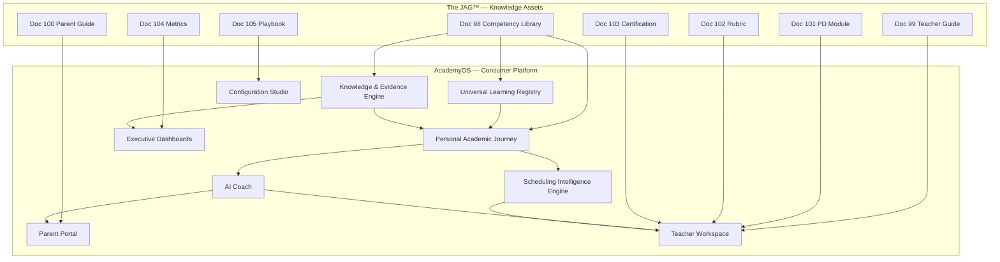

# DOCUMENT 105 — The JAG™ Implementation Playbook™

**Foundational Phonological Awareness Reference Learning Package**  
**Playbook Key:** `playbook.rlp.sl.pa.implementation.v1.0.0`  
**Competency Library:** Document 98  
**Package Documents:** 99–104  
**Version:** 1.0.0  
**Status:** Reference Implementation — Integration Architecture Only  
**Authority:** Documents 57–61 · Academy Way Documents 1–24

---

## Constitutional Principle

> **The JAG™ owns knowledge assets. AcademyOS consumes them.**

This playbook documents **how** the Foundational Phonological Awareness Reference Learning Package integrates with AcademyOS platform services — **without implementing code, databases, or application modules.**

Every future competency library **shall** publish an equivalent implementation playbook.

---

## 1. Package Inventory

| Doc | Asset | AcademyOS Consumption Surface |
|-----|-------|------------------------------|
| **98** | Competency Library | ULR Registry · PAJ · KEE · Intelligence Graph |
| **99** | Teacher Guide | Teacher Workspace · Playbook Composer |
| **100** | Parent Guide | Parent Portal · Family Journey · Parent AI Coach |
| **101** | PD Module | Professional Learning · Credentials |
| **102** | Observation Rubric | Coach Workspace · Fidelity Analytics |
| **103** | Certification Blueprint | Credentials · Permissions |
| **104** | Dashboard Metrics | Executive Dashboards · Analytics |
| **105** | Implementation Playbook | Configuration Studio · Deployment |

**Package key:** `rlp.foundational_phonological_awareness`  
**Version pin:** Semantic version aligned to Document 98

---

## 2. Integration Architecture



---

## 3. AcademyOS Integration

### 3.1 Universal Learning Registry (ULR)

| Integration Point | Behavior |
|-------------------|----------|
| **Asset ingestion** | Document 98 competencies published as ULR records — `competency_key` immutable |
| **Version pin** | Configuration Studio pins `competency_library.foundational_phonological_awareness@1.0.0` |
| **Graph edges** | Prerequisite graph from Doc 98 Part IV → Intelligence Graph `requires` edges |
| **Cross-domain links** | Doc 98 `cross_domain_connections[]` → Doc 46 link registry |
| **Atomic skill placeholders** | Future AS publish attaches to parent competency — inherit rules Doc 25 §5 |
| **Status lifecycle** | Doc 49 pipeline: draft → review → published |

### 3.2 Configuration Studio

| Configuration | Source |
|---------------|--------|
| Active PA library version | Document 98 semver |
| RLP package bundle version | Docs 98–105 aligned semver |
| Feature flags | PA pathway enabled per campus |
| Locale overlays | Document 82 — parent/teacher guide sections |
| Wilson boundary flag | `wilson_content: none` enforced |

---

## 4. Personal Academic Journey (PAJ)

### 4.1 Pathway Placement

| Step | Source | PAJ Behavior |
|------|--------|--------------|
| 1 | Screen / diagnostic | `assess.sl.screen.pa` or `assess.sl.diagnostic.pa` |
| 2 | Competency assignment | Lowest gap competency in Doc 98 sequence |
| 3 | Level tracking | Universal 0–4 per competency_key |
| 4 | Advance | Next competency when L3 + educator confirmation |
| 5 | Handoff | PA-024 L3 → unlock Phonemic Awareness library (future) |

### 4.2 PAJ Display Elements

| Element | Source Document |
|---------|-----------------|
| Current competency title | Doc 98 — student-facing `title` |
| Success criteria summary | Doc 98 — plain language overlay |
| Progress bar | `competencies_l3_count / 24` — Doc 104 |
| Next milestone | Next competency or PA-024 |
| Home activity | Doc 100 — when L2+ |

### 4.3 PAJ Rules

| Rule | Requirement |
|------|-------------|
| **PAJ-PA-1** | No advance without L3 evidence bundle |
| **PAJ-PA-2** | Recursive review competencies injected by SIE |
| **PAJ-PA-3** | Age never blocks PA pathway entry |
| **PAJ-PA-4** | PA-024 handoff requires `hr.cross_domain_unlock` |

---

## 5. Knowledge & Evidence Engine (KEE)

### 5.1 Evidence Type Registration

| Evidence Type | Doc 98 / 99 Use |
|---------------|-----------------|
| `observation.instructional` | Session observation |
| `observation.checklist` | Doc 102 checklist |
| `measurement.progress` | Weekly probe |
| `measurement.formative` | Session exit |
| `measurement.retention` | 2-week spaced |
| `media.audio` | Optional recording |
| `observation.parent` | Home log — Doc 100 |

### 5.2 Bundle Validation

```
EvidenceBundleValidator — PA
    ├── rule: PA-L3-bundle (Doc 98 Part II)
    ├── min_types: 2
    ├── educator_required: true
    ├── confidence_floor: 0.75
    ├── parent_weight_cap: 0.55
    └── expiry_days: 90
```

### 5.3 KEE → PAJ Flow

1. Educator logs evidence → KEE validates type and source  
2. Bundle evaluator checks PA-L3-bundle rules  
3. Confidence aggregate computed  
4. PAJ mastery level updated — **educator confirms L3**  
5. Executive metrics updated — Doc 104  

---

## 6. Scheduling Intelligence Engine (SIE)

### 6.1 Scheduling Rules (Document 98 · 51)

| Rule Key | Behavior |
|----------|----------|
| `sl.schedule.pa.daily_burst` | Schedule 10–15 min PA segment |
| `sl.schedule.pa.review_cluster` | Insert cumulative review block |
| `sl.schedule.pa.group_min_2` | Min pair when WRS metadata linked |
| `sl.schedule.pa.break_ef` | Auto-suggest break when EF profile high |

### 6.2 Dosage Parameters

| Parameter | Value | Source |
|-----------|-------|--------|
| Session duration | 10–15 min | Doc 98 Part II |
| Frequency | 4–5× / week when PA active | Doc 98 |
| Review ratio | 70% new : 30% review | Doc 99 |
| Group size | 2–6 default | Doc 98 |

### 6.3 SIE Inputs

| Input | Source |
|-------|--------|
| Active competency | PAJ |
| EF profile | Learning Profile — Doc 19 |
| Dosage deficit | Doc 104 `dosage_adequacy` |
| Tier status | Intervention plan — Doc 20 |
| Certified teacher constraint | SL metadata — PA segment exempt |

### 6.4 SIE Outputs

| Output | Consumer |
|--------|----------|
| PA session blocks | Teacher Workspace calendar |
| Review cluster insertion | Session plan |
| Break suggestions | Teacher notification |
| Recovery sessions | Doc 104 dosage metric trigger |

---

## 7. AI Coach (AIC)

### 7.1 Coach Roles (Document 41)

| Role | PA Package Function | Rule Keys |
|------|---------------------|-----------|
| **Teacher Coach** | Strategy, advance suggestions | `sl.aic.pa.strategy`, `sl.aic.pa.assess` |
| **Intervention Coach** | Tier 2/3 plans | `sl.aic.pa.intervention` |
| **Parent Coach** | Home activity match | `sl.aic.pa.parent` |
| **Scheduling Coach** | Dosage recovery | `sl.aic.pa.schedule` |
| **Assessment Coach** | Probe timing, capstone | `sl.aic.pa.assess`, `sl.aic.pa.advance` |

### 7.2 AI Metadata Consumption (Document 47)

| Field | Source | Platform Use |
|-------|--------|--------------|
| `confidence_thresholds` | Doc 98 per-competency `ai_metadata` | Surface / suppress recommendations |
| `human_review_triggers` | Doc 98 | Queue educator review |
| `ai_usage_constraints` | Doc 98, 99 | Hard blocks — no auto-mastery |
| `scheduling_preferences` | Doc 98 | SIE input |
| `parent_coaching_rules` | Doc 98 | Parent Portal |

### 7.3 AI Integration Rules

| Rule | Enforcement |
|------|-------------|
| **AIC-PA-1** | `auto_action_ceiling: 0.00` — no automated mastery |
| **AIC-PA-2** | Mastery suggestion ≥ 0.75 still requires educator |
| **AIC-PA-3** | Handoff suggestion requires `hr.cross_domain_unlock` |
| **AIC-PA-4** | No dyslexia diagnosis from PA patterns |
| **AIC-PA-5** | Explainability cites competency_key + evidence_ids |

### 7.4 AI Metrics Feedback

Doc 104 AI confidence metrics → quarterly calibration → Document 47 threshold adjustment proposal → JAG governance review

---

## 8. Parent Portal

### 8.1 Content Surfaces

| Surface | Source | Trigger |
|---------|--------|---------|
| PA explainer | Doc 100 §1–2 | Pathway entry |
| Home activities | Doc 100 §3–4 | L2+ assignment by teacher |
| Progress summary | Doc 98 title + PAJ level | Weekly digest |
| Conversation prompts | Doc 100 §5 | Parent Coach suggestion |
| FAQ | Doc 100 §9 | Always available |
| Support guidance | Doc 100 §8 | Struggle flag |

### 8.2 Parent Evidence Workflow

```
Parent Portal — PA Evidence
    1. Teacher assigns activity (Doc 100)
    2. Parent completes 5–10 min play
    3. Parent logs observation (optional structured form)
    4. KEE records observation.parent — confidence capped 0.55
    5. Teacher verifies — may contribute to bundle
    6. Parent Coach celebrates L3 — draft message teacher approves
```

### 8.3 Parent AI Coach Boundaries

| Permitted | Prohibited |
|-----------|------------|
| Suggest Doc 100 activity | Assign Wilson content |
| Plain-language progress summary | Diagnose |
| Escalate struggle to teacher | Override educator mastery |
| Multilingual activity tips | Skip school sequence |

---

## 9. Teacher Workspace

### 9.1 Workspace Modules

| Module | Package Assets |
|--------|----------------|
| **Session Planner** | Doc 99 session template · Doc 98 competency target |
| **Probe Admin** | Doc 99 §5 · Doc 40 methods |
| **Evidence Logger** | Doc 99 §6 · KEE types |
| **Differentiation Panel** | Doc 99 §8 · Doc 98 per-competency |
| **Learner PAJ View** | Doc 98 index · progress metrics Doc 104 |
| **AI Recommendations** | Doc 99 §11 · human review queue |
| **Family Comms** | Doc 99 §13 · Doc 100 links |
| **Coach Observation** | Doc 102 rubric forms |
| **PD Progress** | Doc 101 module tracker |

### 9.2 Teacher Workflow (Single Session)

| Step | Platform Action | Document Source |
|------|-----------------|-----------------|
| 1 | Open PAJ — confirm competency | Doc 98 |
| 2 | Review success criteria | Doc 98 / 99 |
| 3 | SIE displays scheduled block | Doc 105 §6 |
| 4 | Deliver session — playbook structure | Doc 99 §14 · Doc 22 |
| 5 | Administer formative probe | Doc 99 §5 |
| 6 | Log evidence to KEE | Doc 99 §6 |
| 7 | Review AI suggestions | Doc 99 §11 |
| 8 | Assign home activity if L2+ | Doc 100 |
| 9 | Self-assess — Doc 102 | Optional |

### 9.3 Permission Flags

| Flag | Source |
|------|--------|
| `teacher.cert.sl.pa` | Doc 103 certification |
| `teacher.pd.sl.pa.module` | Doc 101 completion |
| `teacher.pa.tier2.assign` | Intervention credential |

---

## 10. Executive Dashboards

### 10.1 Metric Consumption (Document 104)

| Dashboard | Metric Categories |
|-----------|-------------------|
| Teacher | §3 student + §4 teacher |
| School Leader | §5 school |
| Network Executive | §6 network |
| Research Portal | §7–8 longitudinal + research |
| AI Operations | §9 AI confidence |

### 10.2 Alert Thresholds (Conceptual)

| Alert | Condition | Action Owner |
|-------|-----------|--------------|
| Dosage deficit | `dosage_adequacy = false` 2 weeks | SIE + teacher |
| Flat probe | 3 consecutive flat probes | Intervention Coach |
| Evidence stale | `staleness_days > 14` | Teacher |
| Fidelity drop | `fidelity_index < 70` network | PD lead |
| AI ceiling violation | `ceiling_violation_count > 0` | AI ops — immediate |
| Version drift | `version_compliance < 100%` | JAG governance |

---

## 11. Deployment Sequence

### Phase 1 — Registry Publish

| Step | Action |
|------|--------|
| 1 | Document 98 competencies → ULR `published` |
| 2 | Intelligence Graph edges validated |
| 3 | Evidence types registered in KEE taxonomy |
| 4 | Assessment method keys registered (instruments future) |
| 5 | AI rule keys registered in Decision Engine |

### Phase 2 — RLP Bundle Publish

| Step | Action |
|------|--------|
| 6 | Documents 99–105 → JAG asset registry |
| 7 | Handbook sections composed — Doc 82 |
| 8 | PD module loaded — Doc 101 |
| 9 | Metrics definitions loaded — Doc 104 |
| 10 | Configuration Studio version pin |

### Phase 3 — Campus Activation

| Step | Action |
|------|--------|
| 11 | Campus enables PA pathway flag |
| 12 | Teacher PD enrollment |
| 13 | Coach calibration — Doc 102 |
| 14 | Parent Portal content live |
| 15 | Dashboard widgets configured |

### Phase 4 — Validation

| Step | Action |
|------|--------|
| 16 | Pilot cohort — min 30 learners |
| 17 | Metric baseline captured |
| 18 | QA panel sign-off — Doc 48 |
| 19 | Gold Standard Declaration — Doc 50 pattern |
| 20 | Next library authorized |

---

## 12. Gold Standard Replication Pattern

Every future competency library **shall** publish:

| # | Required Asset |
|---|----------------|
| 1 | Competency Library (Doc 98 pattern) |
| 2 | Teacher Guide (Doc 99 pattern) |
| 3 | Parent Guide (Doc 100 pattern) |
| 4 | PD Module (Doc 101 pattern) |
| 5 | Observation Rubric (Doc 102 pattern) |
| 6 | Certification Blueprint (Doc 103 pattern) |
| 7 | Executive Dashboard Metrics (Doc 104 pattern) |
| 8 | Implementation Playbook (Doc 105 pattern) |
| 9 | Package Index (Doc 00 pattern) |

**Gate:** Library N+1 RLP blocked until Library N reaches maturity Level 7 (Document 83) and Gold Standard Declaration.

---

## 13. Governance & Ownership

| Entity | Role |
|--------|------|
| **The JAG™** | Owns all Docs 98–105 |
| **AcademyOS** | Consumes — does not own |
| **Library Curator** | Publish authority — Doc 61 |
| **Campus Admin** | Version pin · feature enable |
| **Teacher** | Evidence author · mastery gate |

**Amendment:** MAJOR version on Document 98 triggers RLP package MAJOR review — all 8 assets.

---

## 14. Related Documents

| Document | Integration Role |
|----------|------------------|
| 57 | JAG ownership model |
| 61 | Publication authority |
| 80 | Publication formats |
| 81 | PD pathways |
| 82 | Handbook composition |
| 83 | Maturity model — Level 7 publish gate |
| 22 | Universal lesson playbook structure |
| 23 | Analytics framework parent |
| 50 | Reference implementation pattern |

---

*End of Document 105 — The JAG™ Implementation Playbook™: Foundational Phonological Awareness Reference Learning Package*

*The JAG™ — All Rights Reserved. AcademyOS consumes; does not own.*
