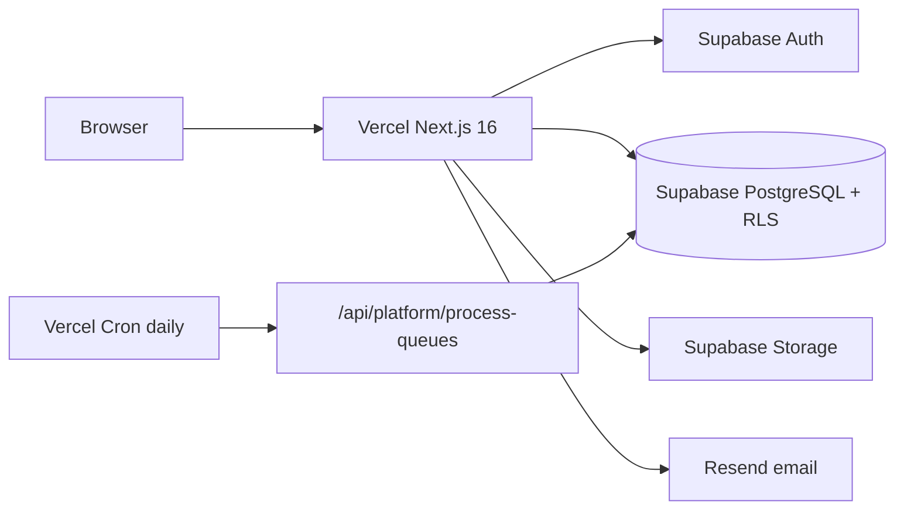
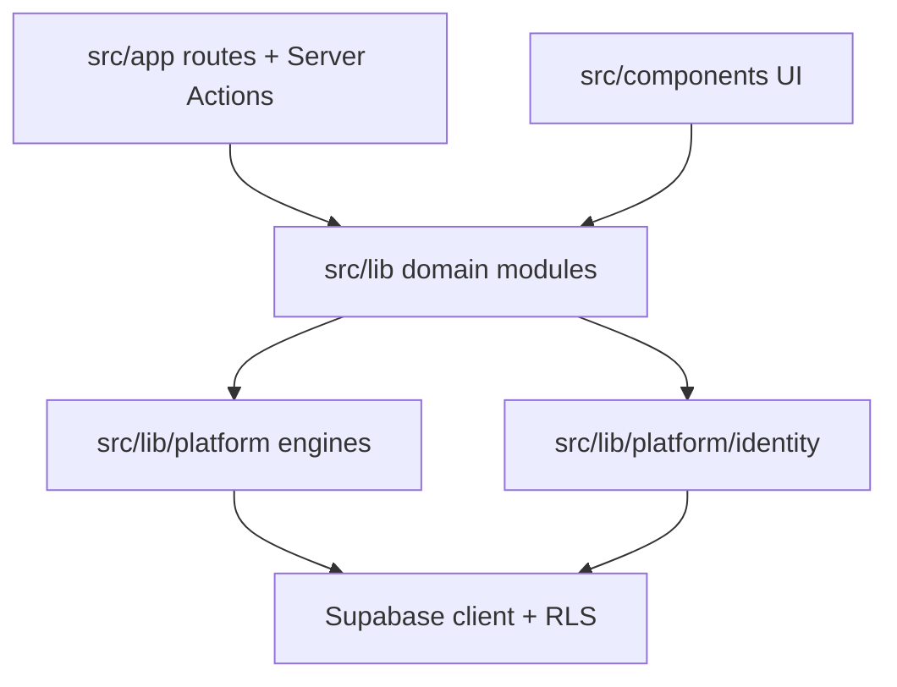

# System & Platform Architecture — Phase F

| Field | Value |
|-------|-------|
| **Purpose** | Describe the production runtime topology as implemented |
| **Scope** | Hosting, app surfaces, layers, health |
| **Audience** | Engineers, ops, architects |
| **Prerequisites** | Supabase + Vercel project access |
| **Version** | 1.0.0 |
| **Date** | 2026-07-17 |

---

## Procedures — how to read this architecture

1. Start with the deploy diagram below.  
2. For module depth, open `docs/architecture/CURRENT_ARCHITECTURE_REPORT.md`.  
3. For platform engines, open `docs/architecture/platform-services.md`.  
4. Confirm env contract in `src/lib/platform/env/schema.ts`.

---

## Deployed topology (implementation)

| Component | Implementation |
|-----------|----------------|
| App runtime | Next.js 16.2.9 App Router on **Vercel** (`vercel.json`) |
| Database / Auth / Storage | **Supabase** |
| ORM | None — Supabase client |
| Containers | **No Dockerfile** in repo |
| CI | `.github/workflows/ci.yml` — lint, typecheck, build, integration, smoke (no deploy) |

---

## Product surfaces

| Surface | Prefix | Audience |
|---------|--------|----------|
| Staff ERP | `/dashboard` | School staff |
| Family portal | `/portal` | Parents / students |
| Admissions | `/apply` | Prospects / guardians |
| Executive (JAG) | `/exec` | Founder / `JAG_ACCESS` |
| Cloud | `/cloud` | Cloud employees |
| Operations | `/operations` | Ops center |
| Org platform | `/platform`, `/organizations`, `/users`, `/settings` | Platform admin |

---

## Logical layers

---

## Health probes

| Probe | Path | Behavior |
|-------|------|----------|
| Liveness | `GET /api/health` | `{ status: "ok" }` — no dependency check |
| Readiness | `GET /api/ready` | 503 if Supabase URL/anon key missing |

---

## Troubleshooting

| Issue | Check |
|-------|-------|
| App up, data fails | Supabase URL/keys; RLS; service-role misuse |
| Cron not running | Vercel cron + `CRON_SECRET`; schedule in `vercel.json` |
| Build fails | Registry validators in `npm run build` |

## Related documents

- `docs/architecture/PLATFORM_ARCHITECTURE.md`
- `../13_MONITORING_AND_OPERATIONS.md`
- `../runbooks/12_DEPLOYMENT.md`

## Version history

| Version | Date | Notes |
|---------|------|-------|
| 1.0.0 | 2026-07-17 | Initial |
