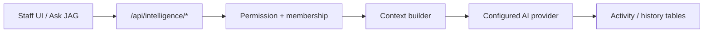

# Database Topology, Graphs & AI Architecture — Phase F

| Field | Value |
|-------|-------|
| **Purpose** | Document data, executive/knowledge graphs, and AI surfaces as implemented |
| **Scope** | Postgres via Supabase; intelligence modules; AI context API |
| **Audience** | Engineers, data, AI owners |
| **Prerequisites** | Supabase access; Phase B security awareness |
| **Version** | 1.0.0 |

---

## Database architecture (implementation)

| Item | Reality |
|------|---------|
| Engine | PostgreSQL (Supabase; local `config.toml` Postgres 17) |
| Schema source of truth | `supabase/migrations/*.sql` (171+ files) |
| App types | Manual mirror `src/types/database.ts` |
| Access control | RLS + permission engine (`src/lib/platform/identity/`) |
| Migrations apply | Supabase CLI / dashboard — see `04_DATABASE_DOCUMENTATION.md` |

Detailed table/RLS catalogs: migrations + `docs/security/phase-b/03_RLS_VALIDATION_REPORT.md`. Full ERD generation is Wave F.1.

---

## Executive graph

| Item | Reality |
|------|---------|
| ADR | `docs/architecture/adr/ADR-A1-001-executive-graph-packages.md` |
| Surfaces | `/exec/*` (JAG Command Center) and `/dashboard/executive/*` |
| Implementation note | Dual packages intentional per ADR — do not merge without architecture decision |
| Graph UI | `/exec/graph` — verify placeholder vs live data before operational use |

---

## Knowledge / intelligence graph

| Layer | Path / module |
|-------|----------------|
| Platform intelligence graph | `src/lib/platform/intelligence-graph/` |
| Docs | `docs/architecture/JAG_INTELLIGENCE_ARCHITECTURE.md`, `JAG_V1_INTELLIGENCE_GRAPH.md` |
| Domains | Market, customer, operations, document, knowledge, legal, innovation (sprint docs under `docs/architecture/`) |
| Runtime caution | Sprint docs may describe target state — verify code before ops claims |

---

## AI architecture

| Component | Implementation |
|-----------|----------------|
| AIP console | `/dashboard/intelligence` → `src/lib/intelligence-platform/` |
| Context API | `GET|POST /api/intelligence/context` |
| Docs JSON | `GET /api/intelligence/docs` |
| Security | Phase B: caller-controlled org/school/student IDs are a **High** risk — bind to session membership before production AI use |
| Approvals UI | Experience-system AI confirm dialog (limited adoption) |

---

## Troubleshooting

| Issue | Action |
|-------|--------|
| Graph empty | Confirm ADR package + data seed; check permissions |
| AI context cross-tenant | Block until Phase B remediations; do not expand prompts |
| Types drift from DB | Regenerate/update `database.ts` after migrations |

## Related documents

- `../04_DATABASE_DOCUMENTATION.md`
- `docs/security/phase-b/SECURITY_REPORT.md`
- `docs/architecture/INTELLIGENCE_LAYER_MODEL.md`

## Version history

| Version | Date | Notes |
|---------|------|-------|
| 1.0.0 | 2026-07-17 | Initial |
